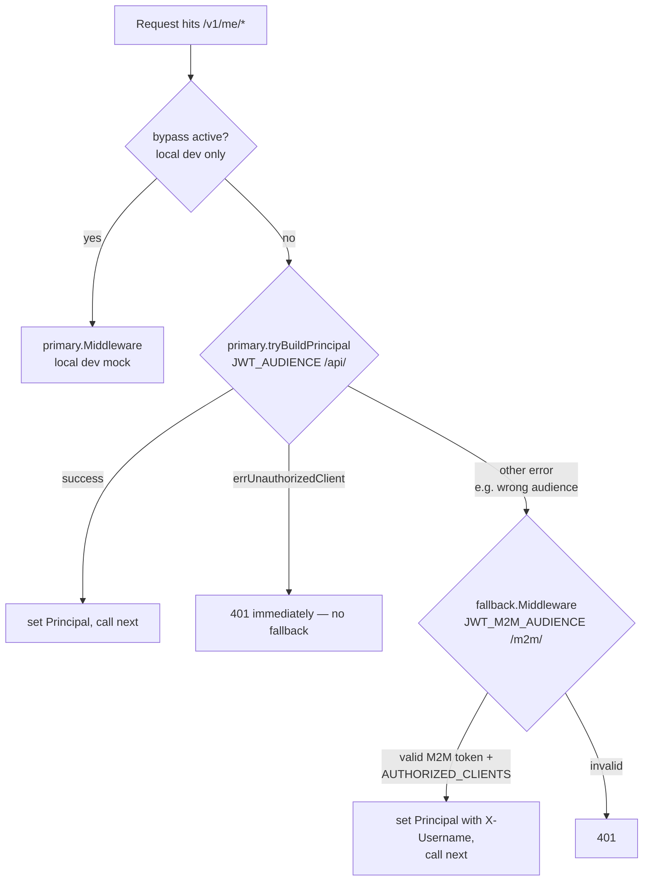

<!-- Copyright The Linux Foundation and each contributor to LFX. -->
<!-- SPDX-License-Identifier: MIT -->

# Self Serve → Crowdfunding API Authentication

**Status:** Approved — implemented (DEV)
**Author:** Michal Lehotsky
**Related:** `auth0-terraform` #321, `lfx-v2-argocd` #882/#893, `lfx-secrets-management` #262
**Reviewed by:** Eric Searcy, Robert Detjens (May–June 2026)

---

## 1. Problem

LFX Self Serve (SS) needs to call Crowdfunding (CF) backend APIs on behalf of authenticated users, including when an admin is impersonating another user. CF validates JWTs on every protected route, so SS must obtain a token CF will accept and communicate the correct acting-user identity.

---

## 2. Approach: M2M + Explicit Identity Header

SS authenticates to CF using **M2M client credentials** (same pattern as CDP). SS obtains an Auth0 access token via `client_credentials` for the dedicated M2M audience (`/m2m/`), passes it as the Bearer token, and sends the acting user's LFID username in an **`X-Username` header**.

CF's `/v1/me/*` routes are protected by `MultiAudienceMiddleware` — a chained middleware that accepts either a user token (primary, `/api/` audience) or an M2M token (fallback, `/m2m/` audience). This keeps the two caller types cleanly separated at the audience level while sharing a single set of me-style endpoints.

**Why not forward the user token directly?** SS's `apiGatewayToken` always carries the **admin's** identity, even during impersonation. Forwarding it to CF would silently operate on the admin's data instead of the target user's (see Appendix). M2M + explicit `X-Username` makes identity intentional.

**Why `X-Username`?** The platform is migrating from Auth0 `sub` identifiers to LFID usernames (OQ-23). `X-Username` carries a human-readable LFID username, not an opaque Auth0 sub.

---

## 3. Token Flow

```
SS server start / first CF call
  └─ Auth0 token endpoint (client_credentials grant)
       client_id     = PCC_AUTH0_CLIENT_ID   (the lfx_one client)
       client_secret = PCC_AUTH0_CLIENT_SECRET
       audience      = https://crowdfunding.{env}.lfx.dev/m2m/   (dev/staging)
                     = https://crowdfunding.linuxfoundation.org/m2m/  (prod)
       → M2M access token (cached, ~24hr lifetime)

User navigates to a CF feature in SS
  └─ SS resolves acting user LFID username via getEffectiveUsername()
       normal:        logged-in user's LFID username
       impersonating: impersonated user's LFID username

  └─ SS BFF proxies to CF /v1/me/* endpoint
       Authorization: Bearer {M2M token}
       X-Username:    {LFID username of acting user}
```

### Middleware flow (`MultiAudienceMiddleware`)

The `/v1/me/*` routes use `MultiAudienceMiddleware(primary, fallback)` — primary validates against `JWT_AUDIENCE` (`/api/`), fallback validates against `JWT_M2M_AUDIENCE` (`/m2m/`).



**Key behaviour:**
- User token (`/api/` audience, CF frontend) → passes primary; `AUTHORIZED_CLIENTS` not checked for user tokens
- M2M token (`/m2m/` audience, SS) → fails primary (wrong audience) → fallback validates, checks `azp` ∈ `AUTHORIZED_CLIENTS`, reads `X-Username` → `Principal.Username`
- Token valid for `/api/` but `azp` not in `AUTHORIZED_CLIENTS` → `errUnauthorizedClient` → **401 immediately**, no fallback

---

## 4. Impersonation

`getEffectiveUsername()` returns the impersonated user's LFID username when impersonation is active. CF sees a normal authenticated call — it has no need to know impersonation is occurring. The audit trail is maintained in SS's session.

Write access under impersonation is a product-level decision; read-only gating is product-side for launch.

---

## 5. Required Changes

### `auth0-terraform` — `grants_crowdfunding_m2m.tf`

New M2M resource server (`lfx_crowdfunding_m2m`, `/m2m/`) with `user deny_all` / `client require_client_grant`, plus a client grant for `lfx_one`.

```hcl
resource "auth0_resource_server" "lfx_crowdfunding_m2m" {
  identifier = "https://crowdfunding.{env}.lfx.dev/m2m/"  // per workspace
  signing_alg = "RS256"
  token_dialect = "rfc9068_profile"
  subject_type_authorization {
    user   { policy = "deny_all" }
    client { policy = "require_client_grant" }
  }
}

resource "auth0_client_grant" "lfxone_crowdfunding_m2m" {
  client_id  = auth0_client.lfx_one.id
  audience   = auth0_resource_server.lfx_crowdfunding_m2m.identifier
  scopes     = ["access:api"]
  depends_on = [auth0_resource_server_scopes.lfx_crowdfunding_m2m]
}
```

### `lfx-v2-argocd`

| File | Change |
|---|---|
| `values/{dev,staging,prod}/lfx-crowdfunding-backend.yaml` | Add `JWT_M2M_AUDIENCE` and `AUTHORIZED_CLIENTS` (lfx_one client ID via ExternalSecret); `JWT_AUDIENCE`, `JWT_ISSUER`, `JWKS_URL` unchanged |
| `values/{dev,staging,prod}/lfx-self-serve.yaml` | Add `CROWDFUNDING_API_BASE_URL` and `CROWDFUNDING_API_AUDIENCE` (`/m2m/`) |

### `lfx-self-serve`

New `crowdfunding.service.ts` modelled on `cdp.service.ts`:
- M2M token via `client_credentials` using `PCC_AUTH0_CLIENT_ID/SECRET` (the `lfx_one` client), minted directly by the service (same pattern as `cdp.service.ts`)
- Proxy routes under `/api/crowdfunding/*` forwarding M2M Bearer + `X-Username`
- `getEffectiveUsername()` resolves the acting user's LFID username from the `https://sso.linuxfoundation.org/claims/username` claim

### `lfx-crowdfunding` backend

`MultiAudienceMiddleware(primary, fallback)` is wired on `/v1/me/*` routes. Primary uses `JWT_AUDIENCE` (`/api/`); fallback uses `JWT_M2M_AUDIENCE` (`/m2m/`) with `AUTHORIZED_CLIENTS` gating and `X-Username` → `Principal.Username` for trusted callers. See middleware flow diagram in §3.

> **Username is the canonical user identifier in new CF (OQ-23).** Both paths (user JWT and M2M) resolve to `Principal.Username` (LFID username). Handlers must use `Username`, not `UserID` — `UserID` on the M2M path is the Auth0 client credential subject, not a user identity. This applies across me-routes and non-me ownership checks (`initiative_handler.go`, `subscription_handler.go:Cancel`). Full details in LFXV2-1690.

---

## 6. What This Does Not Need

- Changes to the existing `lfx_crowdfunding_api` user-facing resource server
- Changes to Heimdall routing or `lfx-platform.yaml`
- New token exchange logic in SS
- New session fields

---

## 7. Long-term: Heimdall Alignment

Every other LFX v2 service sits behind Heimdall. Adding Heimdall to CF would normalise both user and M2M tokens through the platform gateway, making `X-Username` unnecessary — impersonation identity would flow through the Heimdall-issued JWT directly. Not in scope now; the M2M approach does not block it.

---

## 8. Open Items

| Item | Status | Detail |
|---|---|---|
| M2M + single RS + `X-Username` | ✅ Confirmed | Eric Searcy (me-style + identity header); Robert Detjens (single RS) |
| sub → username migration | 🔲 Needs implementation | DB and Stripe customer keys store Auth0 sub; update via migration — tracked as OQ-23 |
| Impersonation write access | 🔲 Product decision | Read-only gating is product-side for launch |
| Impersonation bug in SS (Appendix) | 🔲 Pending Jordan | Confirm whether by-design or a real bug |
| Heimdall alignment | 🔲 Planned follow-up | Does not block launch |

---

## Appendix: Known Impersonation Bug in Self Serve

`apiGatewayToken` is always derived from the admin's refresh token and always carries the **admin's** identity. Every SS feature that uses it during impersonation silently operates on the admin's data:

| Feature | Impact |
|---|---|
| Rewards tab | Shows admin's points and coupons, not the target user's |
| Visa letter requests | Submits under admin's Salesforce ID — wrong record created |
| Travel fund requests | Submits under admin's Salesforce ID — wrong record created |
| Membership / enrollment | Reads and modifies admin's membership, not the target's |

Visa and travel fund submissions are a **data integrity issue**. This is why the `apiGatewayToken` forwarding pattern was not adopted for CF.

This is a separate SS bug, not CF scope.

**Option A (ship now):** Disable affected features during impersonation with a clear message.
**Option B (follow-up):** Fix root cause — derive `apiGatewayToken` from the impersonation token.

**Recommendation:** ship Option A now, track Option B separately.
