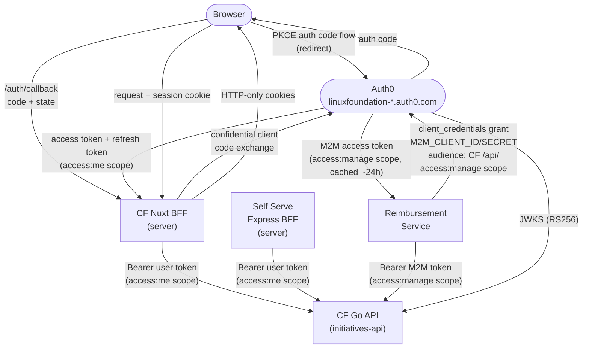
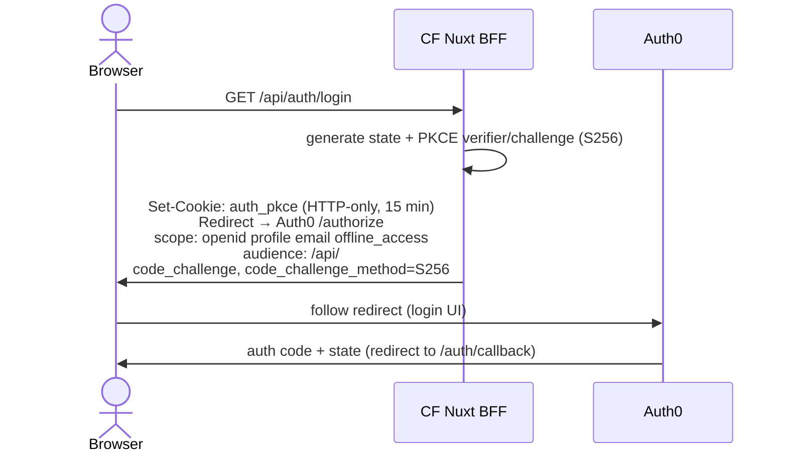
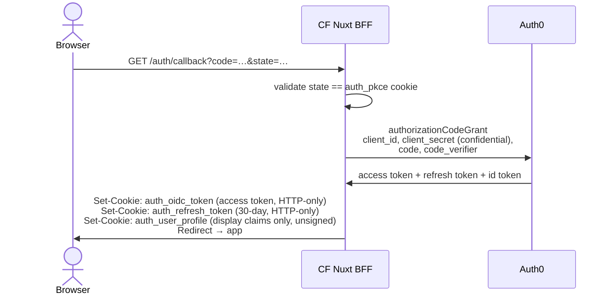
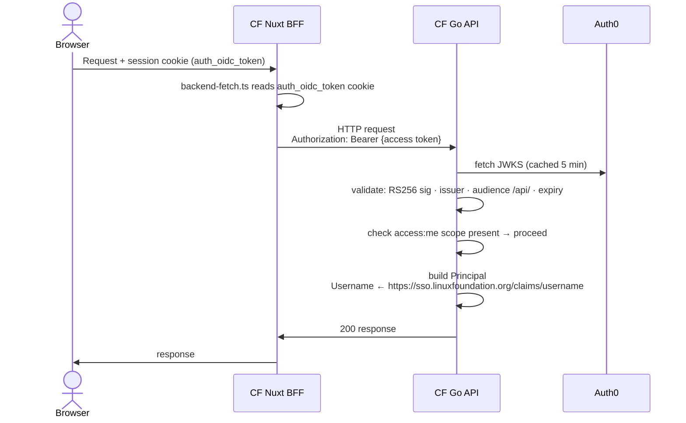
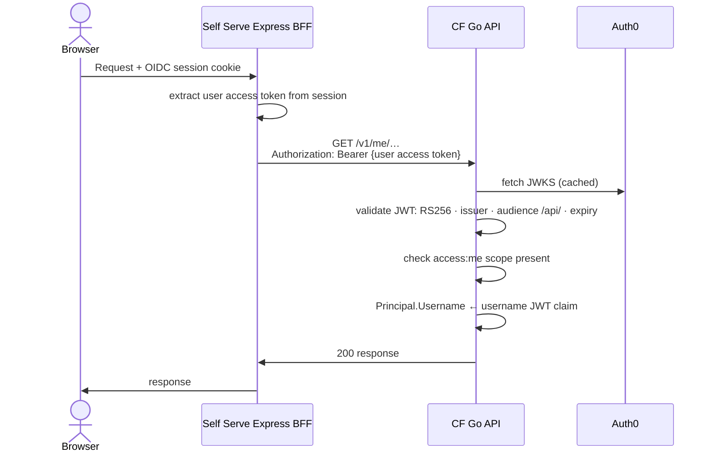
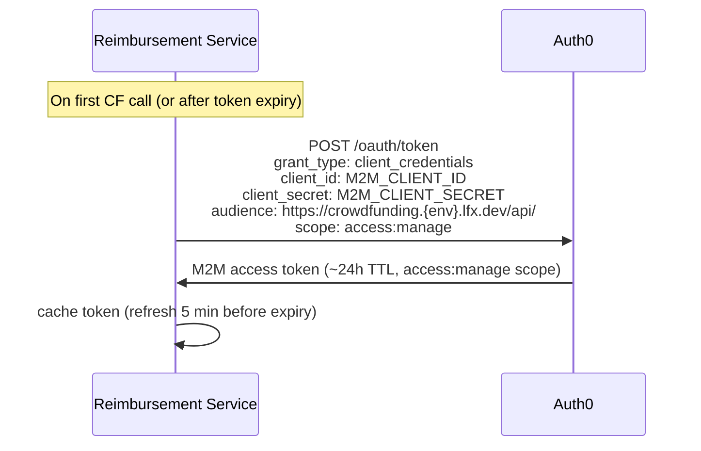
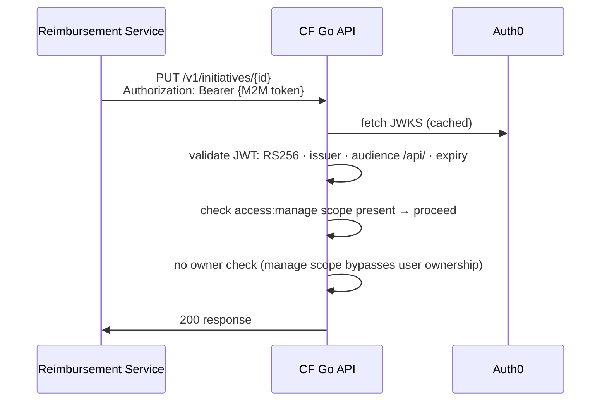
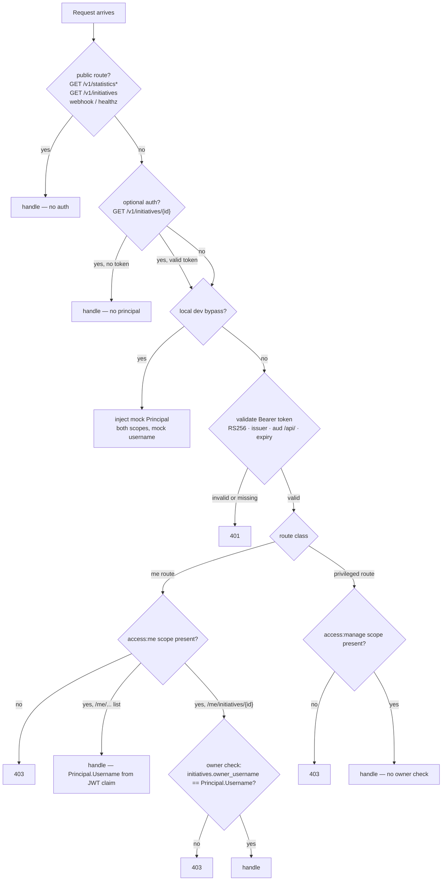

<!-- Copyright The Linux Foundation and each contributor to LFX. -->
<!-- SPDX-License-Identifier: MIT -->

# Authentication Architecture

---

This document describes how authentication works in the Crowdfunding (CF) platform and how
**LFX Self Serve ("LFX One")** and the **Reimbursement Service** authenticate to CF backend APIs.
It is written for architecture review. Scope is limited to **authentication only**; business logic
and data flows are out of scope.

---

## Actors & Trust Boundaries

| Actor | Type | Notes |
|---|---|---|
| **Browser** | Untrusted client | Never receives access tokens directly |
| **CF Nuxt BFF** | Trusted server | Holds tokens in HTTP-only cookies; proxies requests to CF API |
| **CF Go API** (`initiatives-api`) | Trusted server | Validates JWTs; the protected resource server |
| **Auth0** (`linuxfoundation-{dev,staging}.auth0.com`) | Identity provider | Issues all tokens; hosts JWKS endpoint |
| **LFX Self Serve Express BFF** | Trusted server | Proxies user-issued access tokens on behalf of the logged-in user |
| **Reimbursement Service** | Trusted server | M2M caller; uses `access:manage` scope for privileged routes |

**Key principle:** access tokens never reach the browser. Both BFFs hold them server-side
(HTTP-only cookies in CF; forwarded from the user session in Self Serve) and attach them on the
server when making upstream API calls.

---

## Overview



---

## Two Scopes, One Resource Server

The CF API uses a single Auth0 resource server (`lfx_crowdfunding_api`, audience `/api/`) with two
scopes that gate access to different route classes:

| Scope | Issued to | Route class | Identity source |
|---|---|---|---|
| `access:me` | Users (via interactive login) | User-facing `/me/*` routes and initiative-by-ID me routes | `https://sso.linuxfoundation.org/claims/username` JWT claim |
| `access:manage` | M2M clients (client_credentials) | Privileged routes — initiative create/update/delete, approval | `sub` claim (Auth0 M2M client subject; no user identity needed) |

This replaces the previous `access:api` single-scope + `AUTHORIZED_CLIENTS` allowlist pattern.
The scope itself is the access control gate; no client ID allowlist is needed.

---

## Flow 1 — CF End-User Authentication (Nuxt BFF)

The CF Nuxt BFF acts as an OAuth2 confidential client. All token handling is server-side.
The browser participates in the authorization code flow but never receives an access token.

### 1.1 Login



### 1.2 Callback & Token Storage



Cookie details:
- `auth_oidc_token` — the Auth0 access token (`access:me` scope) forwarded to the CF Go API as a Bearer token
- `auth_refresh_token` — used to silently refresh; 30-day TTL
- `auth_user_profile` — base64 JSON of display claims (name, email, username); **unsigned, for display only, never for authorization**
- All cookies: `httpOnly: true`, `secure` (non-local), `sameSite: lax`

### 1.3 Authenticated API Call



### 1.4 Token Refresh

`POST /api/auth/refresh` calls `refreshTokenGrant` with the stored refresh token, rotates
`auth_oidc_token` and `auth_refresh_token`. On any failure all auth cookies are cleared and
the client receives 401 (forcing a new login).

---

## Flow 2 — Self Serve → CF API (User Token)

Self Serve proxies the logged-in user's **own** access token to the CF API. There is no M2M token
exchange and no identity header — the user token carries the user's identity via the
`https://sso.linuxfoundation.org/claims/username` claim, same as the CF frontend.

This is correct because all SS→CF calls are me-style endpoints: `/v1/me/donations`,
`/v1/me/subscriptions`, `/v1/me/payment-account`, etc. The user is always acting on their own
data; no impersonation scope is needed at the CF layer.



---

## Flow 3 — Reimbursement Service → CF API (M2M)

The Reimbursement Service is a machine-to-machine caller that needs privileged access to
initiative data (create, update, financial state). It uses the **Auth0 client credentials grant**
to obtain a token with the `access:manage` scope.

### 3.1 Token Acquisition



### 3.2 Privileged API Call



---

## Go API Authorization Decision Tree

The same `JWTAuthenticator.Middleware` handles all token types. After JWT validation, route class
and scope determine what happens next:



---

## Route Authentication Tiers

| Tier | Routes | Auth mechanism |
|---|---|---|
| **No auth** | `GET /livez`, `/healthz`, `/readyz` | None |
| **No auth** | `POST /v1/stripe/webhook` | Stripe HMAC signature (separate from JWT) |
| **No auth** | `GET /v1/statistics*`, `GET /v1/initiatives`, `GET /v1/initiatives/{id}/transactions` | None |
| **Optional auth** | `GET /v1/initiatives/{id}` | `OptionalMiddleware` — attaches Principal if valid Bearer present; never rejects. Allows approvers to view unpublished initiatives. |
| **`access:me` required** | `GET /v1/me/*`, `POST /v1/me/*`, `DELETE /v1/subscriptions/{id}`, `POST /v1/presigned-url` | `Middleware` — rejects 401 on missing/invalid token; 403 if `access:me` scope absent |
| **`access:me` + owner check** | `GET /v1/me/initiatives/{id}`, `PATCH /v1/me/initiatives/{id}` | As above, plus DB lookup: `initiatives.owner_username == Principal.Username` |
| **`access:manage` required** | `POST /v1/initiatives/`, `PATCH /v1/initiatives/{id}`, `DELETE /v1/initiatives/{id}`, `POST /v1/initiatives/{id}/process-approval/{action}`, `GET /v1/initiatives/{id}/donations`, `POST /v1/initiatives/{id}/donations`, `GET /v1/initiatives/{id}/subscriptions`, `POST /v1/initiatives/{id}/subscriptions` | `Middleware` — rejects 403 if `access:manage` scope absent |

---

## Auth0 Terraform — Required Changes

### Resource server scopes

Replace the single `access:api` scope with two scopes on `lfx_crowdfunding_api`:

```hcl
resource "auth0_resource_server_scopes" "lfx_crowdfunding_api" {
  resource_server_identifier = auth0_resource_server.lfx_crowdfunding_api.identifier

  scopes {
    name        = "access:me"
    description = "Access LFX Crowdfunding API as an authenticated user (me-style endpoints)"
  }

  scopes {
    name        = "access:manage"
    description = "Privileged access to LFX Crowdfunding API (M2M, initiative management)"
  }
}
```

### Client grants

**CF frontend (Nuxt BFF)** — already has a client grant; update scope from `access:api` to `access:me`.

**Self Serve** — already has a client grant; update scope from `access:api` to `access:me`. No M2M client grant needed.

**Reimbursement Service** — new client grant with `access:manage` scope:

```hcl
resource "auth0_client_grant" "reimbursement_crowdfunding" {
  client_id  = auth0_client.reimbursement_service.id
  audience   = auth0_resource_server.lfx_crowdfunding_api.identifier
  scopes     = ["access:manage"]
  depends_on = [auth0_resource_server_scopes.lfx_crowdfunding_api]
}
```

---

## Configuration Reference

### CF Backend (`initiatives-api`)

| Env var | Purpose | Dev value |
|---|---|---|
| `JWKS_URL` | Auth0 JWKS endpoint | `https://linuxfoundation-dev.auth0.com/.well-known/jwks.json` |
| `JWT_ISSUER` | Expected `iss` claim | `https://linuxfoundation-dev.auth0.com/` |
| `JWT_AUDIENCE` | Expected `aud` claim | `https://crowdfunding.dev.lfx.dev/api/` |
| `ALLOW_MOCK_LOCAL_PRINCIPAL_BYPASS` | Local-dev: skip JWKS, inject mock Principal with both scopes | not set in deployed envs |

> **Removed:** `AUTHORIZED_CLIENTS`. The scope-based model does not require a client ID allowlist.

### CF Frontend (Nuxt BFF)

| Env var | Purpose |
|---|---|
| `NUXT_PUBLIC_AUTH0_DOMAIN` | Auth0 tenant (`https://linuxfoundation-dev.auth0.com`) |
| `NUXT_PUBLIC_AUTH0_CLIENT_ID` | SPA / BFF client ID |
| `NUXT_AUTH0_CLIENT_SECRET` | Client secret (server-only; confidential client) |
| `NUXT_PUBLIC_AUTH0_AUDIENCE` | Token audience (`https://crowdfunding.dev.lfx.dev/api/`) |
| `NUXT_PUBLIC_AUTH0_REDIRECT_URI` | OAuth2 callback URL |
| `NUXT_API_BASE_URL` | CF Go API base URL (server-internal, default `http://localhost:8080`) |
| `NUXT_JWT_SECRET` | Session cookie signing secret |

### LFX Self Serve (Express BFF)

No M2M credentials needed for CF. The user's access token is forwarded directly.

| Env var | Purpose |
|---|---|
| `CROWDFUNDING_API_BASE_URL` | CF API base URL (`https://crowdfunding-api.dev.lfx.dev`) |

### Reimbursement Service

| Env var | Purpose |
|---|---|
| `CF_M2M_CLIENT_ID` | Auth0 M2M client ID for CF API |
| `CF_M2M_CLIENT_SECRET` | Auth0 M2M client secret |
| `CF_M2M_ISSUER_BASE_URL` | Auth0 token endpoint base URL |
| `CF_API_BASE_URL` | CF API base URL |
| `CF_API_AUDIENCE` | CF API audience (`https://crowdfunding.{env}.lfx.dev/api/`) |

---

## Migration from Previous Design

The previous design used a single `access:api` scope with an `AUTHORIZED_CLIENTS` allowlist and
`X-Username` header impersonation to distinguish M2M callers (Self Serve) from user callers.

| Previous | New |
|---|---|
| `access:api` on all tokens | `access:me` for users, `access:manage` for M2M |
| `AUTHORIZED_CLIENTS` allowlist + `X-Username` header | Scope-based; no allowlist, no identity header |
| Self Serve uses M2M client credentials | Self Serve forwards user's own access token |

The `X-Username` header and `AUTHORIZED_CLIENTS` env var are **removed**. The ingress no longer
needs to strip `X-Username` headers.

---

## Related Documents

- [`08-self-serve-auth.md`](08-self-serve-auth.md) — Self Serve integration rationale and impersonation handling
- [`04-target-architecture.md`](04-target-architecture.md) — overall target architecture including Auth0 tenant topology
