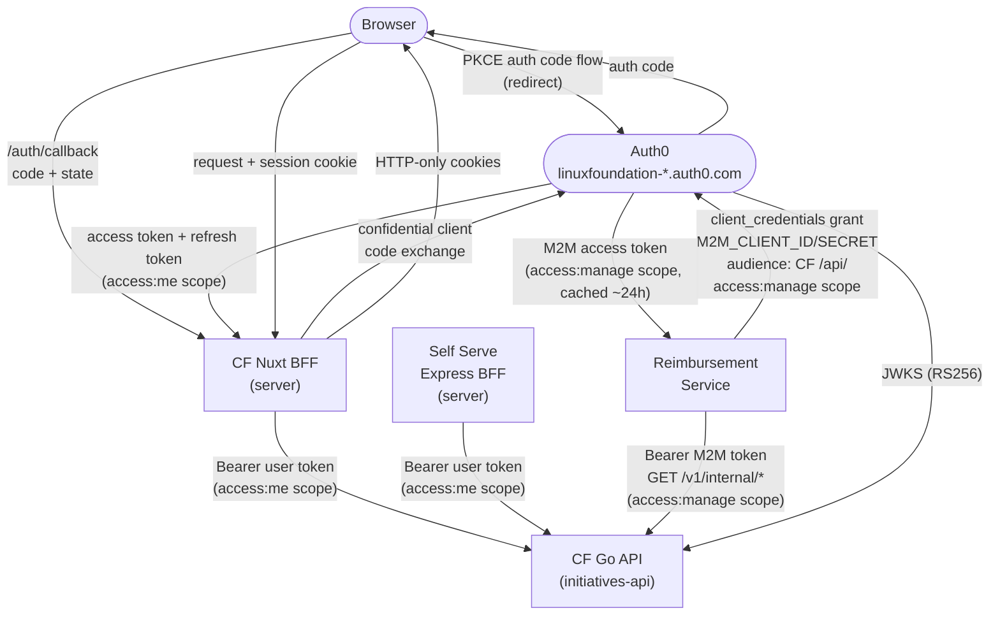
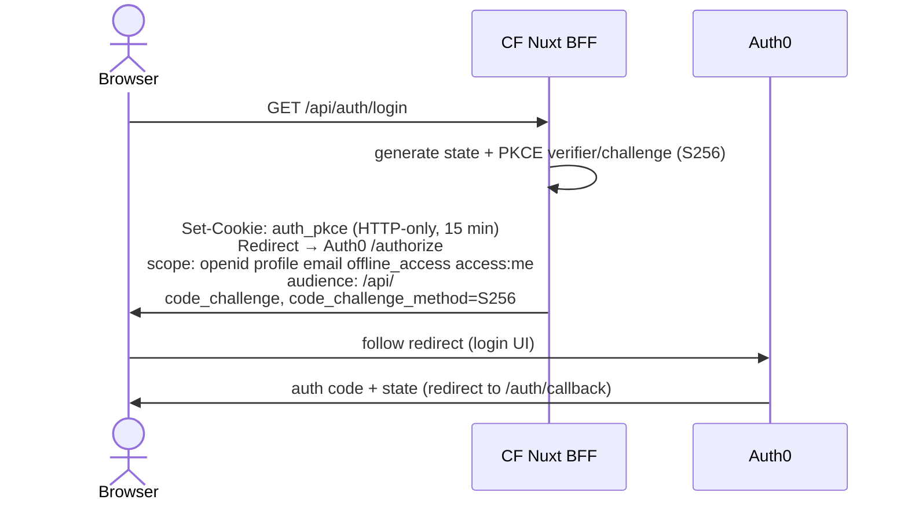
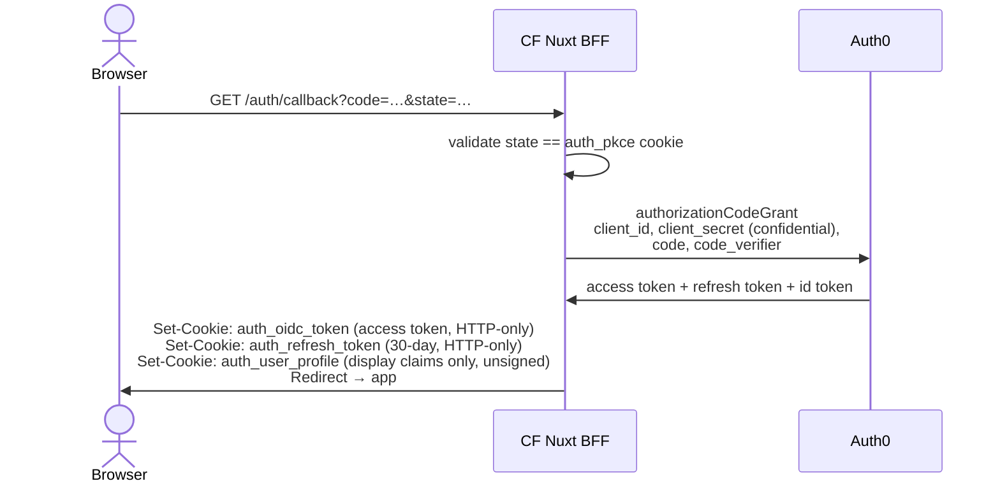
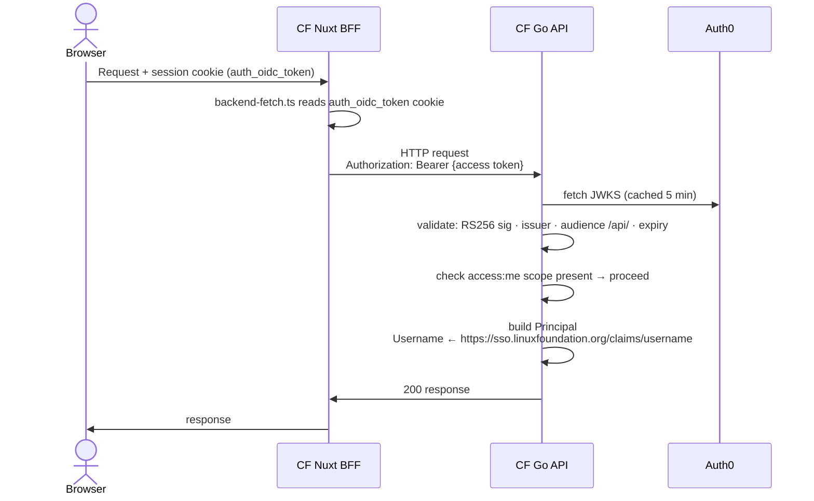
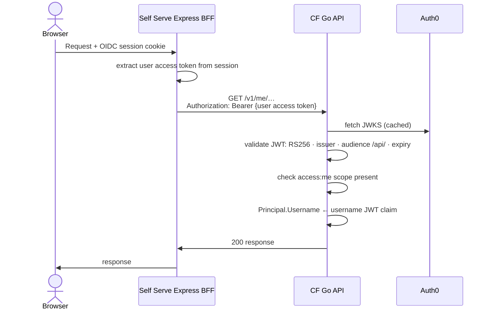
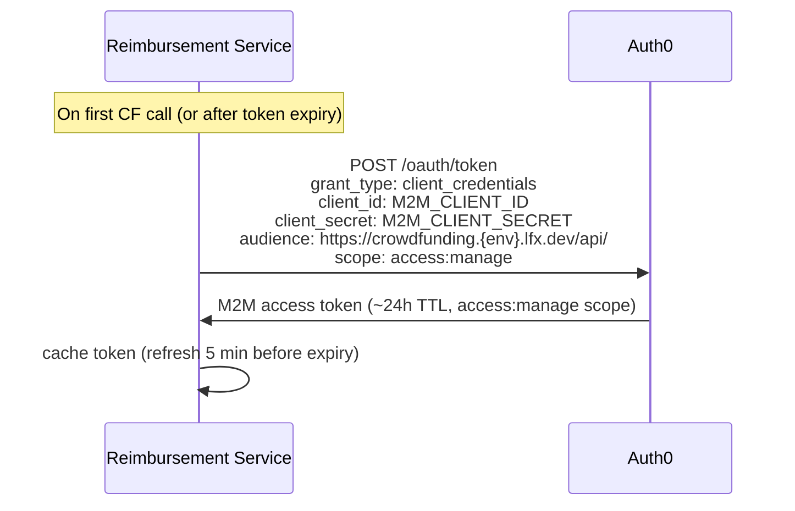
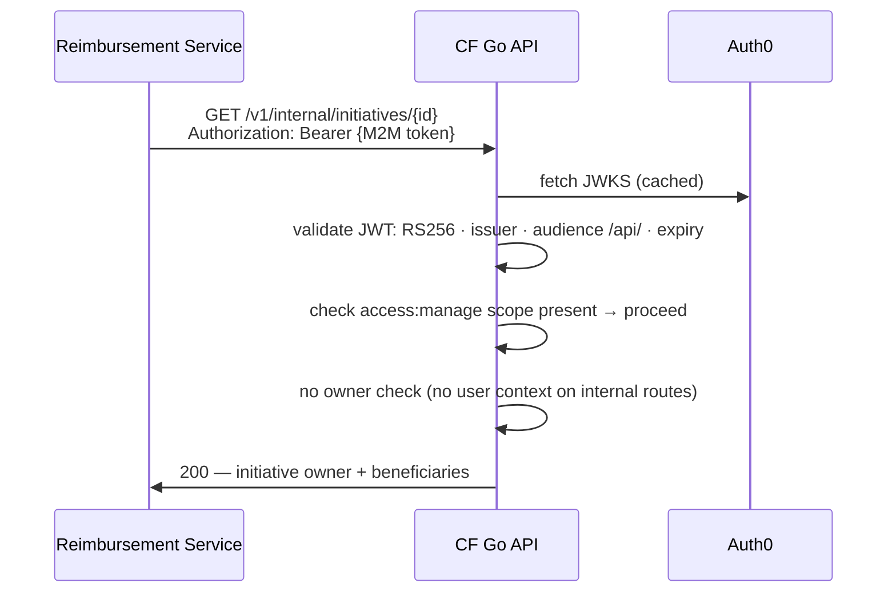
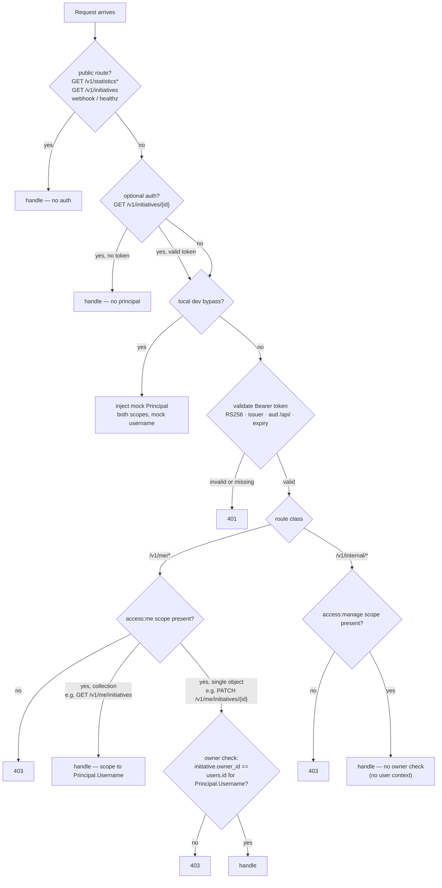

<!-- Copyright The Linux Foundation and each contributor to LFX. -->
<!-- SPDX-License-Identifier: MIT -->

# Authentication Architecture

**Status:** Target design — approved at architecture review (2026-06-04: Eric Searcy, Robert Detjens, Lewis Ojile).
**Not yet implemented.**

---

This document describes the **target** authentication design for the Crowdfunding (CF) platform and how
**LFX Self Serve ("LFX One")** and the **Reimbursement Service** authenticate to CF backend APIs.
It is written for architecture review. Scope is limited to **authentication only**; business logic
and data flows are out of scope.

> **This is a target-state document, not a description of current behavior.** The current code
> validates JWTs on every `/v1/*` route but does **not** yet enforce scopes, does **not** split
> routes into `/me/*` and `/internal/*` classes, and still carries the `AUTHORIZED_CLIENTS` +
> `X-Username` mechanism from the prior design. Everything below describes the state we are
> building toward. Implementation tracking is out of scope for this doc.

---

## Design Rules

These rules, set at the architecture review, constrain every decision in this document:

1. **Two scopes, one resource server.** `access:me` for user-issued tokens; `access:manage` for
   M2M tokens. Both validate against the single `lfx_crowdfunding_api` resource server (`/api/`).
2. **A route serves exactly one scope — never both.** If an operation is needed by both a user and
   a machine, it is split into two distinct routes (one under `/me/*`, one under `/internal/*`).
   Eric was explicit: *"I would not design your API that way"* — no single endpoint accepts both
   `access:me` and `access:manage`.
3. **User-facing routes carry identity in the token.** No identity header. The acting user is the
   `username` JWT claim. This is why Self Serve forwards the user's own token rather than an M2M token.
4. **Object-level authorization lives in the resource server, not the token.** A valid `access:me`
   token proves *who* you are; the CF API still checks *whether you own* the object you are touching.

---

## Actors & Trust Boundaries

| Actor | Type | Notes |
|---|---|---|
| **Browser** | Untrusted client | Never receives access tokens directly |
| **CF Nuxt BFF** | Trusted server | Holds tokens in HTTP-only cookies; proxies requests to CF API |
| **CF Go API** (`initiatives-api`) | Trusted server | Validates JWTs; the protected resource server |
| **Auth0** (`linuxfoundation-{dev,staging}.auth0.com`) | Identity provider | Issues all tokens; hosts JWKS endpoint |
| **LFX Self Serve Express BFF** | Trusted server | Proxies user-issued access tokens on behalf of the logged-in user |
| **Reimbursement Service** | Trusted server | M2M caller; uses `access:manage` scope for privileged routes |

**Key principle:** access tokens never reach the browser. Both BFFs hold them server-side
(HTTP-only cookies in CF; forwarded from the user session in Self Serve) and attach them on the
server when making upstream API calls.

---

## Overview



---

## Two Scopes, One Resource Server

The CF API uses a single Auth0 resource server (`lfx_crowdfunding_api`, audience `/api/`) with two
scopes that gate access to different route classes:

| Scope | Issued to | Route class | Identity source |
|---|---|---|---|
| `access:me` | Users (via interactive login) | `/v1/me/*` — everything a user does on their own data (initiatives, donations, subscriptions, payment methods) | `https://sso.linuxfoundation.org/claims/username` JWT claim |
| `access:manage` | M2M clients (client_credentials) | `/v1/internal/*` — machine-to-machine, no user context (Reimbursement Service) | `sub` claim (Auth0 M2M client subject; no user identity) |

This replaces the previous `access:api` single-scope + `AUTHORIZED_CLIENTS` allowlist pattern.
The scope itself is the access control gate; no client ID allowlist is needed.

> **Note on user-facing writes.** Creating, editing, donating to, and subscribing to initiatives
> are **user** actions and live under `access:me`, not `access:manage`. `access:manage` is reserved
> for genuine machine-to-machine traffic with no logged-in user — currently only the Reimbursement
> Service (see Flow 3). The `/internal/` path prefix signals this at a glance.

---

## Flow 1 — CF End-User Authentication (Nuxt BFF)

The CF Nuxt BFF acts as an OAuth2 confidential client. All token handling is server-side.
The browser participates in the authorization code flow but never receives an access token.

### 1.1 Login



The `access:me` scope **must** be in the authorization request — otherwise the resulting access
token will not carry it and the CF API will reject every protected call with 403. Both the CF
frontend client and the Self Serve client must request `access:me` on the CF audience.

### 1.2 Callback & Token Storage



Cookie details:
- `auth_oidc_token` — the Auth0 access token (`access:me` scope) forwarded to the CF Go API as a Bearer token
- `auth_refresh_token` — used to silently refresh; 30-day TTL
- `auth_user_profile` — base64 JSON of display claims (name, email, username); **unsigned, for display only, never for authorization**
- All cookies: `httpOnly: true`, `secure` (non-local), `sameSite: lax`

### 1.3 Authenticated API Call



### 1.4 Token Refresh

`POST /api/auth/refresh` calls `refreshTokenGrant` with the stored refresh token, rotates
`auth_oidc_token` and `auth_refresh_token`. On any failure all auth cookies are cleared and
the client receives 401 (forcing a new login).

---

## Flow 2 — Self Serve → CF API (User Token)

Self Serve proxies the logged-in user's **own** access token to the CF API. There is no M2M token
exchange and no identity header — the user token carries the user's identity via the
`https://sso.linuxfoundation.org/claims/username` claim, same as the CF frontend.

This is correct because all SS→CF calls are me-style endpoints: `/v1/me/donations`,
`/v1/me/subscriptions`, `/v1/me/payment-account`, etc. The user is always acting on their own
data; no impersonation scope is needed at the CF layer.



---

## Flow 3 — Reimbursement Service → CF API (M2M)

The Reimbursement Service is a machine-to-machine caller. It does **not** call CF today; this is a
target integration. When processing mentorship reimbursements, it needs to read CF data for
**mentorship-type initiatives** — specifically the initiative **owner** and its **beneficiaries
(the selected mentees)** — to attribute and validate reimbursement requests.

There is no logged-in user in this flow, so the user-token pattern does not apply. Reimbursement
authenticates as itself via the **Auth0 client credentials grant** with the `access:manage` scope,
and calls a dedicated **`/v1/internal/*`** route. The access is **read-only**.

### 3.1 Suggested Endpoint

```
GET /v1/internal/initiatives/{id}
  Authorization: Bearer {M2M token, access:manage}

  200 →
  {
    "id":             "…",
    "initiative_type": "mentee",
    "owner": {
      "username":   "…",          // from initiatives.owner_id → users
      "email":      "…",
      "given_name": "…",
      "family_name":"…"
    },
    "beneficiaries": [             // from initiative_beneficiaries
      { "name": "…", "email": "…" }
    ]
  }
```

A list variant (`GET /v1/internal/initiatives?type=mentee&project={id}`) can be added if
Reimbursement needs to enumerate rather than look up by ID. Both are read-only; if Reimbursement
later needs to write back to CF, that would be a separate `POST/PATCH /v1/internal/*` route — still
under `access:manage`, never mixed with a read route (Design Rule 2).

### 3.2 Token Acquisition



### 3.3 Internal API Call



---

## Go API Authorization Decision Tree

The same `JWTAuthenticator.Middleware` handles all token types. After JWT validation, route class
and scope determine what happens next:



---

## Route Authentication Tiers (target)

This is the route shape we are building toward. It requires restructuring the current API: the
existing dual-purpose `/v1/initiatives/{id}` (which today serves both public reads and authenticated
edits) is split so that user-scoped operations move under `/v1/me/*` and machine operations move
under `/v1/internal/*`, per Design Rule 2.

| Tier | Routes | Auth mechanism |
|---|---|---|
| **No auth** | `GET /livez`, `/healthz`, `/readyz` | None |
| **No auth** | `POST /v1/stripe/webhook` | Stripe HMAC signature (separate from JWT) |
| **No auth** | `GET /v1/statistics*`, `GET /v1/initiatives`, `GET /v1/initiatives/{id}/transactions` | None — fully public data |
| **Optional auth** | `GET /v1/initiatives/{id}` | `OptionalMiddleware` — attaches Principal if a valid Bearer is present; never rejects. Lets approvers view unpublished initiatives. |
| **`access:me`** | `GET /v1/me/initiatives`, `GET /v1/me/donations`, `GET /v1/me/subscriptions`, `GET /v1/me/payment-account`, `POST /v1/me/setup-intent`, `POST /v1/me/payment-method`, `DELETE /v1/me/payment-method`, `POST /v1/me/presigned-url` | `Middleware` — 401 on missing/invalid token; 403 if `access:me` absent. Collection scoped to the token's `username`. |
| **`access:me` + owner check** | `GET /v1/me/initiatives/{id}`, `PATCH /v1/me/initiatives/{id}`, `DELETE /v1/me/initiatives/{id}`, plus the donation/subscription writes a user performs on an initiative | As above, plus DB lookup: `initiative.owner_id == users.id` for the token's `username`. 403 if not owned. |
| **`access:manage`** | `GET /v1/internal/initiatives/{id}` (Reimbursement: mentorship owner + beneficiaries); future `/v1/internal/*` | `Middleware` — 403 if `access:manage` absent. No owner check (no user context). |

> **Approval routes.** Initiative approval (`process-approval`) is gated by the `ALLOWED_APPROVERS`
> username list at the handler level. Approvers are real users, so this stays under `access:me`;
> the approver list is an additional handler-level authorization check, independent of scope.

---

## Auth0 Terraform — Required Changes

### Resource server scopes

Replace the single `access:api` scope with two scopes on `lfx_crowdfunding_api`:

```hcl
resource "auth0_resource_server_scopes" "lfx_crowdfunding_api" {
  resource_server_identifier = auth0_resource_server.lfx_crowdfunding_api.identifier

  scopes {
    name        = "access:me"
    description = "Access LFX Crowdfunding API as an authenticated user (me-style endpoints)"
  }

  scopes {
    name        = "access:manage"
    description = "Privileged access to LFX Crowdfunding API (M2M, initiative management)"
  }
}
```

### Client grants

**CF frontend (Nuxt BFF)** — already has a client grant; update scope from `access:api` to `access:me`.

**Self Serve** — already has a client grant; update scope from `access:api` to `access:me`. No M2M client grant needed.

**Reimbursement Service** — new client grant with `access:manage` scope:

```hcl
resource "auth0_client_grant" "reimbursement_crowdfunding" {
  client_id  = auth0_client.reimbursement_service.id
  audience   = auth0_resource_server.lfx_crowdfunding_api.identifier
  scopes     = ["access:manage"]
  depends_on = [auth0_resource_server_scopes.lfx_crowdfunding_api]
}
```

---

## Configuration Reference

### CF Backend (`initiatives-api`)

| Env var | Purpose | Dev value |
|---|---|---|
| `JWKS_URL` | Auth0 JWKS endpoint | `https://linuxfoundation-dev.auth0.com/.well-known/jwks.json` |
| `JWT_ISSUER` | Expected `iss` claim | `https://linuxfoundation-dev.auth0.com/` |
| `JWT_AUDIENCE` | Expected `aud` claim | `https://crowdfunding.dev.lfx.dev/api/` |
| `ALLOW_MOCK_LOCAL_PRINCIPAL_BYPASS` | Local-dev: skip JWKS, inject mock Principal with both scopes | not set in deployed envs |

> **Removed:** `AUTHORIZED_CLIENTS`. The scope-based model does not require a client ID allowlist.

### CF Frontend (Nuxt BFF)

| Env var | Purpose |
|---|---|
| `NUXT_PUBLIC_AUTH0_DOMAIN` | Auth0 tenant (`https://linuxfoundation-dev.auth0.com`) |
| `NUXT_PUBLIC_AUTH0_CLIENT_ID` | SPA / BFF client ID |
| `NUXT_AUTH0_CLIENT_SECRET` | Client secret (server-only; confidential client) |
| `NUXT_PUBLIC_AUTH0_AUDIENCE` | Token audience (`https://crowdfunding.dev.lfx.dev/api/`) |
| `NUXT_PUBLIC_AUTH0_REDIRECT_URI` | OAuth2 callback URL |
| `NUXT_API_BASE_URL` | CF Go API base URL (server-internal, default `http://localhost:8080`) |
| `NUXT_JWT_SECRET` | Session cookie signing secret |

### LFX Self Serve (Express BFF)

No M2M credentials needed for CF. The user's access token is forwarded directly.

| Env var | Purpose |
|---|---|
| `CROWDFUNDING_API_BASE_URL` | CF API base URL (`https://crowdfunding-api.dev.lfx.dev`) |

### Reimbursement Service

| Env var | Purpose |
|---|---|
| `CF_M2M_CLIENT_ID` | Auth0 M2M client ID for CF API |
| `CF_M2M_CLIENT_SECRET` | Auth0 M2M client secret |
| `CF_M2M_ISSUER_BASE_URL` | Auth0 token endpoint base URL |
| `CF_API_BASE_URL` | CF API base URL |
| `CF_API_AUDIENCE` | CF API audience (`https://crowdfunding.{env}.lfx.dev/api/`) |

---

## Migration from Previous Design

The previous design used a single `access:api` scope with an `AUTHORIZED_CLIENTS` allowlist and
`X-Username` header impersonation to distinguish M2M callers (Self Serve) from user callers.

| Previous | New |
|---|---|
| `access:api` on all tokens | `access:me` for users, `access:manage` for M2M |
| `AUTHORIZED_CLIENTS` allowlist + `X-Username` header | Scope-based; no allowlist, no identity header |
| Self Serve uses M2M client credentials | Self Serve forwards user's own access token |
| Single dual-purpose `/v1/initiatives/{id}` (read + edit) | Split: user edits under `/v1/me/initiatives/{id}`, machine reads under `/v1/internal/initiatives/{id}` |

The `X-Username` header and `AUTHORIZED_CLIENTS` env var are **removed**. The ingress no longer
needs to strip `X-Username` headers.

---

## Known Deviations & Future Direction

This design is a deliberate, scoped-for-launch choice. Two points an architecture reviewer should
note:

**CF sits outside the platform API gateway (Heimdall).** Every other LFX v2 service is fronted by
Heimdall, which normalizes authentication centrally. CF instead validates JWTs and enforces scopes
itself. This is the reason `access:manage` and the owner check exist in CF code rather than at the
gateway. Adding Heimdall later would normalize both user and M2M tokens through the platform gateway
and is the expected long-term direction; the scope-based design here does not block that migration.

**Object-level authorization is hand-rolled, not OpenFGA.** The owner check (`initiative.owner_id ==
caller`) is a direct DB lookup. This is sufficient for single-owner initiatives at launch. The
platform standard for fine-grained access control is OpenFGA, which would also enable richer rules
(e.g. *"maintainers of the linked project may also manage this initiative"* or multi-owner/admin
initiatives). Eric flagged OpenFGA as the idiomatic path if/when ownership rules grow beyond a
single owner. Not in scope now.

---

## Related Documents

- [`08-self-serve-auth.md`](08-self-serve-auth.md) — Self Serve integration rationale and impersonation handling. **Note:** §2–§4 of that doc still describe the prior M2M + `X-Username` mechanism and are superseded by this document for the auth mechanism.
- [`04-target-architecture.md`](04-target-architecture.md) — overall target architecture including Auth0 tenant topology
