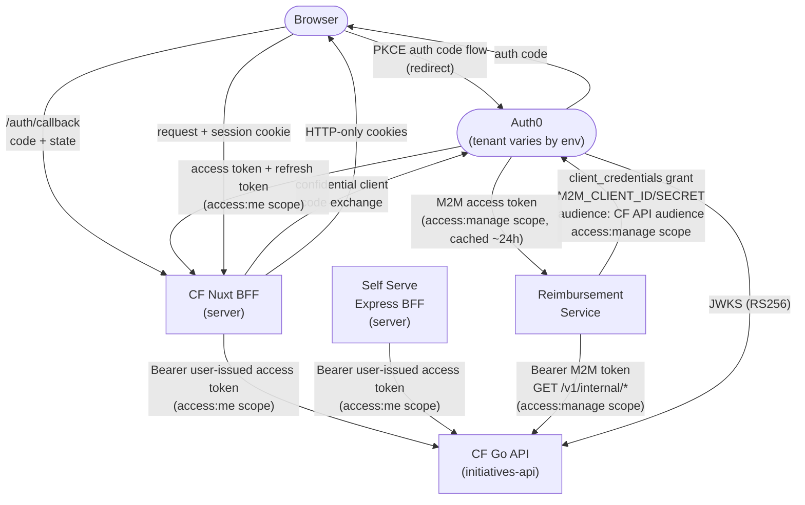
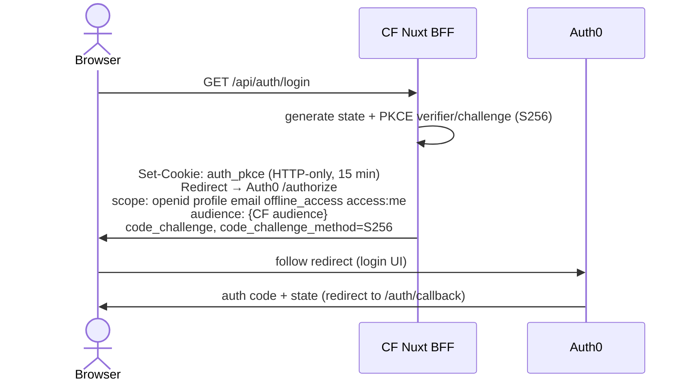
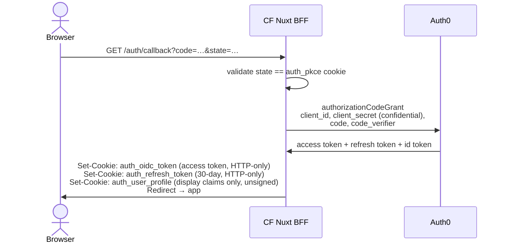
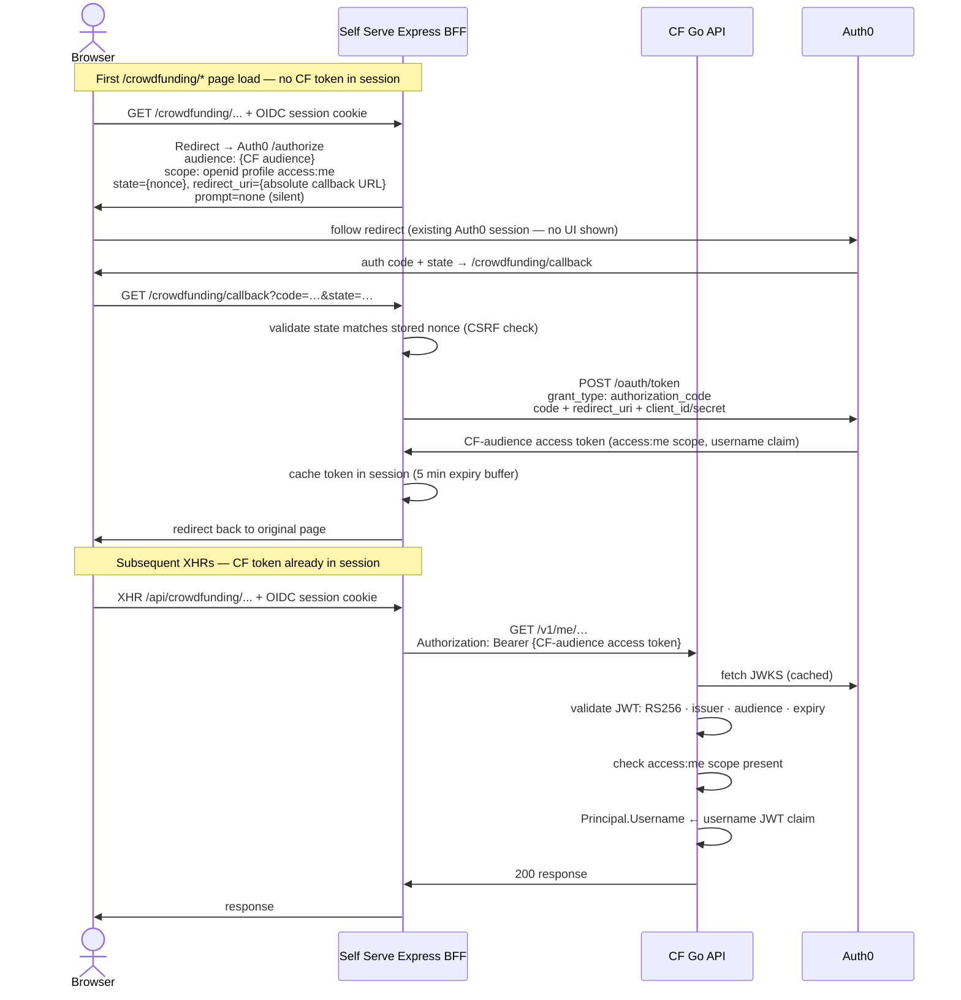
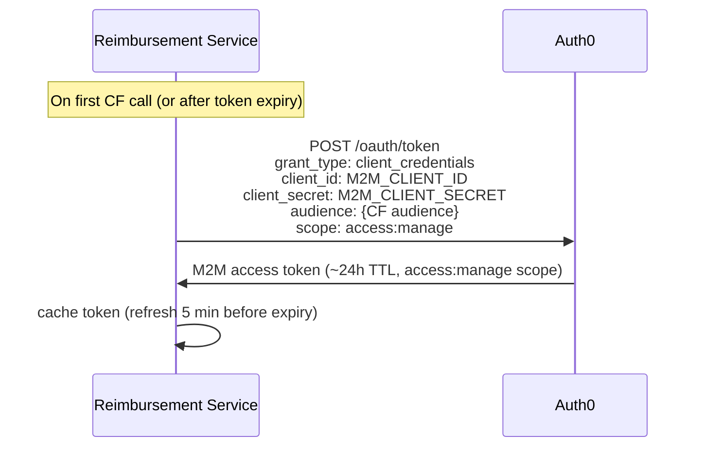
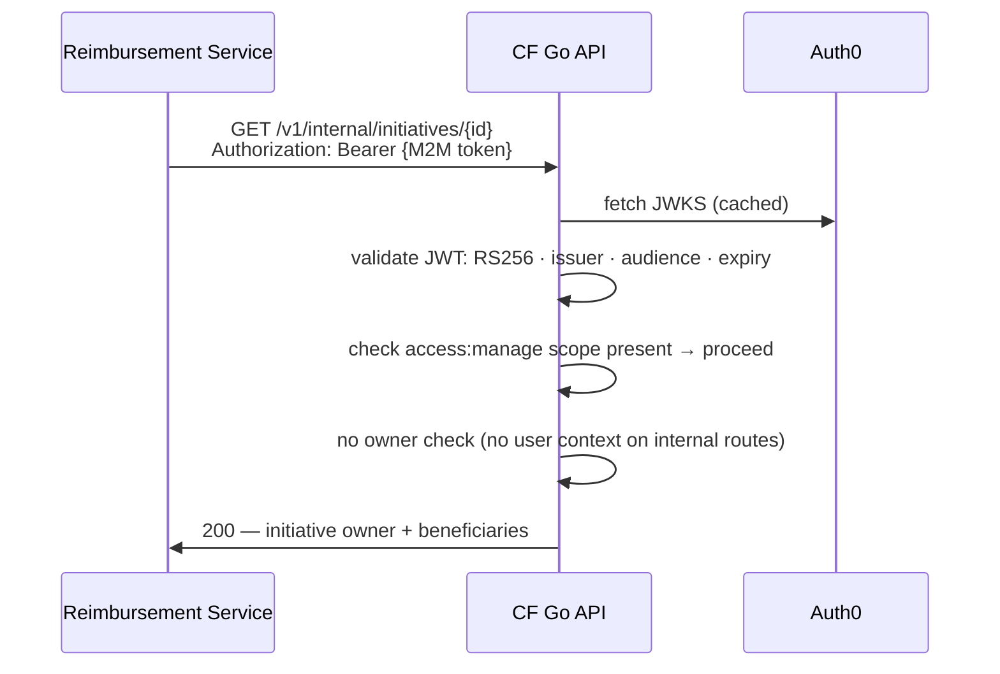
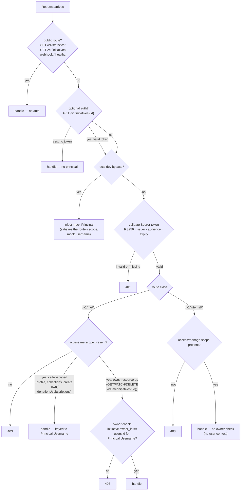

<!-- Copyright The Linux Foundation and each contributor to LFX. -->
<!-- SPDX-License-Identifier: MIT -->

# Authentication Architecture

---

This document describes the **target** authentication design for the Crowdfunding (CF) platform and how
**LFX Self Serve** and the **Reimbursement Service** authenticate to CF backend APIs.
It is written for architecture review. Scope is limited to **authentication only**; business logic
and data flows are out of scope.

---

## Design Rules

These rules, set at the architecture review, constrain every decision in this document:

1. **Two scopes, one resource server.** `access:me` for user-issued tokens; `access:manage` for
   M2M tokens. Both validate against the single `lfx_crowdfunding_api` resource server.
2. **A route serves exactly one scope — never both.** If an operation is needed by both a user and
   a machine, it is split into two distinct routes (one under `/me/*`, one under `/internal/*`).
   No single endpoint accepts both `access:me` and `access:manage`.
3. **User-facing routes carry identity in the token.** No identity header. The acting user is the
   **custom** `username` claim (`https://sso.linuxfoundation.org/claims/username`, added via an
   Auth0 Action). This is why Self Serve forwards the user's own access token rather than an M2M token.
4. **Object-level authorization lives in the resource server, not the token.** A valid `access:me`
   token proves *who* you are; the CF API still checks *whether you own* the object you are touching.

---

## Actors & Trust Boundaries

| Actor | Type | Notes |
|---|---|---|
| **Browser** | Untrusted client | Receives the access token only as an HTTP-only cookie — never exposed to client-side JavaScript |
| **CF Nuxt BFF** | Trusted server | Holds tokens in HTTP-only cookies; proxies requests to CF API |
| **CF Go API** (`initiatives-api`) | Trusted server | Validates JWTs; the protected resource server |
| **Auth0** | Identity provider | Issues all tokens; hosts JWKS endpoint. Tenant: `linuxfoundation-{dev,staging}.auth0.com` (dev/staging), `sso.linuxfoundation.org` (prod) |
| **LFX Self Serve Express BFF** | Trusted server | Proxies user-issued access tokens on behalf of the logged-in user |
| **Reimbursement Service** | Trusted server | M2M caller; uses `access:manage` scope for privileged routes |

**Key principle:** the access token is never exposed to client-side JavaScript. In CF it is stored
as an HTTP-only cookie (`auth_oidc_token`) the browser cannot read; in Self Serve it is held in the
server-side session. Both BFFs attach it on the server when making upstream API calls, so it is
never readable by page scripts or third parties. The token cookies should be **encrypted at rest**
(sealed), not stored as the raw token.

---

## Overview



---

## Two Scopes, One Resource Server

The CF API uses a single Auth0 resource server (`lfx_crowdfunding_api`) with two scopes that gate
access to different route classes.

The audience is environment-specific:

| Environment | Audience |
|---|---|
| dev | `https://crowdfunding-api.dev.lfx.dev` |
| staging | `https://crowdfunding-api.staging.lfx.dev` |
| prod | `https://crowdfunding-api.linuxfoundation.org` |

The exact value Auth0 issues and the API validates is the `JWT_AUDIENCE` env var (see
[Configuration Reference](#cf-backend-initiatives-api)). Diagrams in this doc use
`{CF audience}` as shorthand.

| Scope | Issued to | Route class | Identity source |
|---|---|---|---|
| `access:me` | Users (via interactive login) | `/v1/me/*` — everything a user does on their own data (initiatives, donations, subscriptions, payment methods) | `https://sso.linuxfoundation.org/claims/username` JWT claim |
| `access:manage` | M2M clients (client_credentials) | `/v1/internal/*` — machine-to-machine, no user context (Reimbursement Service) | `sub` claim (Auth0 M2M client subject; no user identity) |

The scope itself is the access control gate; no client ID allowlist is needed.

> **Identity claims.** The access token carries **only the username** (a custom claim, needed on
> every request for the owner check). All other profile fields — email, given/family name, avatar —
> are **not** put on the token; CF fetches them from Auth0 **`/userinfo`** at login sync
> (see [User Profile Sync](#user-profile-sync)).

> **Note on user-facing writes.** Creating, editing, donating to, and subscribing to initiatives
> are **user** actions and live under `access:me`, not `access:manage`. `access:manage` is reserved
> for genuine machine-to-machine traffic with no logged-in user — the Reimbursement Service
> (see Flow 3). The `/internal/` path prefix signals this at a glance.

---

## Flow 1 — CF End-User Authentication (Nuxt BFF)

The CF Nuxt BFF acts as an OAuth2 confidential client. All token handling is server-side.
The browser participates in the authorization code flow but never receives an access token.

### 1.1 Login



The `access:me` scope **must** be in the authorization request — otherwise the resulting access
token will not carry it and the CF API will reject every protected call with 403. Both the CF
frontend client and the Self Serve client must request `access:me` on the CF audience.

### 1.2 Callback & Token Storage



Cookie details:
- `auth_oidc_token` — the Auth0 access token (`access:me` scope) forwarded to the CF Go API as a Bearer token
- `auth_refresh_token` — used to silently refresh; 30-day TTL
- `auth_user_profile` — base64 JSON of display claims (name, email, username); **unsigned, for display only, never for authorization**
- All cookies: `httpOnly: true`, `secure` (non-local), `sameSite: lax`
- **Target requirement:** the token cookies (`auth_oidc_token`, `auth_refresh_token`) should be **encrypted at rest** rather than storing the raw token. Not yet implemented.

### 1.3 Authenticated API Call


### 1.4 Token Refresh

`POST /api/auth/refresh` calls `refreshTokenGrant` with the stored refresh token and sets a fresh
`auth_oidc_token`. If Auth0 returns a new refresh token (rotation), `auth_refresh_token` is updated
too; otherwise the existing one is kept. On any failure all auth cookies are cleared and the client
receives 401 (forcing a new login).

---

## Flow 2 — Self Serve → CF API (User Token)

Self Serve forwards a **user-issued access token scoped to the CF audience** to the CF API. There
is no M2M credential and no identity header — the token carries the user's identity via the
`https://sso.linuxfoundation.org/claims/username` claim, same as the CF frontend.

Because SS's primary login audience is the LFX V2 cluster (not CF), SS runs a **silent second
`authorization_code` flow** for the CF audience. This happens on the first top-level navigation to
a `/crowdfunding/*` page; the resulting token is cached in the server session. The redirect uses
`prompt=none` so it is invisible to the user when an Auth0 session already exists.

> **Why not a refresh-token exchange?** Auth0 ignores the `audience` parameter on a
> `grant_type=refresh_token` request and returns the primary LFX V2 cluster token, which CF
> rejects with 401. The second auth-code flow is the confirmed approach (validated with the LFX
> platform team, lfx-self-serve PR #901). No auth0-terraform client grant is required — Auth0's
> `allow_all` policy covers `authorization_code` flows without an explicit grant.

All SS→CF calls are me-style endpoints: `/v1/me/donations`, `/v1/me/subscriptions`,
`/v1/me/payment-account`, etc. Impersonation is handled entirely on the Self Serve side — CF
always sees a normal `access:me` user token.



> **Scope note.** The SS authorization request uses `openid profile access:me` — no `email` or
> `offline_access`. `email` is omitted because CF fetches profile data from Auth0 `/userinfo` at
> login sync (not from the token). `offline_access` is omitted because SS does not use a refresh
> token for CF — token renewal re-runs the silent auth-code flow instead.

---

## Flow 3 — Reimbursement Service → CF API (M2M)

The Reimbursement Service is a machine-to-machine caller. When processing mentorship
reimbursements, it reads CF data for **mentorship-type initiatives** — specifically the initiative
**owner** and its **beneficiaries (the selected mentees)** — to attribute and validate
reimbursement requests.

There is no logged-in user in this flow, so the user-token pattern does not apply. Reimbursement
authenticates as itself via the **Auth0 client credentials grant** (`client_id` / `client_secret`)
with the `access:manage` scope, and calls a dedicated **`/v1/internal/*`** route. The access is
**read-only**.

### 3.1 Suggested Endpoint

```
GET /v1/internal/initiatives/{id}
  Authorization: Bearer {M2M token, access:manage}

  200 →
  {
    "id":             "…",
    "initiative_type": "mentorship",
    "owner": {
      "username":   "…",          // from initiatives.owner_id → users
      "email":      "…",
      "given_name": "…",
      "family_name":"…"
    },
    "beneficiaries": [             // from initiative_beneficiaries
      { "name": "…", "email": "…" }
    ]
  }
```

A list variant (`GET /v1/internal/initiatives?type=mentorship&project={id}`) can be added if
Reimbursement needs to enumerate rather than look up by ID. Both are read-only.

### 3.2 Token Acquisition



### 3.3 Internal API Call



---

## User Profile Sync

CF needs the user's email, given/family name, and avatar (e.g. for donation display, sponsor
avatars, Stripe). These profile fields are **not** placed on the access token — only the username
is. CF fetches them from **Auth0 `/userinfo`** on **login sync** (the `PATCH /v1/me` call at
sign-in) and persists them to the `users` table. CF reads profile data from the `users` table
thereafter, so behavior is deterministic: a user who never completed sync has no row, and
user-scoped writes fail cleanly.

The `/userinfo` call is made by the **Go API** (not Nuxt) using the user's access token — Nuxt only
ever forwards the access token. Detailed design and implementation are owned by the sync handler
work; this document covers only the authentication boundary.

---

## Go API Authorization Decision Tree

The same `JWTAuthenticator.Middleware` handles all token types. After JWT validation, route class
and scope determine what happens next:



---

## Route Authentication Tiers

User-scoped operations live under `/v1/me/*` and machine operations under `/v1/internal/*`, so each
route belongs to exactly one scope (Design Rule 2).

The two `access:me` rows below are the **same scope** — they differ only in whether an additional
owner check runs after the scope is validated.

| Tier | Routes | Auth mechanism |
|---|---|---|
| **No auth** | `GET /livez`, `/healthz`, `/readyz` | None |
| **No auth** | `POST /v1/stripe/webhook` | Stripe HMAC signature (separate from JWT) |
| **No auth** | `GET /v1/statistics*`, `GET /v1/initiatives`, `GET /v1/initiatives/{id}/transactions` | None — fully public data |
| **Optional auth** | `GET /v1/initiatives/{id}` | `OptionalMiddleware` — attaches Principal if a valid Bearer is present; never rejects. Lets approvers view unpublished initiatives. |
| **`access:me`** (caller-scoped) | `PATCH /v1/me` (profile sync), `GET /v1/me/initiatives` (caller's own), `GET /v1/me/donations`, `GET /v1/me/subscriptions`, `GET /v1/me/payment-account`, `POST /v1/me/setup-intent`, `POST /v1/me/payment-method`, `DELETE /v1/me/payment-method`, `POST /v1/me/initiatives` (create — owner is always the caller), `POST /v1/me/initiatives/{id}/donations`, `POST /v1/me/initiatives/{id}/subscriptions`, `GET /v1/me/initiatives/{id}/donations`, `GET /v1/me/initiatives/{id}/subscriptions`, `POST /v1/me/presigned-url` | `Middleware` — 401 on missing/invalid token; 403 if `access:me` absent. The operation is keyed to the caller's `username` (collections filtered to the caller; donations/subscriptions recorded under the caller). No initiative-ownership check. |
| **`access:me` + owner check** | `GET /v1/me/initiatives/{id}`, `PATCH /v1/me/initiatives/{id}`, `DELETE /v1/me/initiatives/{id}`, `DELETE /v1/me/subscriptions/{id}` | As above, plus a DB lookup that the caller owns the resource (`initiative.owner_id == users.id` for the token's `username`). 403 if not owned. |
| **`access:manage`** | `GET /v1/internal/initiatives/{id}` (Reimbursement: mentorship owner + beneficiaries); future `/v1/internal/*` | `Middleware` — 403 if `access:manage` absent. No owner check (no user context). |

> **Approval routes.** Initiative approval (`process-approval`) is gated by the `ALLOWED_APPROVERS`
> username list at the handler level. Approvers are real users, so this stays under `access:me`;
> the approver list is an additional handler-level authorization check, independent of scope.

---

## Auth0 Terraform

### Resource server scopes

The `lfx_crowdfunding_api` resource server defines two scopes:

```hcl
resource "auth0_resource_server_scopes" "lfx_crowdfunding_api" {
  resource_server_identifier = auth0_resource_server.lfx_crowdfunding_api.identifier

  scopes {
    name        = "access:me"
    description = "Access LFX Crowdfunding API as an authenticated user (me-style endpoints)"
  }

  scopes {
    name        = "access:manage"
    description = "Privileged access to LFX Crowdfunding API (M2M, /v1/internal/* routes)"
  }
}
```

### Client grants

`lfx_crowdfunding_api` uses `user { policy = "allow_all" }`, so single-audience user-facing clients
need **no** client grant — `access:me` is consented when the user logs in interactively.

**CF frontend (Nuxt BFF)** — no client grant. Logs in with the CF audience as its primary
`audience` parameter and forwards `req.bearerToken` directly to CF.

**Self Serve** — no client grant needed. SS uses a silent second `authorization_code` flow for the
CF audience (see Flow 2). Auth0's `allow_all` policy covers `authorization_code` flows without an
explicit client grant, so no terraform change is required. The resulting token is user-scoped —
it carries the user's identity (`access:me` scope, username claim).

**Reimbursement Service** — the only M2M client grant, for `access:manage` access:

```hcl
resource "auth0_client_grant" "reimbursement_crowdfunding" {
  client_id  = auth0_client.m2m_clients["Reimbursement Service"].id
  audience   = auth0_resource_server.lfx_crowdfunding_api.identifier
  scopes     = ["access:manage"]
  depends_on = [auth0_resource_server_scopes.lfx_crowdfunding_api]
}
```

The Reimbursement Service client authenticates with **`client_id` / `client_secret`** (the service
is an existing Lambda already using client-secret auth, so it moves onto its own dedicated CF client
without new code). The secret is generated in Auth0; because the service runs in a separate AWS
account, it is provided via the service's own deployment secrets (see Configuration Reference)
rather than the LFX secrets-distribution pipeline.

---

## Configuration Reference

### CF Backend (`initiatives-api`)

| Env var | Purpose | Example values |
|---|---|---|
| `JWKS_URL` | Auth0 JWKS endpoint | dev/staging: `https://linuxfoundation-{dev,staging}.auth0.com/.well-known/jwks.json`<br/>prod: `https://sso.linuxfoundation.org/.well-known/jwks.json` |
| `JWT_ISSUER` | Expected `iss` claim | dev/staging: `https://linuxfoundation-{dev,staging}.auth0.com/`<br/>prod: `https://sso.linuxfoundation.org/` |
| `JWT_AUDIENCE` | Expected `aud` claim | `https://crowdfunding-api.{dev,staging}.lfx.dev` / `https://crowdfunding-api.linuxfoundation.org` |
| `ALLOW_MOCK_LOCAL_PRINCIPAL_BYPASS` | Local-dev safety gate — must be `true` to permit `DISABLED_MOCK_LOCAL_PRINCIPAL`. Does nothing on its own. | not set in deployed envs |
| `DISABLED_MOCK_LOCAL_PRINCIPAL` | Local-dev only: when set (and the gate above is `true`), skips JWKS and injects this static mock Principal. Mutually exclusive with `JWKS_URL`. | not set in deployed envs |

### CF Frontend (Nuxt BFF)

| Env var | Purpose |
|---|---|
| `NUXT_PUBLIC_AUTH0_DOMAIN` | Auth0 tenant (e.g. `https://linuxfoundation-staging.auth0.com`, `https://sso.linuxfoundation.org`) |
| `NUXT_PUBLIC_AUTH0_CLIENT_ID` | SPA / BFF client ID |
| `NUXT_AUTH0_CLIENT_SECRET` | Client secret (server-only; confidential client) |
| `NUXT_PUBLIC_AUTH0_AUDIENCE` | Token audience (e.g. `https://crowdfunding-api.staging.lfx.dev`) |
| `NUXT_PUBLIC_AUTH0_REDIRECT_URI` | OAuth2 callback URL |
| `NUXT_API_BASE_URL` | CF Go API base URL (server-internal, default `http://localhost:8080`) |
| `NUXT_AUTH0_COOKIE_DOMAIN` | Cookie domain scope for the auth cookies (required in production) |

### LFX Self Serve (Express BFF)

No M2M credentials needed for CF. The token forwarded is a user-issued access token obtained via
a silent second `authorization_code` flow for the CF audience — not a service credential.
The LFX One app client (`PCC_AUTH0_CLIENT_ID` / `PCC_AUTH0_CLIENT_SECRET`) is reused; no
dedicated CF client credentials are needed.

| Env var | Purpose | Example value (staging) |
|---|---|---|
| `CROWDFUNDING_API_BASE_URL` | CF API base URL | `https://crowdfunding-api.staging.lfx.dev` |
| `CROWDFUNDING_API_AUDIENCE` | CF resource server identifier — used as `audience` in the auth-code flow | `https://crowdfunding-api.staging.lfx.dev` |
| `CROWDFUNDING_REDIRECT_URI` | Auth0 callback URL for the second auth-code flow — defaults to `{PCC_BASE_URL}/crowdfunding/callback` if unset | not set in ArgoCD (default used) |

### Reimbursement Service

The Reimbursement Service needs the following inputs to mint an M2M token and call CF. It is a
Serverless/Lambda app in a separate AWS account, so it reads these from its **own GitHub Actions
secrets** (the credential is copied there from Auth0); it is not wired into the LFX
secrets-distribution pipeline. Exact env-var names are owned by that repo.

| Input | Value |
|---|---|
| Auth0 M2M client ID | the `Reimbursement Service` Auth0 client (auth0-terraform) |
| Auth0 M2M client secret | the client's secret (`client_id` / `client_secret` auth) |
| Auth0 token endpoint | dev/staging: `https://linuxfoundation-{dev,staging}.auth0.com/oauth/token`<br/>prod: `https://sso.linuxfoundation.org/oauth/token` |
| CF API audience | `https://crowdfunding-api.{dev,staging}.lfx.dev` / `https://crowdfunding-api.linuxfoundation.org` (scope `access:manage`) |
| CF API base URL | same as audience (e.g. `https://crowdfunding-api.staging.lfx.dev`) |

---

## Known Deviations & Future Direction

This design is a deliberate, scoped-for-launch choice. Two points an architecture reviewer should
note:

**CF sits outside the platform API gateway (Heimdall).** Every other LFX v2 service is fronted by
Heimdall, which normalizes authentication centrally. CF instead validates JWTs and enforces scopes
itself. This is the reason `access:manage` and the owner check exist in CF code rather than at the
gateway. Adding Heimdall later would normalize both user and M2M tokens through the platform gateway
and is the expected long-term direction; the scope-based design here does not block that migration.

**Object-level authorization is hand-rolled, not OpenFGA.** The owner check (`initiative.owner_id ==
caller`) is a direct DB lookup. This is sufficient for single-owner initiatives at launch. The
platform standard for fine-grained access control is OpenFGA, which would also enable richer rules
(e.g. *"maintainers of the linked project may also manage this initiative"* or multi-owner/admin
initiatives). OpenFGA is the idiomatic path if/when ownership rules grow beyond a single owner. Not
in scope now.

---

## Related Documents

- [`08-self-serve-auth.md`](08-self-serve-auth.md) — Self Serve integration rationale
- [`04-target-architecture.md`](04-target-architecture.md) — overall target architecture including Auth0 tenant topology
