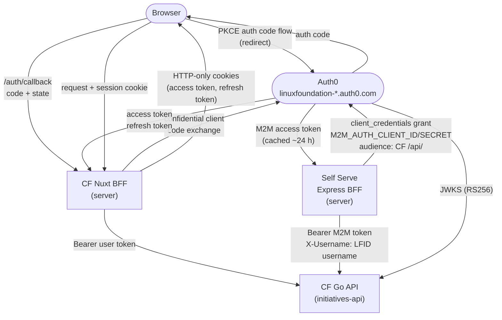
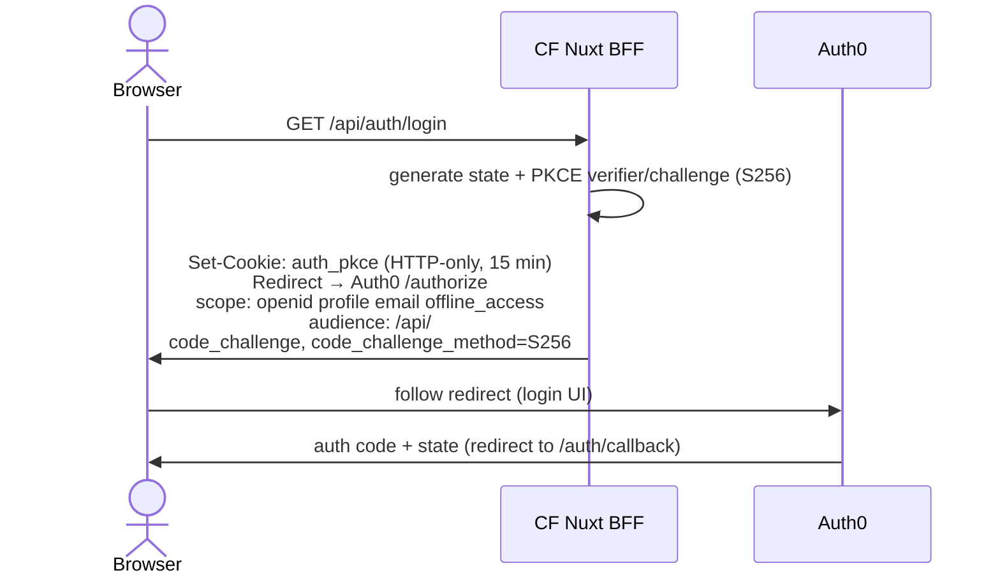
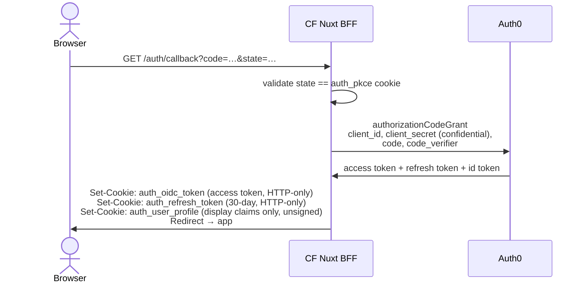
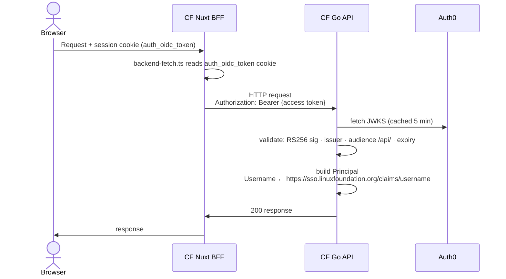
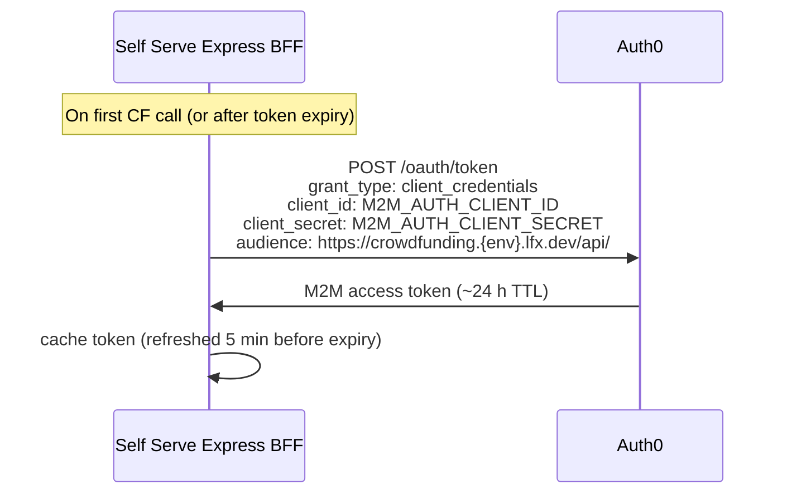
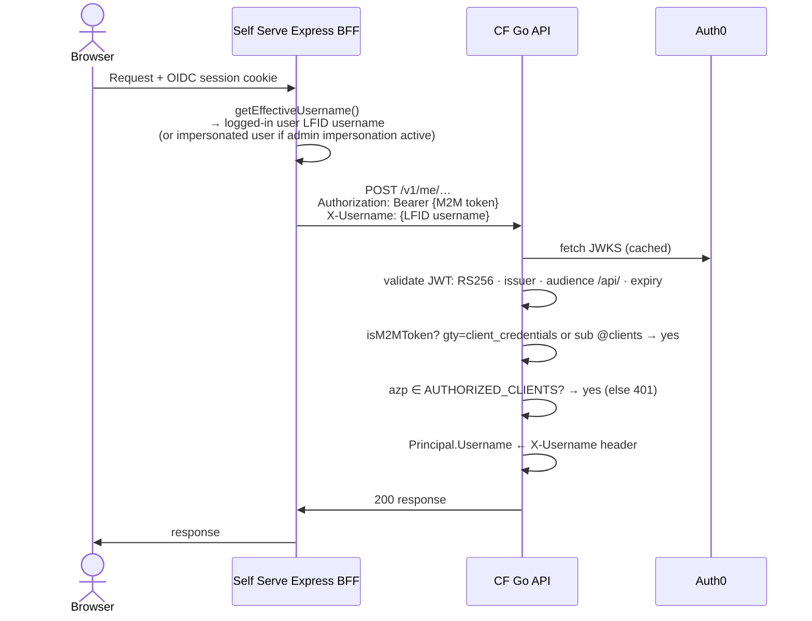
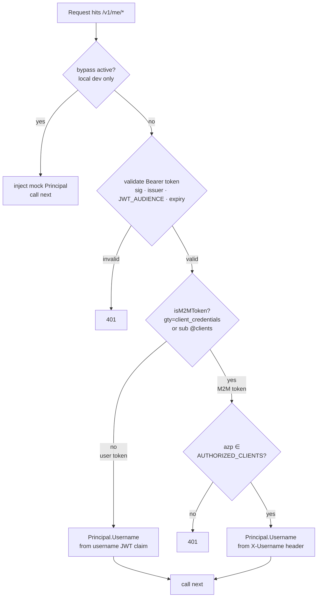

<!-- Copyright The Linux Foundation and each contributor to LFX. -->
<!-- SPDX-License-Identifier: MIT -->

# Authentication Architecture

---

This document describes how authentication works in the Crowdfunding (CF) platform and how
**LFX Self Serve ("LFX One")** authenticates to CF backend APIs. It is written for architecture
review. Scope is limited to **authentication only**; business logic and data flows are out of
scope.

---

## Actors & Trust Boundaries

| Actor | Type | Notes |
|---|---|---|
| **Browser** | Untrusted client | Never receives access tokens directly |
| **CF Nuxt BFF** | Trusted server | Holds tokens in HTTP-only cookies; proxies requests to CF API |
| **CF Go API** (`initiatives-api`) | Trusted server | Validates JWTs; the protected resource |
| **Auth0** (`linuxfoundation-{dev,staging}.auth0.com`) | Identity provider | Issues all tokens; hosts JWKS endpoint |
| **LFX Self Serve Express BFF** | Trusted server | Holds M2M token in memory; proxies requests on behalf of the logged-in user |

**Key principle:** access tokens never reach the browser. Both BFFs hold them server-side
(HTTP-only cookies in CF; in-memory cache in Self Serve) and attach them on the server when
making upstream API calls.

---

## Overview



---

## Flow 1 — CF End-User Authentication

The CF Nuxt BFF acts as an OAuth2 confidential client. All token handling is server-side.
The browser participates in the authorization code flow but never receives an access token.

### 1.1 Login



### 1.2 Callback & Token Storage



Cookie details:
- `auth_oidc_token` — the Auth0 access token forwarded to the CF Go API as a Bearer token
- `auth_refresh_token` — used to silently refresh; 30-day TTL
- `auth_user_profile` — base64 JSON of display claims (name, email, username); **unsigned, for display only, never for authorization**
- All cookies: `httpOnly: true`, `secure` (non-local), `sameSite: lax`

### 1.3 Authenticated API Call



### 1.4 Token Refresh

`POST /api/auth/refresh` calls `refreshTokenGrant` with the stored refresh token, rotates
`auth_oidc_token` and `auth_refresh_token`. On any failure all auth cookies are cleared and
the client receives 401 (forcing a new login).

---

## Flow 2 — Self Serve → CF API (M2M)

Self Serve uses the **Auth0 client credentials grant** to obtain a machine-to-machine token for
the CF API audience (`/api/`). The user's identity is communicated explicitly via an
`X-Username` header. This pattern mirrors the existing `CdpService` in the Self Serve codebase.

### 2.1 Token Acquisition (once per server lifetime / per token TTL)



### 2.2 Proxied Request to CF API



### 2.3 CF JWT Middleware Decision Logic

The same `JWTAuthenticator.Middleware` handles both user tokens and M2M tokens:



**Security control:** The CF backend ingress (public HTTPS) **must strip any client-supplied
`X-Username` header** before forwarding to the Go API. The `AUTHORIZED_CLIENTS` allowlist is
the server-side gate; stripping at ingress prevents an unauthenticated caller from setting the
header directly.

---

## Authorization Model

Authentication establishes identity; authorization determines what that identity may do.

| Mechanism | Scope |
|---|---|
| **Auth0 JWT validation** (JWKS, RS256) | Every protected route. Single resource server `lfx_crowdfunding_api` (`/api/`) used for both user tokens and M2M tokens. |
| **`AUTHORIZED_CLIENTS` allowlist** | Restricts which Auth0 client IDs may call the API (M2M and user SPAs). Also gates `X-Username` header trust — only clients in the allowlist may set it. When the list is empty, all valid tokens pass. |
| **`ALLOWED_APPROVERS`** | Username list checked at the handler level for initiative approval actions. |
| **`access:api` scope** | Granted in Auth0 on the `lfx_crowdfunding_api` resource server. Not currently enforced in application code; authorization is via the client allowlist above. |

---

## Route Authentication Tiers

| Tier | Routes | Auth mechanism |
|---|---|---|
| **No auth** | `GET /livez`, `/healthz`, `/readyz` | None |
| **No auth** | `POST /v1/stripe/webhook` | Stripe HMAC signature (separate from JWT) |
| **No auth** | `GET /v1/statistics*`, `GET /v1/initiatives`, `GET /v1/initiatives/{id}/transactions` | None |
| **Optional auth** | `GET /v1/initiatives/{id}` | `OptionalMiddleware` — attaches Principal if a valid Bearer token is present; never rejects. Allows approvers to view unpublished initiatives. |
| **Required auth** | All other `/v1/*` routes (initiative write, donations/subscriptions write, `/me/*`, `/presigned-url`) | `Middleware` — rejects with 401 on missing or invalid token. |

---

## Auth0 Terraform — Required Grant

The Self Serve M2M client (`lfx_one`) requires a single client grant on the existing
`lfx_crowdfunding_api` resource server. No new resource server is needed:

```hcl
resource "auth0_client_grant" "lfxone_crowdfunding" {
  client_id  = auth0_client.lfx_one.id
  audience   = auth0_resource_server.lfx_crowdfunding_api.identifier
  scopes     = ["access:api"]
  depends_on = [auth0_resource_server_scopes.lfx_crowdfunding_api]
}
```

---

## Configuration Reference

All values are environment-driven. Defaults shown are for dev.

### CF Backend (`initiatives-api`)

| Env var | Purpose | Dev value |
|---|---|---|
| `JWKS_URL` | Auth0 JWKS endpoint for signature verification | `https://linuxfoundation-dev.auth0.com/.well-known/jwks.json` |
| `JWT_ISSUER` | Expected `iss` claim | `https://linuxfoundation-dev.auth0.com/` |
| `JWT_AUDIENCE` | Expected `aud` claim | `https://crowdfunding.dev.lfx.dev/api/` |
| `AUTHORIZED_CLIENTS` | Comma-separated Auth0 client IDs allowed to call the API; gates `X-Username` trust for M2M callers | injected from ESO secret (`lfx_one_client_id`) |
| `ALLOW_MOCK_LOCAL_PRINCIPAL_BYPASS` + `DISABLED_MOCK_LOCAL_PRINCIPAL` | Local-dev only: skip JWKS and inject a static Principal | not set in deployed envs |

### CF Frontend (Nuxt BFF)

| Env var | Purpose |
|---|---|
| `NUXT_PUBLIC_AUTH0_DOMAIN` | Auth0 tenant (`https://linuxfoundation-dev.auth0.com`) |
| `NUXT_PUBLIC_AUTH0_CLIENT_ID` | SPA / BFF client ID |
| `NUXT_AUTH0_CLIENT_SECRET` | Client secret (server-only; confidential client) |
| `NUXT_PUBLIC_AUTH0_AUDIENCE` | Token audience (`https://crowdfunding.dev.lfx.dev/api/`) |
| `NUXT_PUBLIC_AUTH0_REDIRECT_URI` | OAuth2 callback URL |
| `NUXT_API_BASE_URL` | CF Go API base URL (server-internal, default `http://localhost:8080`) |
| `NUXT_JWT_SECRET` | Session cookie signing secret |

### LFX Self Serve (Express BFF)

| Env var | Purpose |
|---|---|
| `M2M_AUTH_CLIENT_ID` | Auth0 M2M client ID (dedicated SS M2M application) |
| `M2M_AUTH_CLIENT_SECRET` | Auth0 M2M client secret |
| `M2M_AUTH_ISSUER_BASE_URL` | Auth0 token endpoint base URL |
| `CROWDFUNDING_API_BASE_URL` | CF API base URL (`https://crowdfunding-api.dev.lfx.dev`) |
| `CROWDFUNDING_API_AUDIENCE` | CF API audience for `client_credentials` grant (`https://crowdfunding.dev.lfx.dev/api/`) |

---

## Related Documents

- [`08-self-serve-auth.md`](08-self-serve-auth.md) — detailed M2M design rationale, impersonation
  handling, required Terraform and ArgoCD changes
- [`04-target-architecture.md`](04-target-architecture.md) — overall target architecture including
  Auth0 tenant topology
