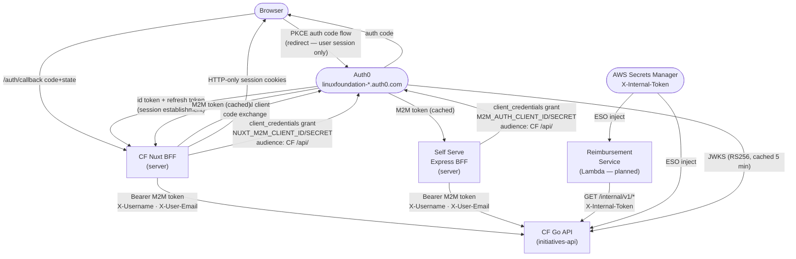
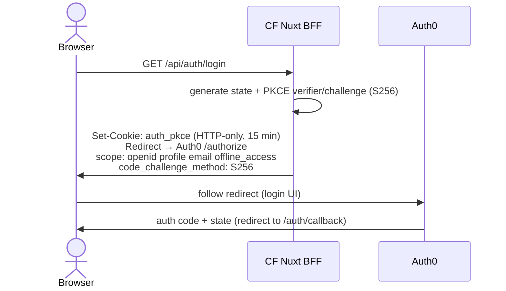
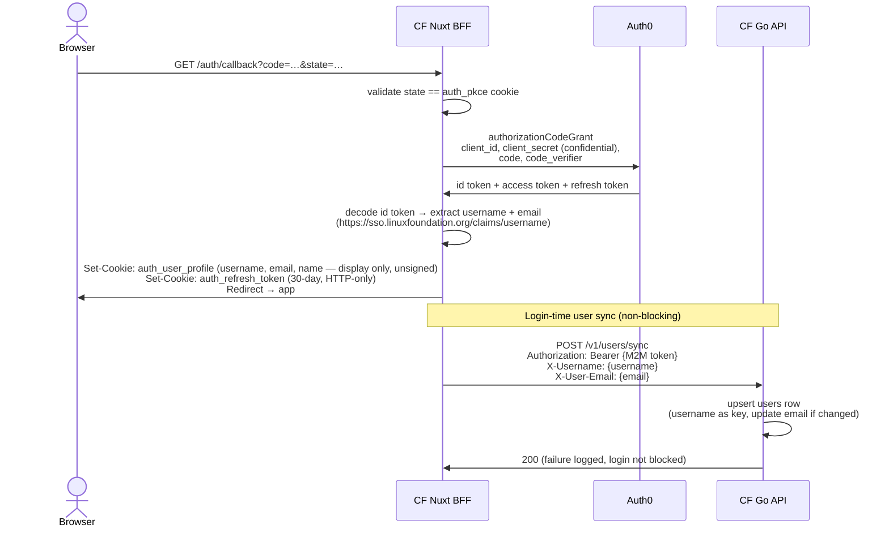
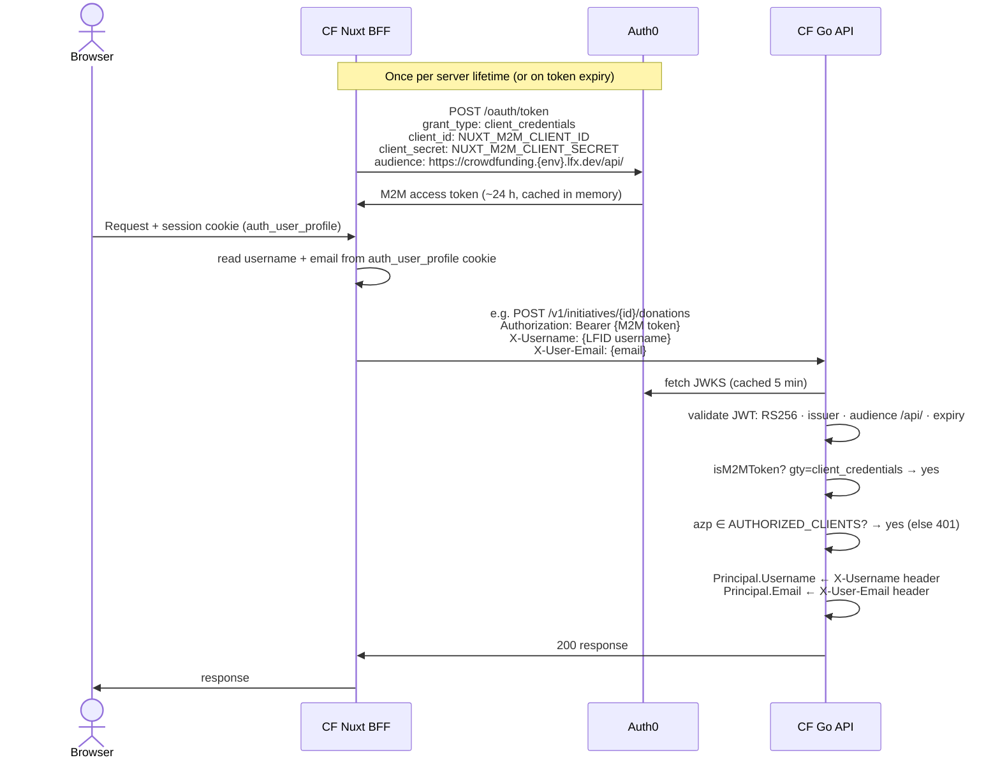
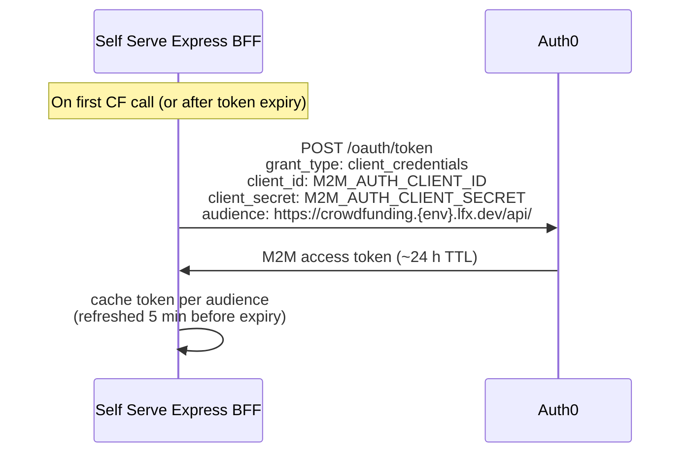
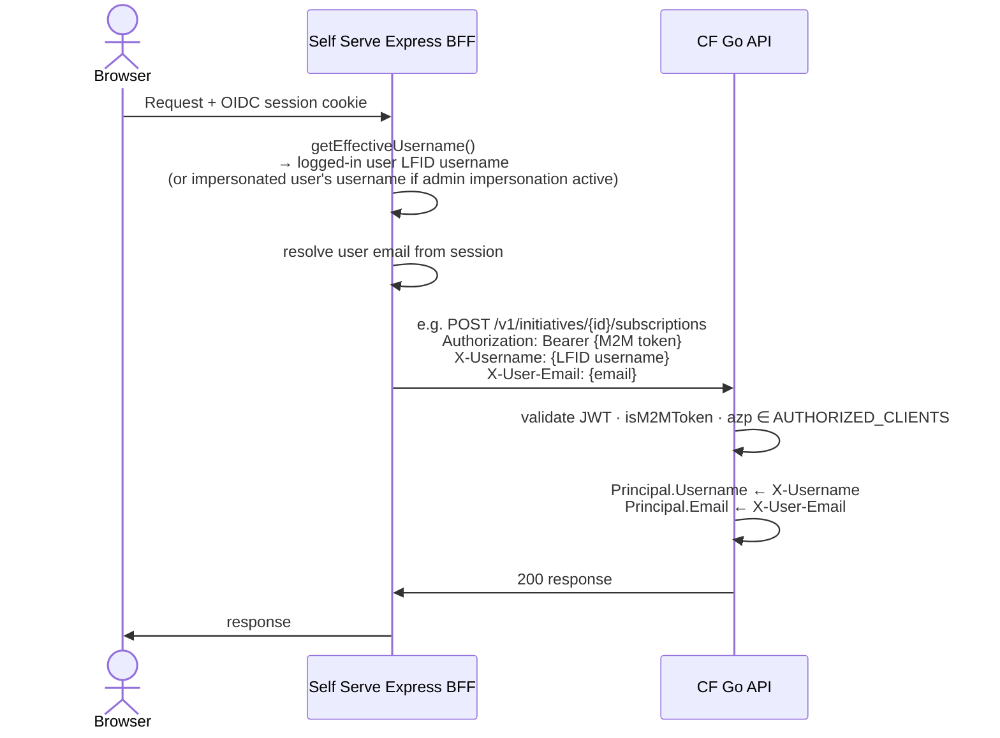
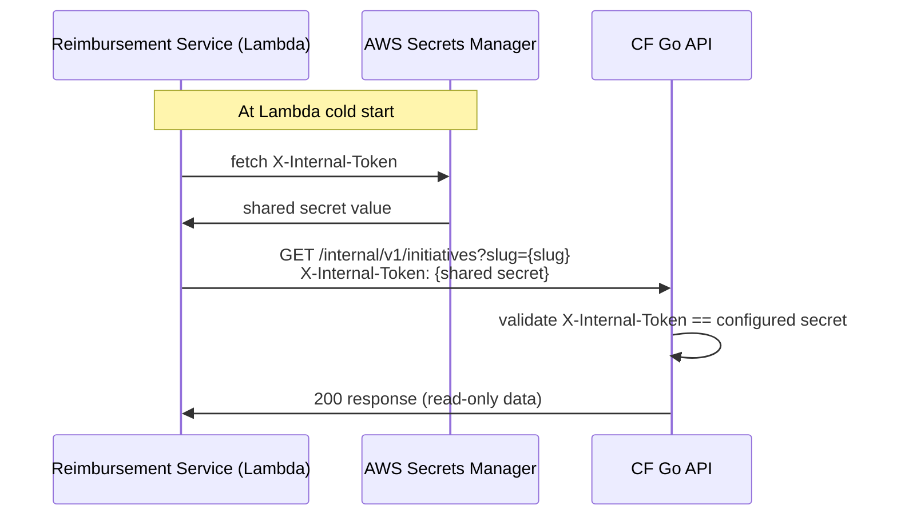
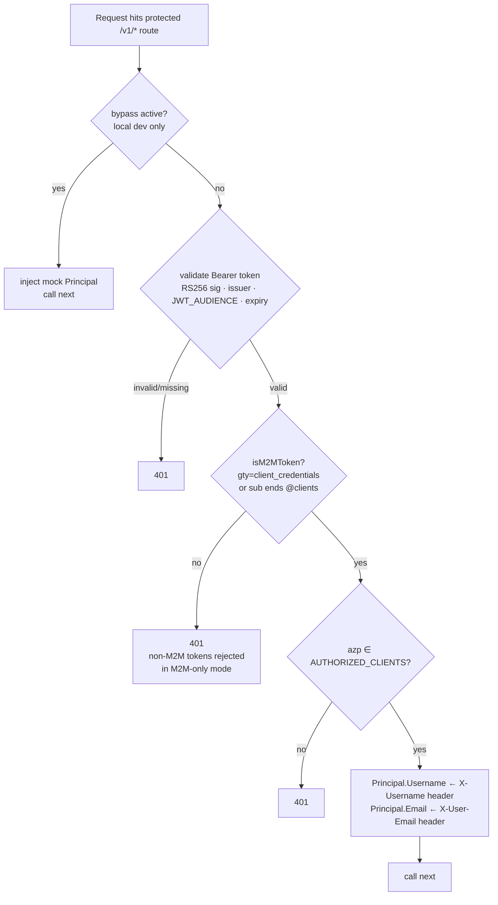

<!-- Copyright The Linux Foundation and each contributor to LFX. -->
<!-- SPDX-License-Identifier: MIT -->

# Authentication Architecture — M2M Unified Approach

---

This document supersedes [`09-authentication-architecture.md`](09-authentication-architecture.md)
and describes the **target authentication design** for the Crowdfunding (CF) platform. It is
written for architecture review. Scope is limited to **authentication only**.

## Key Design Decision

All callers authenticate to the CF Go API using **Auth0 machine-to-machine (M2M) client
credentials tokens**. No caller forwards a user access token directly to the Go API.

- The **Nuxt BFF** still runs OAuth2 PKCE with Auth0 to establish the user's session (it needs
  to know *who* is logged in). But for Go API calls it uses a separate M2M token and passes the
  user's identity explicitly via `X-Username` and `X-User-Email` headers.
- **LFX Self Serve** uses the same M2M pattern for `/me/*`, subscription, and payment endpoints.
- The **Reimbursement Service** uses a different mechanism (`X-Internal-Token` shared secret)
  for its narrow read-only endpoints — planned, not yet implemented.

This unifies the Go API's trust model: every caller is a known, explicitly allowlisted M2M
client. The middleware has one authentication path to reason about.

---

## Actors & Trust Boundaries

| Actor | Type | Notes |
|---|---|---|
| **Browser** | Untrusted client | Never receives access tokens; holds only session cookies |
| **CF Nuxt BFF** | Trusted server | Runs PKCE for user session; calls Go API via M2M |
| **CF Go API** (`initiatives-api`) | Trusted server | Validates M2M JWTs; protected resource |
| **Auth0** (`linuxfoundation-{dev,staging}.auth0.com`) | Identity provider | Issues all tokens; hosts JWKS endpoint |
| **LFX Self Serve Express BFF** | Trusted server | Calls Go API via M2M for `/me/*`, subscriptions, payments |
| **Reimbursement Service** | Trusted server (Lambda) | Calls `/internal/v1/*` via shared secret; planned |

**Key principles:**
- Access tokens never reach the browser.
- The Go API never receives a user access token — only M2M tokens from allowlisted clients.
- User identity (`username`, `email`) is communicated via trusted headers, not JWT claims.
- The ingress **must strip** `X-Username` and `X-User-Email` from inbound requests so only
  the BFFs (post-authentication) can set them.

---

## Overview



---

## Flow 1 — CF End-User Authentication (Nuxt BFF)

The Nuxt BFF runs OAuth2 Authorization Code + PKCE with Auth0 solely to establish **who the
user is** and maintain their session. The resulting access token is **not forwarded** to the
Go API — the BFF uses a separate M2M token for that.

### 1.1 Login



### 1.2 Callback, Token Storage & User Sync



Cookie details:
- `auth_user_profile` — base64 JSON of `{ username, email, name, picture }` decoded from the
  Auth0 id token. **Unsigned — for display and BFF header population only, never for
  authorization decisions.**
- `auth_refresh_token` — used to silently refresh the user session; 30-day TTL; HTTP-only.
- The Auth0 access token is **not stored in a cookie** — the BFF uses a separate M2M token
  for all Go API calls.

**Why user sync at login?** The Go API's donation and subscription services upsert a user row
on first payment, using the email passed in at that moment. By syncing at login the user row
is guaranteed to exist with a current email before any downstream call needs it. This makes
the per-call `X-User-Email` header a safety net rather than the primary email source.

### 1.3 Nuxt BFF → Go API (M2M)



### 1.4 Session Refresh

`POST /api/auth/refresh` uses `refreshTokenGrant` to silently rotate the user session. On
failure all session cookies are cleared → client receives 401 → full login required. The M2M
token used for Go API calls is unaffected by user session refresh (it has its own TTL).

---

## Flow 2 — Self Serve → CF API (M2M)

Self Serve authenticates its own users via Auth0 OIDC (separate from CF's flow). For CF API
calls it uses the **same M2M pattern** as the Nuxt BFF. The user's LFID username and email are
resolved from the Self Serve session.

### 2.1 M2M Token Acquisition



### 2.2 Proxied Request to CF API



**Impersonation:** `getEffectiveUsername()` returns the impersonated user's LFID username when
admin impersonation is active. The CF Go API has no knowledge of impersonation — it sees a
normal authenticated call. The audit trail is maintained in Self Serve's session.

---

## Flow 3 — Reimbursement Service → CF API (Planned)

> **Status: not yet implemented.** Documented here for architecture completeness.

The Reimbursement Service (RS) is an AWS Lambda. It cannot participate in Auth0 flows in the
same way. It authenticates to CF via a **shared secret** (`X-Internal-Token`) rather than Auth0
JWTs. This is a separate auth path from the M2M pattern used by Nuxt BFF and Self Serve.



Available endpoints (read-only):

| Method | Path | Returns |
|---|---|---|
| `GET` | `/internal/v1/initiatives?slug={slug}` | `{id, name, owner_id, status, initiative_type}` |
| `GET` | `/internal/v1/initiatives?status=published` | `[{id, name}]` all published |
| `GET` | `/internal/v1/users/{owner_id}` | `{id, email}` |

`X-Internal-Token` is stored in AWS Secrets Manager and injected via ESO into both CF and RS
at deploy time.

---

## CF JWT Middleware Decision Logic

`JWTAuthenticator.Middleware` is the single authentication pipeline for all `/v1/*` protected
routes. It handles both caller types (Nuxt BFF and Self Serve) identically:



> **Note:** the flowchart shows the target M2M-only state. Today the middleware also accepts
> user tokens (the `F -- no` branch currently sets `Principal.Username` from the JWT claim).
> Removing user token support is a backend config/code change gated on all callers migrating
> to M2M.

**Security controls:**
- Ingress **must strip** `X-Username` and `X-User-Email` from all inbound requests.
  `AUTHORIZED_CLIENTS` is the server-side gate; ingress stripping prevents an unauthenticated
  caller from injecting headers directly.
- `AUTHORIZED_CLIENTS` is non-empty in all deployed environments — when non-empty, every token
  (M2M or otherwise) must present a `client_id`/`azp` in the list or receive 401.

---

## Endpoint Caller Matrix

Which client calls which CF Go API endpoint:

| Endpoint | Nuxt BFF | Self Serve | Reimbursement Svc |
|---|---|---|---|
| `POST /v1/initiatives` | ✅ | — | — |
| `POST /v1/initiatives/{id}/donations` | ✅ | — | — |
| `POST /v1/initiatives/{id}/subscriptions` | — | ✅ | — |
| `DELETE /v1/subscriptions/{id}` | — | ✅ | — |
| `PATCH /v1/initiatives/{id}` | — | ✅ | — |
| `DELETE /v1/initiatives/{id}` | — | ✅ | — |
| `POST /v1/initiatives/{id}/process-approval/{action}` | — | ✅ | — |
| `GET /v1/me/donations` | — | ✅ | — |
| `GET /v1/me/subscriptions` | — | ✅ | — |
| `POST /v1/me/setup-intent` | — | ✅ | — |
| `POST /v1/me/payment-method` | — | ✅ | — |
| `GET /v1/me/payment-account` | — | ✅ | — |
| `DELETE /v1/me/payment-method` | — | ✅ | — |
| `POST /presigned-url` | ✅ | ✅ | — |
| `POST /v1/users/sync` *(new)* | ✅ (login only) | — | — |
| `GET /internal/v1/initiatives` | — | — | ✅ planned |
| `GET /internal/v1/users/{id}` | — | — | ✅ planned |

Public routes (`GET /v1/initiatives`, `GET /v1/statistics*`, etc.) are unauthenticated and
accessible by the Nuxt BFF and browser directly — not listed here.

---

## Route Authentication Tiers

| Tier | Routes | Auth mechanism |
|---|---|---|
| **No auth** | `GET /livez`, `/healthz`, `/readyz` | None |
| **No auth** | `POST /v1/stripe/webhook` | Stripe HMAC signature (separate from JWT) |
| **No auth** | `GET /v1/statistics*`, `GET /v1/initiatives`, `GET /v1/initiatives/{id}/transactions` | None |
| **Optional auth** | `GET /v1/initiatives/{id}` | `OptionalMiddleware` — attaches Principal if valid Bearer present; never rejects. Allows approvers to view unpublished initiatives. |
| **M2M required** | All other `/v1/*` routes | `Middleware` — M2M JWT from allowlisted client; 401 otherwise |
| **Internal token** | `/internal/v1/*` *(planned)* | `X-Internal-Token` shared secret |

---

## Authorization Model

| Mechanism | Scope |
|---|---|
| **Auth0 JWT validation** (JWKS, RS256) | Every M2M-protected route. Single resource server `lfx_crowdfunding_api` (`/api/`) — same audience for Nuxt BFF and Self Serve M2M clients. |
| **`AUTHORIZED_CLIENTS` allowlist** | Restricts which Auth0 client IDs may call the API. Also gates `X-Username`/`X-User-Email` header trust — only allowlisted clients may set them. |
| **`X-Internal-Token`** | Shared secret for Reimbursement Service `/internal/v1/*` endpoints. Separate from the JWT path. |
| **`ALLOWED_APPROVERS`** | Username list enforced at the handler level for initiative approval actions (`process-approval`). |
| **`access:api` scope** | Granted in Auth0 on the `lfx_crowdfunding_api` resource server. Not enforced in application code; authorization is via the `AUTHORIZED_CLIENTS` allowlist. |

---

## Auth0 Terraform — Required Grants

Two new `auth0_client_grant` resources are needed — one for the Nuxt BFF M2M client, one for
Self Serve. Both target the existing `lfx_crowdfunding_api` resource server. No new resource
server is needed.

```hcl
# Nuxt BFF M2M client → CF API
resource "auth0_client_grant" "nuxt_crowdfunding" {
  client_id  = auth0_client.lfx_crowdfunding_nuxt_m2m.id
  audience   = auth0_resource_server.lfx_crowdfunding_api.identifier
  scopes     = ["access:api"]
  depends_on = [auth0_resource_server_scopes.lfx_crowdfunding_api]
}

# Self Serve M2M client → CF API
resource "auth0_client_grant" "lfxone_crowdfunding" {
  client_id  = auth0_client.lfx_one.id
  audience   = auth0_resource_server.lfx_crowdfunding_api.identifier
  scopes     = ["access:api"]
  depends_on = [auth0_resource_server_scopes.lfx_crowdfunding_api]
}
```

---

## Required Changes (implementation scope)

| Component | Change |
|---|---|
| **CF Go API** (`jwt.go`) | Read `X-User-Email` from trusted M2M callers (mirrors existing `X-Username` pattern, ~5 lines). Add `Principal.Email` population from header. |
| **CF Go API** (`server.go`) | Add `POST /v1/users/sync` route (M2M-authenticated; upserts user row). |
| **CF Nuxt BFF** | New M2M token utility (client_credentials + in-memory cache). `backend-fetch.ts`: replace user-token forwarding with M2M token + `X-Username` + `X-User-Email` headers. Call `/v1/users/sync` from login callback (non-blocking). |
| **CF Nuxt BFF** (`runtime-config.ts`) | Add `NUXT_M2M_CLIENT_ID`, `NUXT_M2M_CLIENT_SECRET` (server-only). |
| **Auth0 Terraform** | `auth0_client_grant` for Nuxt BFF M2M client (see above). `auth0_client_grant` for Self Serve already in `08-self-serve-auth.md`. |
| **ArgoCD values** | `AUTHORIZED_CLIENTS`: add Nuxt BFF M2M `client_id` alongside Self Serve. Add `NUXT_M2M_CLIENT_ID`/`NUXT_M2M_CLIENT_SECRET` to CF frontend values. |
| **Ingress** | Strip `X-Username` and `X-User-Email` headers from all inbound public requests (already required for `X-Username`; extend to cover `X-User-Email`). |

---

## Configuration Reference

### CF Backend (`initiatives-api`)

| Env var | Purpose | Dev value |
|---|---|---|
| `JWKS_URL` | Auth0 JWKS endpoint | `https://linuxfoundation-dev.auth0.com/.well-known/jwks.json` |
| `JWT_ISSUER` | Expected `iss` claim | `https://linuxfoundation-dev.auth0.com/` |
| `JWT_AUDIENCE` | Expected `aud` claim | `https://crowdfunding.dev.lfx.dev/api/` |
| `AUTHORIZED_CLIENTS` | Comma-separated allowlisted Auth0 client IDs (Nuxt BFF M2M + Self Serve M2M) | injected via ESO |
| `X_INTERNAL_TOKEN` | Shared secret for RS `/internal/v1/*` endpoints *(planned)* | injected via ESO |

### CF Frontend (Nuxt BFF)

| Env var | Purpose |
|---|---|
| `NUXT_PUBLIC_AUTH0_DOMAIN` | Auth0 tenant (user session PKCE flow) |
| `NUXT_PUBLIC_AUTH0_CLIENT_ID` | PKCE client ID (user session only) |
| `NUXT_AUTH0_CLIENT_SECRET` | PKCE client secret (confidential client, user session only) |
| `NUXT_PUBLIC_AUTH0_AUDIENCE` | Audience for PKCE user token (user session only; not forwarded to Go API) |
| `NUXT_PUBLIC_AUTH0_REDIRECT_URI` | OAuth2 callback URL |
| `NUXT_M2M_CLIENT_ID` | M2M client ID for Go API calls *(new)* |
| `NUXT_M2M_CLIENT_SECRET` | M2M client secret for Go API calls *(new)* |
| `NUXT_API_BASE_URL` | CF Go API base URL (server-internal) |
| `NUXT_JWT_SECRET` | Session cookie signing secret |

### LFX Self Serve (Express BFF)

| Env var | Purpose |
|---|---|
| `M2M_AUTH_CLIENT_ID` | Auth0 M2M client ID |
| `M2M_AUTH_CLIENT_SECRET` | Auth0 M2M client secret |
| `M2M_AUTH_ISSUER_BASE_URL` | Auth0 token endpoint base URL |
| `CROWDFUNDING_API_BASE_URL` | CF API base URL |
| `CROWDFUNDING_API_AUDIENCE` | CF API audience (`https://crowdfunding.{env}.lfx.dev/api/`) |

---

## Related Documents

- [`08-self-serve-auth.md`](08-self-serve-auth.md) — Self Serve M2M design rationale,
  impersonation handling, Auth0 Terraform + ArgoCD changes
- [`09-authentication-architecture.md`](09-authentication-architecture.md) — previous design
  (user token forwarding from Nuxt BFF); superseded by this document
- [`04-target-architecture.md`](04-target-architecture.md) — overall target architecture
  including Reimbursement Service internal endpoints and Auth0 tenant topology
