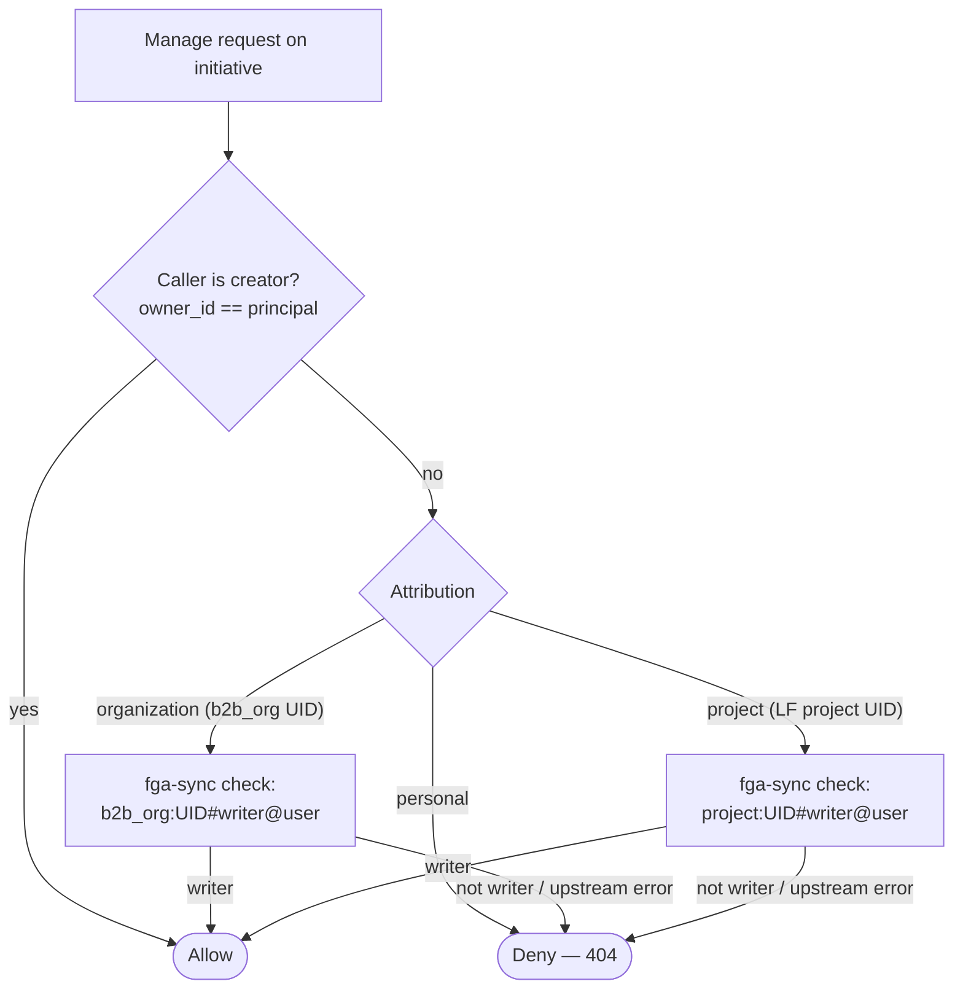
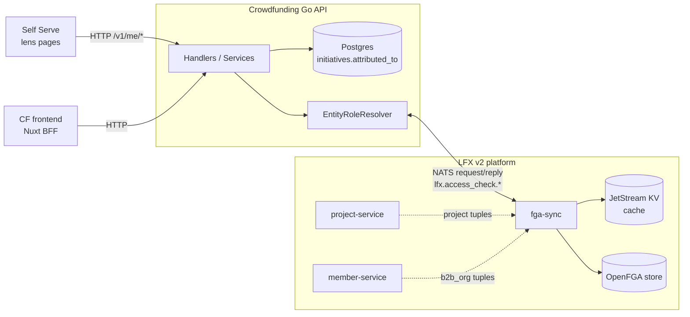
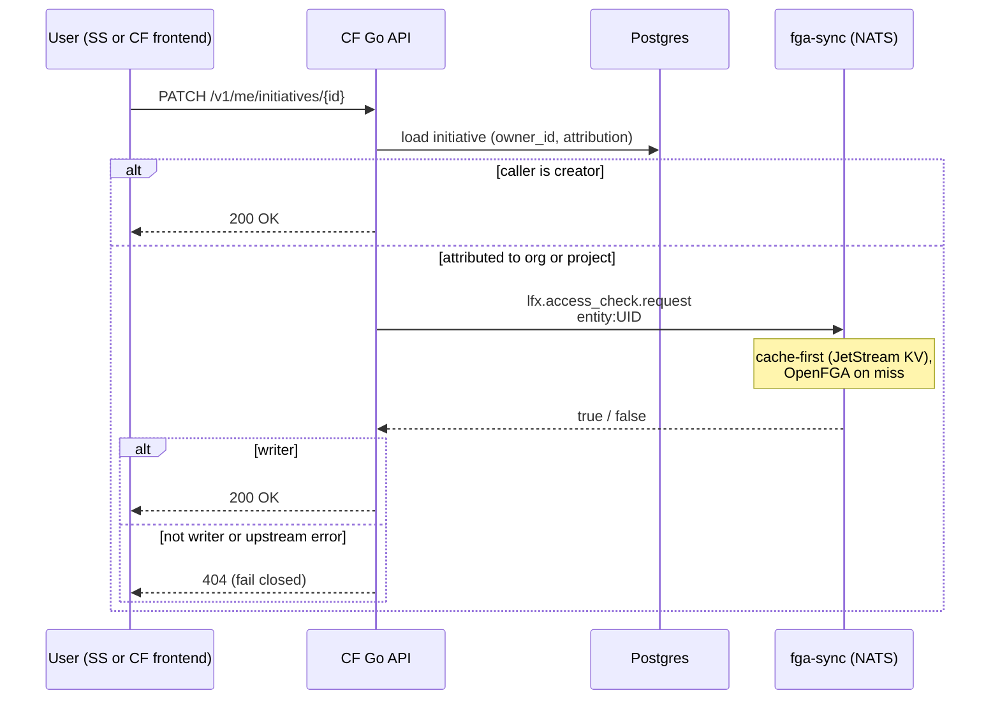
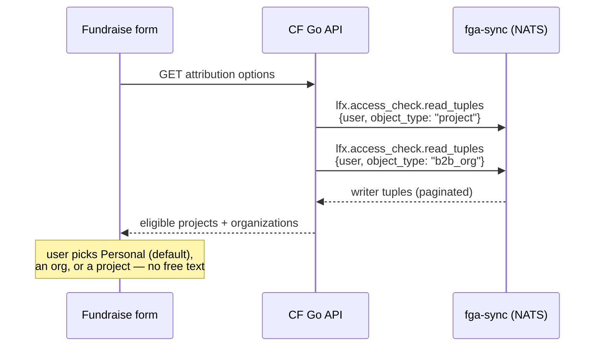

<!-- Copyright The Linux Foundation and each contributor to LFX. -->
<!-- SPDX-License-Identifier: MIT -->

# Initiative Attribution & Role-Based Access

---

**Status:** Agreed direction from exploratory research (July 2026) — not yet a spec or
implementation plan. Related story:
[LFXV2-2537](https://linuxfoundation.atlassian.net/browse/LFXV2-2537) *"Initiatives on behalf of
projects and/or organizations"* (status: Requirements Needed).

**TL;DR.** Today a Crowdfunding (CF) initiative is manageable by exactly one user (`owner_id`).
The proposal: each initiative carries an **attribution** — *personal* (default), *organization*
(`b2b_org` UID), or *project* (LF project UID) — and one flat access rule follows it:

> **A user may manage an initiative if they are its creator, OR a `writer` on the attributed
> entity** (checked against the platform's OpenFGA store via `fga-sync`).

The same attribution field drives the details-page source label and the Self Serve (SS) lens
"Initiatives" pages. Existing initiatives default to *personal* — **no data backfill**.

---

## 1. Problem

Three confirmed needs, one root cause — CF has no relationship between initiatives and the
platform's real orgs and projects:

1. **Multi-person management.** Only the single `owner_id` can manage an initiative. Teams,
   foundations, and companies running fundraisers need shared access.
2. **Attribution (LFXV2-2537).** An initiative can't be marked as run *on behalf of* a company or
   project; visitors can't tell official project fundraisers from personal ones, and SS lenses
   have no "Initiatives" page for their org/project.
3. **Organization donations.** CF's `organizations` table
   ([001_initial.up.sql:53-61](../../db/migrations/001_initial.up.sql)) is free-form per-user
   (name + avatar + creator), with no uniqueness constraint and no external identifier — two users
   donating for the same company create two unrelated rows that can never be reconciled with the
   orgs SS manages.

### Current access model (for contrast)

| Mechanism | Behavior |
|---|---|
| Ownership | `initiative.owner_id == principal` — anything else returns 404 (`ErrInitiativeNotFound`, deliberately not 403) |
| Approvers | Hardcoded username allowlist from an env var (`allowedApprovers`) gates approve/decline |

`Principal` (from the JWT) carries identity and OAuth2 scope only — no role fields. The frontend
has no role awareness; all enforcement is server-side.

---

## 2. Proposed model

### 2.1 Attribution

Each initiative carries exactly one attribution, chosen at creation in a new fundraise-form step
(per LFXV2-2537 — picked from the user's real affiliations, never free text):

| Attribution | Entity reference | Managed by |
|---|---|---|
| `personal` (default) | none | creator only — today's behavior |
| `organization` | `b2b_org` UID (canonical platform org, owned by member-service, backed by Salesforce Accounts) | creator + org writers |
| `project` | LF project UID (owned by project-service) | creator + project writers |

One field, three consumers: **access control**, the **details-page source label**, and the **SS
lens listing pages**. Existing initiatives default to `personal` and behave exactly as today.

### 2.2 Access decision

Design rules:

- **One flat capability.** No view-only tier, no per-initiative grants. Either can be added later
  if a real need surfaces.
- **The creator always retains access.** `owner_id` stays as "created by" and guarantees the
  creator can always edit — without this, a user could create an initiative attributed to an
  entity they're not a writer on and be locked out immediately. Everyone else's access comes and
  goes with their writer role on the attributed entity.
- **Fail closed.** If the upstream check errors, deny management access.
- **CF stores no roles.** No membership tables, no role columns — CF stores one entity reference
  and asks the platform the membership question at request time.

---

## 3. Architecture

### 3.1 Why fga-sync (and not the alternatives)

| Alternative | Why not |
|---|---|
| Copy SS's model (read role lists from member-service) | SS's `OrgRoleGrantsService` reads **org** roles (`b2b_org`) — the wrong axis for project attribution. It also re-implements resolution (cascading, dedup, 5-min cache) that FGA already computes. |
| Call OpenFGA directly | Not the platform pattern — v2 services go through fga-sync, which provides one shared cache with invalidation (per `lfx-v2-fga-sync/docs/fga-sync-contract.md`). |
| Local role tables in CF | CF would own org/project membership it can't keep correct; the platform already maintains it. |
| Literal org ownership (transfer `owner_id` to an org) | Forces CF to answer "who is in the org" — inventing membership. Attribution + FGA-derived access stores one UID instead. |

fga-sync is the canonical enforcement source (it captures committee-derived and inherited grants
that raw data reads miss), CF already runs in the LFX v2 shared cluster so NATS is reachable in
principle, and it's the integration every other v2 service uses. Both `project` and `b2b_org`
live in the same OpenFGA store, so **one integration covers both attribution kinds**.

Two NATS subjects cover everything CF needs:

| Subject | Use |
|---|---|
| `lfx.access_check.request` | Batch yes/no checks (`entity:UID#writer@user`) — the edit-access gate |
| `lfx.access_check.read_tuples` | Enumerate a user's relations per object type — feeds the fundraise-form dropdowns |

**Fallback** if direct NATS access is not granted to CF: `lfx-v2-access-check` exposes an HTTP
wrapper over the same check. Either way, the integration hides behind a small
`EntityRoleResolver` interface (entity type + UID + username → can manage?) so the transport can
be swapped without touching business logic.

**Caching:** none in CF on day one — fga-sync is already cache-first. Add an in-process cache only
if measured latency demands it.

### 3.2 Flow: edit access check

### 3.3 Flow: attribution options in the fundraise form

---

## 4. Organization donations (separable)

Independent of attribution/access, CF's free-form `organizations` table needs linking to canonical
platform orgs. Donations and subscriptions FK to these rows, so the table can't be dropped. The
fix:

1. Add a `b2b_org` UID column to `organizations`.
2. Replace free-text org creation in the donation flow with a canonical-org picker.
3. Dedup existing rows against Salesforce Accounts (data exercise).

Verified *affiliation* is likely unnecessary here — donating on behalf of a company is far
lower-risk than controlling its fundraiser; a canonical-org picker alone may satisfy the
requirement.

---

## 5. Milestones

Each independently shippable; M3 can move ahead of M1/M2.

| # | Scope | Delivers |
|---|---|---|
| M1 | **Attribution foundation** — schema (`attributed_to` type + entity UID), form step with affiliation pickers (`read_tuples`), details-page source label. No access changes. | Most of LFXV2-2537 |
| M2 | **Access from attribution** — `access_check` integration, writers manage attributed initiatives, SS lens "Initiatives" pages | Multi-person management |
| M3 | **Org donations cleanup** — `b2b_org` link, canonical-org picker, dedup | Reconciled org donors |

Scope-reduction levers: ship the Project lens page before the Organization lens page (the
maintainer story is the strongest); drop verified affiliation for donations.

---

## 6. Open questions

1. **PM: benefit vs. attribution axis.** A company-attributed initiative has no LF project
   relation. If finance/reporting needs "which project does this money benefit" independent of
   "who runs the fundraiser," a separate optional benefit-project field is required — attribution
   cannot carry both.
2. **Eligibility vs. access populations.** LFXV2-2537 lets users attribute to entities they're
   *affiliated* with; edit access flows from the *writer* relation. These differ — a contributor
   may be affiliated with a project without being a writer. Confirm which relation feeds the form
   dropdown vs. the access check.
3. **Platform onboarding.** Confirm CF (outside Heimdall) can consume the fga-sync NATS subjects,
   and what onboarding requires (`lfx-v2-fga-sync/docs/fga-catalog.md`).
4. **FGA user identifier.** FGA tuples key users as e.g. `user:auth0|alice`; CF's canonical
   identifier is the LF SSO username. Confirm the identifier CF must send in checks.
5. **`allowedApprovers`.** Fold the env-var allowlist into the new model, or keep it as a separate
   platform-admin concept?
6. **Frontend gating.** The Nuxt frontend needs a "can manage" signal to show/hide management UI
   (server-enforced regardless).

---

## Appendix: how Self Serve does it (reference)

SS's role model was the starting reference but is **not** what CF adopts. In short: SS reads
**org** roles (writer/auditor, with auditor-only parent→child cascading) from member-service
(`OrgRoleGrantsService`, per-username 5-min cache), and per-project staff (`view`/`manage`) from
project-service; capability gates only ever use *direct* roles, inherited ones are display-only.
It is a data-read model, not a live policy check. CF instead needs project- *and* org-scoped
access with one mechanism — which is what the FGA check path provides without re-implementing
SS's resolution logic.

## Related Documents

- [`08-self-serve-auth.md`](./08-self-serve-auth.md) — how SS authenticates to CF (identity, not authorization)
- [`../../../docs/authentication-architecture.md`](../../../docs/authentication-architecture.md) — canonical CF authentication design; its "Known Deviations" section anticipates OpenFGA for multi-owner initiatives
- `lfx-v2-fga-sync/docs/fga-sync-contract.md` — access-check subjects, tuple formats, cache behavior
- [`02-decisions.md`](./02-decisions.md), [`03-open-questions.md`](./03-open-questions.md)
