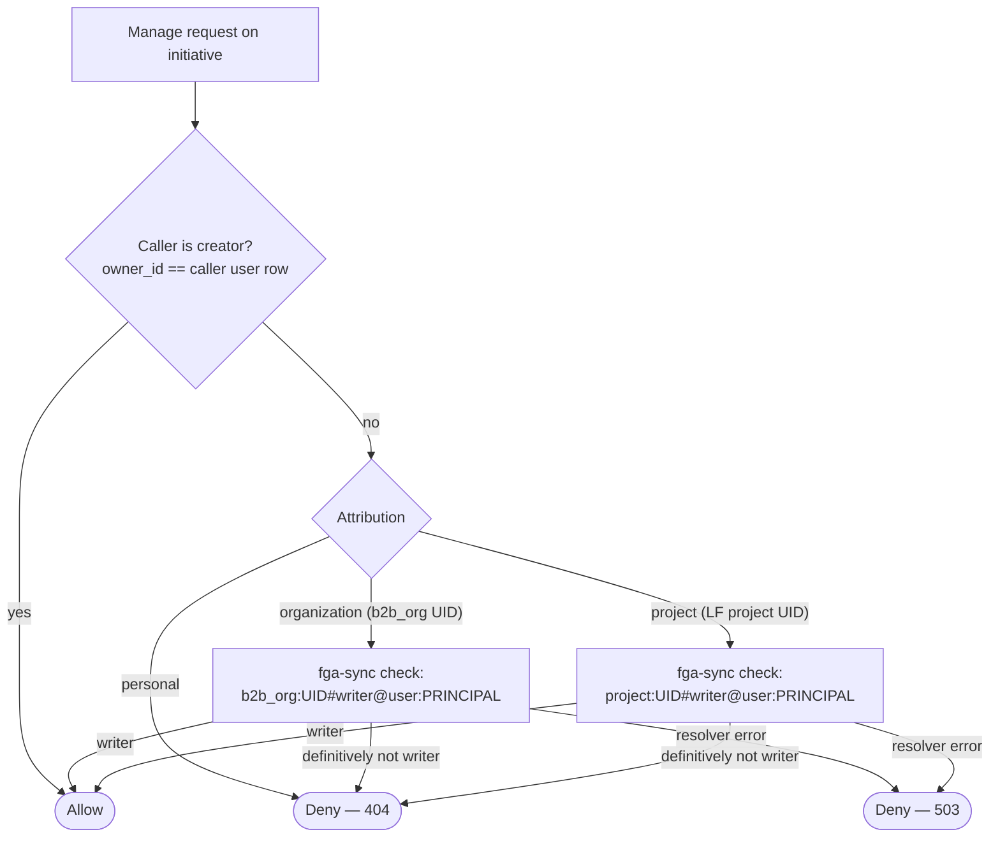
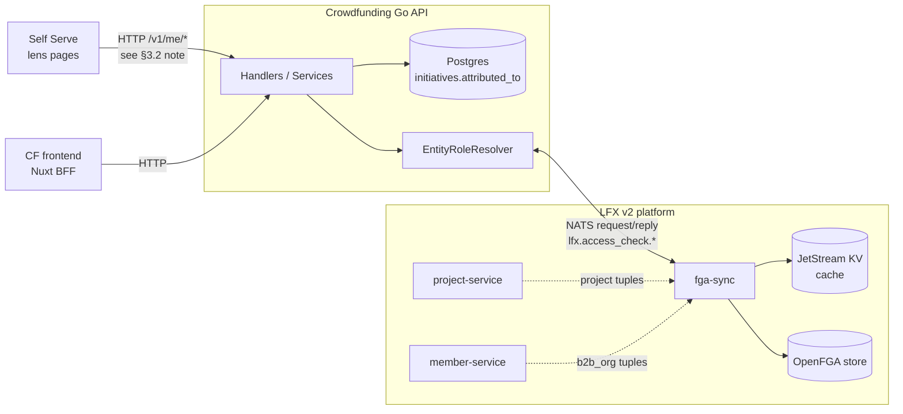
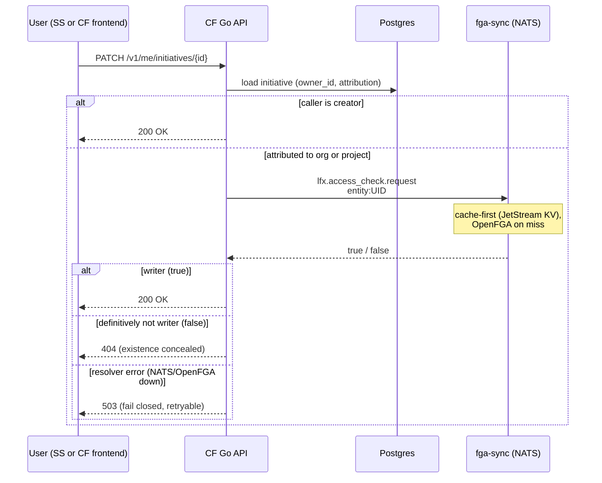
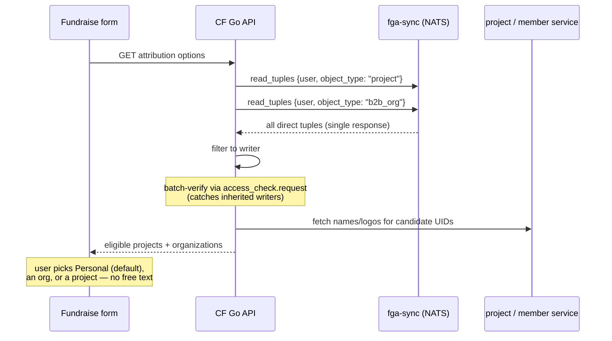

<!-- Copyright The Linux Foundation and each contributor to LFX. -->
<!-- SPDX-License-Identifier: MIT -->

# Initiative Attribution & Role-Based Access

---

**Status:** Design proposal, July 2026 — **pending architecture review**. Not yet a spec or
implementation plan. Related story:
[LFXV2-2537](https://linuxfoundation.atlassian.net/browse/LFXV2-2537) *"Initiatives on behalf of
projects and/or organizations"*; epic
[LFXV2-2759](https://linuxfoundation.atlassian.net/browse/LFXV2-2759).

**TL;DR.** Today a Crowdfunding (CF) initiative is manageable by exactly one user (`owner_id`).
The proposal: each initiative carries an **attribution** — *personal* (default), *organization*
(`b2b_org` UID), or *project* (LF project UID) — and one flat access rule follows it:

> **A user may manage an initiative if they are its creator, OR a `writer` on the attributed
> entity** (checked against the platform's OpenFGA store via `fga-sync`).

The same attribution field drives the details-page source label and the Self Serve (SS) lens
"Initiatives" pages. Existing initiatives default to *personal* — **no data backfill**.

---

## 1. Problem

Three confirmed needs, one root cause — CF has no relationship between initiatives and the
platform's real orgs and projects:

1. **Multi-person management.** Only the single `owner_id` can manage an initiative. Teams,
   foundations, and companies running fundraisers need shared access.
2. **Attribution (LFXV2-2537).** An initiative can't be marked as run *on behalf of* a company or
   project; visitors can't tell official project fundraisers from personal ones, and SS lenses
   have no "Initiatives" page for their org/project.
3. **Organization donations.** CF's `organizations` table
   ([001_initial.up.sql:53-61](../../db/migrations/001_initial.up.sql)) is free-form per-user
   (name + avatar + creator), with no uniqueness constraint and no external identifier — two users
   donating for the same company create two unrelated rows that can never be reconciled with the
   orgs SS manages.

### Current access model (for contrast)

| Mechanism | Behavior |
|---|---|
| Ownership (reads) | Owner-scoped reads compare `initiative.owner_id` to the caller's resolved user row; a non-owner gets 404 (`ErrInitiativeNotFound`), deliberately concealing existence |
| Ownership (mutations) | `Update`/`Delete` return `ErrForbidden` → **403** for a non-owner (`initiative_service.go:570,1070`; `respond.go:73`) — existence is not concealed on the write path |
| Approvers | Hardcoded username allowlist from an env var (`allowedApprovers`) gates approve/decline |

Identity note: `owner_id` is the **CF user's database UUID**, not the JWT principal directly. The
service resolves `Principal.Username` (LF SSO username) to a user row and compares `owner_id` to
that row's `ID` (`initiative_service.go:252,570,1070`). `Principal` itself carries identity and
OAuth2 scope only — no role fields. The frontend has no role awareness; all enforcement is
server-side.

---

## 2. Proposed model

### 2.1 Attribution

Each initiative carries exactly one attribution, chosen at creation in a new fundraise-form step
(per LFXV2-2537 — picked from the user's real affiliations, never free text):

| Attribution | Entity reference | Managed by |
|---|---|---|
| `personal` (default) | none | creator only — today's behavior |
| `organization` | `b2b_org` UID (canonical platform org, owned by member-service, backed by Salesforce Accounts) | creator + org writers |
| `project` | LF project UID (owned by project-service) | creator + project writers |

One field, three consumers: **access control**, the **details-page source label**, and the **SS
lens listing pages**. Existing initiatives default to `personal` and behave exactly as today.

**Eligibility is strict — affiliated entities only.** The org/project pickers list only entities
the user is already affiliated with (per LFXV2-2537's functional requirements: no free text, and
a disabled option with an explanation when the user has none). "Any existing org" is deliberately
rejected: attribution is a public claim of representation — the org's name and logo on a
fundraising page — and under the access rule it would also hand the org's writers edit access to
(and lens visibility of) an initiative nobody at the org sanctioned. Escape hatches **deep-link
out of the form** rather than inlining platform workflows: "can't find your org" links to the
platform's org-creation flow; "org exists but I'm not listed" links to where affiliations are
managed. Users with multiple affiliations simply see them all in the single-select.

**Eligibility is enforced server-side, not by the picker.** Constraining the dropdown is UX only —
a caller can POST a create/update request with any entity UID directly. The API must therefore
re-validate the submitted attribution against the authoritative eligible set (the same
affiliation-or-writer source, per open question 2) *before persisting it*. Otherwise an
unaffiliated user could publish a false org/project attribution by bypassing the form.

### 2.2 Access decision

`user:PRINCIPAL` is the FGA user identifier for the caller (see the identity note in §3.1 — the
exact value CF must send is [open question 4](#6-open-questions)).

Design rules:

- **One flat capability.** No view-only tier, no per-initiative grants. Either can be added later
  if a real need surfaces.
- **The creator always retains access.** `owner_id` (the creator's CF user row) stays as
  "created by" and guarantees the creator can always edit — without this, a user could create an
  initiative attributed to an entity they're not a writer on and be locked out immediately.
  Everyone else's access comes and goes with their writer role on the attributed entity.
- **Fail closed, but distinguish the reason.** A *definitive* non-writer result denies as 404
  (consistent with today's read concealment). A *resolver error* (NATS/OpenFGA unavailable) also
  denies, but returns **503** — never a false 404 — so the outage is visible and clients can
  retry.
- **CF stores no roles.** No membership tables, no role columns — CF stores one entity reference
  and asks the platform the membership question at request time.
- **Who made a given change is out of scope here.** M2 lets multiple writers manage the same
  initiative, but this proposal doesn't add per-change attribution — see open question 6.

---

## 3. Architecture

> **Architecture decision to reconcile (SS → CF runtime dependency).**
> [`02-decisions.md`](./02-decisions.md) (the "LFX Self Serve integration" section) states that SS
> reads CF data from **Snowflake via Fivetran**, with *no runtime dependency between SS and the CF
> API service* — accepting a 24h sync delay for summary widgets. The lens "Initiatives" pages here
> are different: they show **authorization-sensitive unpublished data** (an entity writer seeing
> drafts attributed to their org/project before they go live), which a 24h Snowflake copy cannot
> gate per-viewer. That requires a **live** SS → CF `/v1/me/*` call, contradicting the earlier
> decision *for this surface only*. This must be resolved in architecture review: either accept the
> runtime dependency for lens pages (superseding `02-decisions.md` for this case) or drop
> unpublished visibility and keep lenses on the Snowflake path.

### 3.1 Why fga-sync (and not the alternatives)

| Alternative | Why not |
|---|---|
| Copy SS's model (read role lists from member-service) | SS's `OrgRoleGrantsService` reads **org** roles (`b2b_org`) — the wrong axis for project attribution. It also re-implements resolution (cascading, dedup, 5-min cache) that FGA already computes. |
| Call OpenFGA directly | Not the platform pattern — v2 services go through fga-sync, which provides one shared cache with invalidation (per `lfx-v2-fga-sync/docs/fga-sync-contract.md`). |
| Local role tables in CF | CF would own org/project membership it can't keep correct; the platform already maintains it. |
| Literal org ownership (transfer `owner_id` to an org) | Forces CF to answer "who is in the org" — inventing membership. Attribution + FGA-derived access stores one UID instead. |

fga-sync is the canonical enforcement source (it captures committee-derived and inherited grants
that raw data reads miss), CF already runs in the LFX v2 shared cluster so NATS is reachable in
principle, and it's the integration every other v2 service uses. Both `project` and `b2b_org`
live in the same OpenFGA store, so **one integration covers both attribution kinds**.

Two NATS subjects cover everything CF needs:

| Subject | Use |
|---|---|
| `lfx.access_check.request` | Batch yes/no checks; each tuple is `{object_type}:{object_id}#{relation}@{user_type}:{user_id}` (e.g. `project:UID#writer@user:auth0\|alice`) — the edit-access gate |
| `lfx.access_check.read_tuples` | Returns **all direct** OpenFGA tuples for a (user, object_type), paginating internally and returning them in one response. Candidate source for the form dropdowns — but see the two caveats below |

`read_tuples` has two limits the caller must handle (per `fga-sync-contract.md`): (1) it returns
*all* relations, not just `writer`, so CF must filter; and (2) it returns **direct** tuples only —
it does **not** expand inherited/computed writer access, so an entity where the user is an
inherited writer would be omitted even though `access_check.request` would permit management. It
also returns tuple UIDs only — **not** the entity names/logos the picker and source label need, so
a separate metadata source (project-service / member-service) is required, with defined behavior
for deleted/missing entities. Net: if eligibility must match actual management rights, the form
should enumerate candidates then batch-verify them via `access_check.request`, rather than trust
`read_tuples` alone (ties to open question 2).

**Fallback** if direct NATS access is not granted to CF: `lfx-v2-access-check` exposes an HTTP
wrapper over the same check — **but it is not a drop-in.** It expects a Heimdall-minted JWT and
derives the principal from it, whereas CF sits outside Heimdall and validates Auth0 tokens. Using
it requires a token-exchange / service-auth bridge (open question 3); without one it would fail
auth or check the wrong identity. Either way, the integration hides behind a small
`EntityRoleResolver` interface (entity type + UID + principal → can manage?) so the transport can
be swapped without touching business logic.

**Caching:** none in CF on day one — fga-sync is already cache-first. Add an in-process cache only
if measured latency demands it.

### 3.2 Flow: edit access check

### 3.3 Flow: attribution options in the fundraise form

Two things the simple "read_tuples → dropdown" path misses, shown above: `read_tuples` returns
**all** direct relations (not just `writer`) and does **not** expand inherited writer access, so
CF filters and then batch-verifies candidates via `access_check.request`; and it returns UIDs
only, so names/logos come from a metadata source (project-service / member-service, shown as `PS`).
This whole flow assumes eligibility = the `writer` relation. If the PM instead chooses
*affiliation* (open question 2), the candidate source is affiliation data — not an FGA relation, so
it comes from the platform's profile/affiliation source rather than `read_tuples`. The edit-access
check (§3.2) is unaffected either way.

---

## 4. Organization donations (separable)

Independent of attribution/access, CF's free-form `organizations` table needs linking to canonical
platform orgs. Donations and subscriptions FK to these rows, so the table can't be dropped. The
fix:

1. Add a nullable `b2b_org` UID column to `organizations`, plus a **partial unique index on the
   non-null UID** so two donors can't create two rows for the same canonical org (multiple null
   `unlinked` rows are still allowed). Existing duplicates must be merged *before* the index is
   installed.
2. Make the picker path **reuse/upsert** the canonical linked row rather than inserting a new one —
   the unique index alone doesn't prevent concurrent duplicate inserts without upsert-on-conflict.
3. Replace free-text org creation in the donation flow with a **hybrid picker**: typeahead against
   canonical platform orgs first; if the donor's org isn't found, free text still works and
   creates a **local, unlinked CF row** (flagged `unlinked`) — never a platform/Salesforce org
   from a checkout. A donation is never blocked on data plumbing.
4. Reconcile asynchronously: a back-office task matches `unlinked` rows against Salesforce
   Accounts and links or escalates them. This is the same mechanism as the dedup of existing rows,
   so the escape hatch adds no new machinery.

No *affiliation* check for donating — attribution and donation carry different risk and get
different gates: attributing an initiative **claims authority** to raise money in the org's name
(strict, affiliated-only, §2.1), while donating **gives** money in its name (lenient, hybrid
picker). Accepted consequence: unlinked-org donations don't appear in the SS Organization lens
until reconciled — correct behavior, not a bug.

---

## 5. Milestones

Each independently shippable; M3 can move ahead of M1/M2.

| # | Scope | Delivers |
|---|---|---|
| M1 | **Attribution foundation** — schema (`attributed_to` type + entity UID), form step with eligibility pickers (source per open question 2), **server-side eligibility validation** (§2.1), details-page source label. No access changes. | Most of LFXV2-2537 |
| M2 | **Access from attribution** — `access_check` integration, writers manage attributed initiatives, frontend "can manage" signal, SS lens "Initiatives" pages (authorization-aware — entity writers also see unpublished initiatives). | Multi-person management |
| M3 | **Org donations cleanup** — `b2b_org` link + partial unique index + upsert, canonical-org picker, dedup | Reconciled org donors |

**M2 must migrate every owner-gated path, not just editing.** Today `owner_id` gates more than
Update/Delete: `ListForUser` hard-filters `owner_id` (the CF management list), private/unpublished
initiative reads, owner-scoped transaction reads, and announcement create/update/delete (in
`AnnouncementService`). If M2 only routes the edit path through the resolver, entity writers get
inconsistent partial access — e.g. they could edit an initiative but not see it in their list or
manage its announcements. The "one flat capability" rule requires all of these to move together.

**M1/M2 coupling under affiliation eligibility.** If open question 2 resolves to *affiliation*
(not *writer*), M1 shipped alone would publish an entity's public label for a creator who may not
be a writer, while the entity's writers can't correct or remove it until M2 exists. In that case,
either couple M1+M2, gate M1 on writer eligibility, or suppress the public attribution label until
M2. Under *writer* eligibility this doesn't arise and M1 is independently safe.

Scope-reduction lever: ship the Project lens page before the Organization lens page (the
maintainer story is the strongest).

---

## 6. Open questions

1. **PM: benefit vs. attribution axis.** A company-attributed initiative has no LF project
   relation. If finance/reporting needs "which project does this money benefit" independent of
   "who runs the fundraiser," a separate optional benefit-project field is required — attribution
   cannot carry both.
2. **Eligibility vs. access populations.** LFXV2-2537 lets users attribute to entities they're
   *affiliated* with; edit access flows from the *writer* relation. These differ — a contributor
   may be affiliated with a project without being a writer. Consequence: someone can put an org's
   name on an initiative that no org *writer* approved (the org's writers do gain edit access and
   lens visibility, so they can react — but after the fact). If the PM wants org sign-off *before*
   the name appears, the eligibility gate must be *writer*, not *affiliated*. Confirm with PM.
3. **Platform onboarding.** Confirm CF (outside Heimdall) can consume the fga-sync NATS subjects,
   and what onboarding requires (`lfx-v2-fga-sync/docs/fga-catalog.md`).
4. **FGA user identifier.** FGA tuples key users as e.g. `user:auth0|alice`; CF's canonical
   identifier is the LF SSO username. Confirm the identifier CF must send in checks.
5. **`allowedApprovers`.** Fold the env-var allowlist into the new model, or keep it as a separate
   platform-admin concept?
6. **Edit attribution once multiple writers exist.** Neither `initiatives` nor
   `initiative_announcements` tracks *which* writer made a given change today — `initiatives` has
   no `updated_by`, and `initiative_announcements.created_by` is stamped once at creation and never
   revisited by later `PUT`s, so an announcement edited by a second writer still displays the
   original author. That's harmless while an initiative has exactly one manager; once M2 lets
   multiple org/project writers manage the same initiative, "who changed this" becomes answerable
   only from the last `updated_on` timestamp, not a which-writer record. Decide before M2 ships
   whether that's acceptable or whether initiatives and announcements need a minimal `updated_by`
   column (not a full audit/edit-history log unless a real need surfaces). Confirm with PM.

---

## Appendix: how Self Serve does it (reference)

SS's role model was the starting reference but is **not** what CF adopts. In short: SS reads
**org** roles (writer/auditor, with auditor-only parent→child cascading) from member-service
(`OrgRoleGrantsService`, per-username 5-min cache), and per-project staff (`view`/`manage`) from
project-service; capability gates only ever use *direct* roles, inherited ones are display-only.
It is a data-read model, not a live policy check. CF instead needs project- *and* org-scoped
access with one mechanism — which is what the FGA check path provides without re-implementing
SS's resolution logic.
