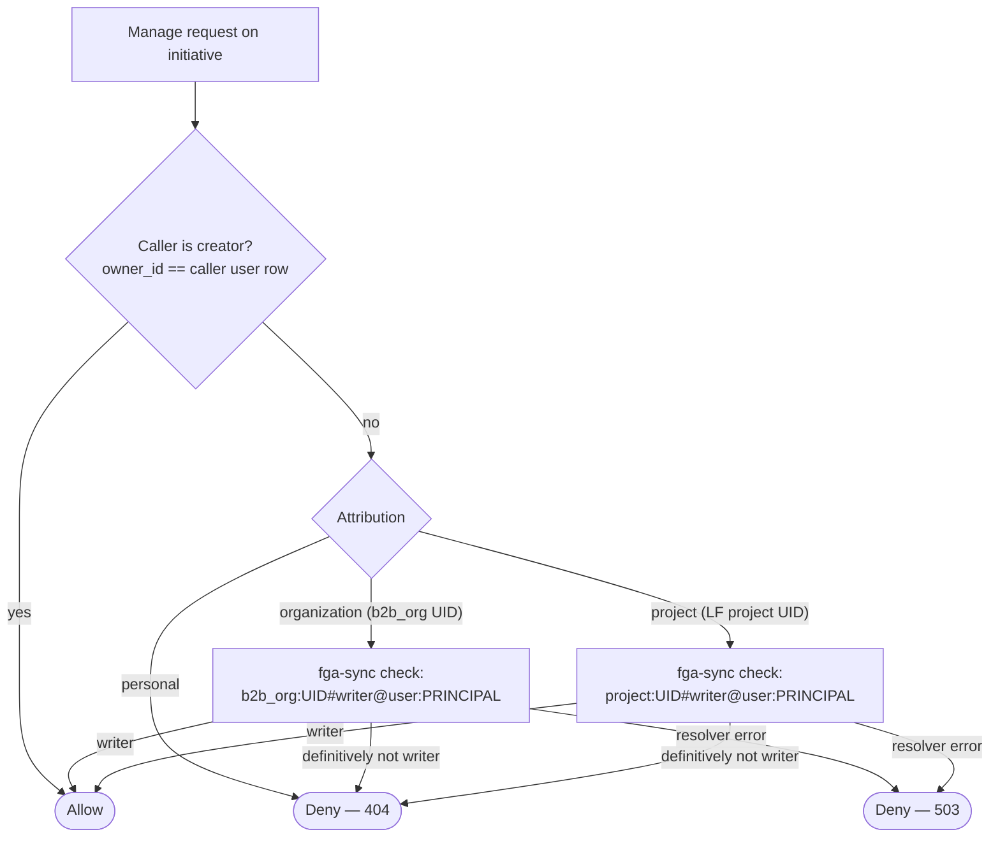
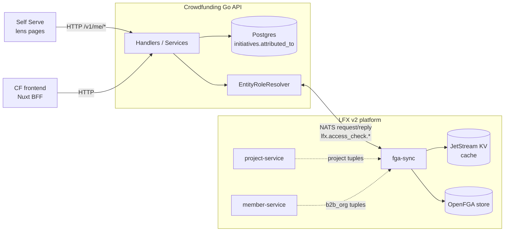
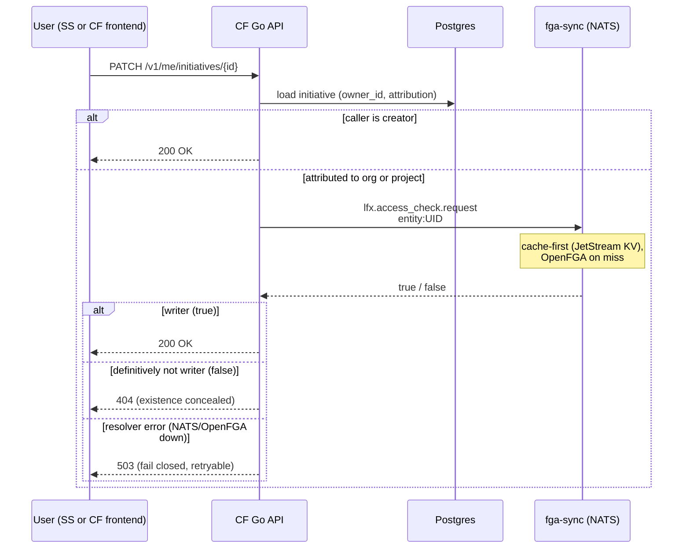
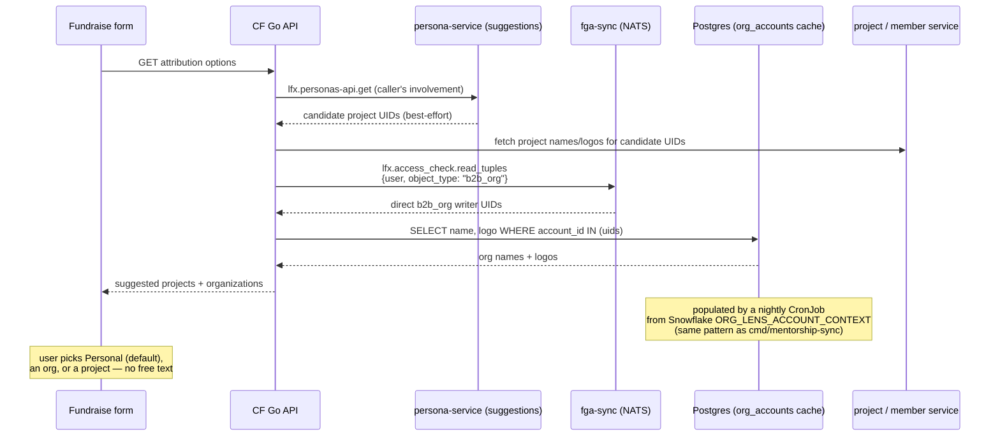

<!-- Copyright The Linux Foundation and each contributor to LFX. -->
<!-- SPDX-License-Identifier: MIT -->

# Initiative Attribution & Role-Based Access

---

**Status:** Design proposal, July 2026 — reviewed at the July architecture sync, settled in the
follow-up exchange. Two decisions: **(1)** transit — CF reaches the FGA checks over direct NATS
(option C), approved by Eric and Jordan (§3.1); **(2)** approach — **hybrid per-entity checks now,
idiomatic `crowdfunding_initiative` type as the target state** once CF is behind the Heimdall
gateway (§3.4), per Eric's initial-step framing. Not yet a spec or implementation plan. Related story:
[LFXV2-2537](https://linuxfoundation.atlassian.net/browse/LFXV2-2537) *"Initiatives on behalf of
projects and/or organizations"*; epic
[LFXV2-2759](https://linuxfoundation.atlassian.net/browse/LFXV2-2759).

**TL;DR.** Today a Crowdfunding (CF) initiative is manageable by exactly one user (`owner_id`).
The proposal: each initiative carries an **attribution** — *personal* (default), *organization*
(`b2b_org` UID), or *project* (LF project UID) — and one flat access rule follows it:

> **A user may manage an initiative if they are its creator, OR a `writer` on the attributed
> entity** (checked against the platform's OpenFGA store via `fga-sync`).

The same attribution field drives the details-page source label and the Self Serve (SS) lens
"Initiatives" pages. Existing initiatives default to *personal* — **no data backfill**.

---

## 1. Problem

Three confirmed needs, one root cause — CF has no relationship between initiatives and the
platform's real orgs and projects:

1. **Multi-person management.** Only the single `owner_id` can manage an initiative. Teams,
   foundations, and companies running fundraisers need shared access.
2. **Attribution (LFXV2-2537).** An initiative can't be marked as run *on behalf of* a company or
   project; visitors can't tell official project fundraisers from personal ones, and SS lenses
   have no "Initiatives" page for their org/project.
3. **Organization donations.** CF's `organizations` table
   ([001_initial.up.sql:53-61](../../db/migrations/001_initial.up.sql)) is free-form per-user
   (name + avatar + creator), with no uniqueness constraint and no external identifier — two users
   donating for the same company create two unrelated rows that can never be reconciled with the
   orgs SS manages.

### Current access model (for contrast)

| Mechanism | Behavior |
|---|---|
| Ownership (reads) | Owner-scoped reads compare `initiative.owner_id` to the caller's resolved user row; a non-owner gets 404 (`ErrInitiativeNotFound`), deliberately concealing existence |
| Ownership (mutations) | `Update`/`Delete` return `ErrForbidden` → **403** for a non-owner (`initiative_service.go:570,1070`; `respond.go:73`) — existence is not concealed on the write path |
| Approvers | Hardcoded username allowlist from an env var (`allowedApprovers`) gates approve/decline |

Identity note: `owner_id` is the **CF user's database UUID**, not the JWT principal directly. The
service resolves `Principal.Username` (LF SSO username) to a user row and compares `owner_id` to
that row's `ID` (`initiative_service.go:252,570,1070`). `Principal` itself carries identity and
OAuth2 scope only — no role fields. The frontend has no role awareness; all enforcement is
server-side.

---

## 2. Proposed model

### 2.1 Attribution

Each initiative carries exactly one attribution, chosen at creation in a new fundraise-form step
(per LFXV2-2537 — picked from the user's real affiliations, never free text):

| Attribution | Entity reference | Managed by |
|---|---|---|
| `personal` (default) | none | creator only — today's behavior |
| `organization` | `b2b_org` UID (canonical platform org, owned by member-service, backed by Salesforce Accounts) | creator + org writers |
| `project` | LF project UID (owned by project-service) | creator + project writers |

One field, three consumers: **access control**, the **details-page source label**, and the **SS
lens listing pages**. Existing initiatives default to `personal` and behave exactly as today.

> **`b2b_org` UIDs are Salesforce SFIDs, not UUIDs.** Per
> `lfx-v2-member-service/docs/indexer-contract.md`, a `b2b_org` uid is an 18-char Salesforce Account
> SFID (e.g. `0012M00002qnukOQAQ`); only the `project` UID is a v2 UUID. The M1 schema and
> `models.Attribution.Validate()` currently assume UUID for both attribution kinds and would reject
> every real organization — tracked as a bug fix landing ahead of any org-picker work, not as part
> of this doc.

**The picker lists affiliated entities only — no free text.** The org/project pickers show only
entities the user is already affiliated with (per LFXV2-2537's functional requirements: no free
text, and a disabled option with an explanation when the user has none). "Any existing org" is
deliberately rejected: attribution is a public claim of representation — the org's name and logo on
a fundraising page — and under the access rule it would also hand the org's writers edit access to
(and lens visibility of) an initiative nobody at the org sanctioned. Escape hatches **deep-link
out of the form** rather than inlining platform workflows: "can't find your org" links to the
platform's org-creation flow; "org exists but I'm not listed" links to where affiliations are
managed. Users with multiple affiliations simply see them all in the single-select.

**Eligibility gate: affiliation, not writer (decided).** A user may attribute to any org/project
they are *affiliated* with — they need not be a `writer` on it (PM decision, 2026-07). This is the
weaker of the two gates: someone affiliated with, but not a writer on, an org can publish a page
carrying that org's name and logo without a writer signing off first. The org's writers *can*
correct or remove it — but only once M2 ships the access rule that grants them management. Two
consequences follow directly (see §5): the public attribution label cannot ship in a standalone
M1, and server-side validation checks an *affiliation* source, not an FGA `writer` relation.

**Known gap: the org picker is narrower than this gate (§3.3).** The org candidate source is
`read_tuples` filtered to direct `writer` tuples — it cannot see affiliation, only a subset of it.
An org member who is affiliated but not a direct writer (or is only an inherited writer) will not
see their org in the picker at all, even though the affiliation gate above would allow the
attribution. Their path is the escape hatch, not the select. This is a real narrowing of who can
use the picker, not just a best-effort miss — see §3.3 for why it's accepted anyway.

> **Architecture ruling on affiliation data (2026-08, Eric).** Involvement/affiliation data (CDP
> contribution history, persona-service detections) is **self-attested and must never be an
> authorization signal** — anyone in the public can contribute to a project and appear "involved."
> This is platform doctrine (epic [LFXV2-1654](https://linuxfoundation.atlassian.net/browse/LFXV2-1654),
> [permission-persona-navigation-model doc](https://github.com/linuxfoundation/lfx-self-serve/blob/docs/permission-persona-preread/docs/architecture/frontend/permission-persona-navigation-model-preread.md)):
> persona/involvement shapes what a user *sees*; only manage/write permission gates what a user
> *does*. The affiliation gate above is compatible with this ruling **only because attribution
> derives no access for the claimant**: the claim grants access *to* the entity's real FGA writers
> (M2), never *from* the claim to the claimer, and the public label stays suppressed until those
> writers can police it (§5). What this changes: server-side "affiliation validation" cannot be an
> authoritative check (no authoritative affiliation source exists — involvement is best-effort and
> self-attested), so attribution is a **self-attested claim**; the server validates that the entity
> exists and is the right type, and the false-claim risk is mitigated by label suppression + writer
> policing, not by an affiliation lookup. Confirmation of this framing with the architect is
> tracked in open question 4.

**Eligibility is enforced server-side, not by the picker.** Constraining the dropdown is UX only —
a caller can POST a create/update request with any entity UID directly. The API must therefore
re-validate the submitted attribution *before persisting it*: the entity UID must exist and match
the claimed type (project-service / member-service lookup). Per the ruling above, this validation
is an existence/shape check, not an authorization check — affiliation data cannot authoritatively
prove or disprove the claim. (Picker suggestion sources: open question 4.)

### 2.2 Access decision


```mermaid
flowchart TD
    A[Manage request on initiative] --> B{Caller is creator?<br/>owner_id == caller user row}
    B -- yes --> ALLOW([Allow])
    B -- no --> C{Attribution}
    C -- personal --> DENY([Deny — 404])
    C -- "organization (b2b_org UID)" --> D[fga-sync check:<br/>b2b_org:UID#writer@user:PRINCIPAL]
    C -- "project (LF project UID)" --> E[fga-sync check:<br/>project:UID#writer@user:PRINCIPAL]
    D -- writer --> ALLOW
    E -- writer --> ALLOW
    D -- "definitively not writer" --> DENY
    E -- "definitively not writer" --> DENY
    D -- "resolver error" --> ERR([Deny — 503])
    E -- "resolver error" --> ERR
```

`user:PRINCIPAL` is the caller's **LFID username** — member-service and project-service key their
`writer` tuples by LFID username (per their FGA contracts), and CF already carries it as
`Principal.Username`. So the check CF sends is `entity:UID#writer@user:{username}`.

Design rules:

- **One flat capability.** No view-only tier, no per-initiative grants. Either can be added later
  if a real need surfaces.
- **At most one FGA check per request.** Attribution is exclusive, so the resolver checks only
  the attributed entity's branch; personal initiatives make no FGA call at all.
- **The creator always retains access** (PM-confirmed, 2026-08 — including after the creator
  leaves the attributed org/project; the entity's writers can edit or unpublish the initiative but
  cannot revoke the creator). `owner_id` (the creator's CF user row) stays as
  "created by" and guarantees the creator can always edit — without this, a user could create an
  initiative attributed to an entity they're not a writer on and be locked out immediately.
  Everyone else's access comes and goes with their writer role on the attributed entity. This
  deliberately keeps one access decision (creator) in CF code while entity decisions defer to
  FGA — the trade is discussed in §3.4.
- **Fail closed, but distinguish the reason.** A *definitive* non-writer result denies as 404
  (consistent with today's read concealment). A *resolver error* (NATS/OpenFGA unavailable) also
  denies, but returns **503** — never a false 404 — so the outage is visible and clients can
  retry.
- **CF stores no roles.** No membership tables, no role columns — CF stores one entity reference
  and asks the platform the membership question at request time.
- **Changing attribution is not the flat manage capability.** Editing an initiative's *content*
  is one flat capability; changing its *attribution* is a separate, more restricted action.
  Validating only the target entity (§2.1) is insufficient: under the flat rule, any current
  writer could reattribute the initiative to another entity they write — or to `personal` —
  silently revoking the original entity's writers and moving (or erasing) the public claim of
  representation. An attribution change must therefore be authorized on **both** the current and
  the target entity; transferring a non-personal initiative to `personal` is **creator-only**.
  Tracking *which* writer made a given change is a separate concern, out of scope here (open
  question 6).

---

## 3. Architecture


```mermaid
flowchart LR
    SS[Self Serve<br/>lens pages] -->|HTTP /v1/me/*| API
    FE[CF frontend<br/>Nuxt BFF] -->|HTTP| API

    subgraph CF[Crowdfunding Go API]
        API[Handlers / Services] --> DB[(Postgres<br/>initiatives.attributed_to)]
        API --> RES[EntityRoleResolver]
    end

    RES <-->|NATS request/reply<br/>lfx.access_check.*| FGASYNC[fga-sync]

    subgraph PLATFORM[LFX v2 platform]
        FGASYNC --> KV[(JetStream KV<br/>cache)]
        FGASYNC --> FGA[(OpenFGA store)]
        PS[project-service] -.->|project tuples| FGASYNC
        MS[member-service] -.->|b2b_org tuples| FGASYNC
    end
```

### 3.1 Why fga-sync (and not the alternatives)

| Alternative | Why not |
|---|---|
| Copy SS's model (read role lists from member-service) | SS's `OrgRoleGrantsService` reads **org** roles (`b2b_org`) — the wrong axis for project attribution. It also re-implements resolution (cascading, dedup, 5-min cache) that FGA already computes. |
| Call OpenFGA directly | Not the platform pattern — v2 services go through fga-sync, which provides one shared cache with invalidation (per `lfx-v2-fga-sync/docs/fga-sync-contract.md`). |
| Local role tables in CF | CF would own org/project membership it can't keep correct; the platform already maintains it. |
| Literal org ownership (transfer `owner_id` to an org) | Forces CF to answer "who is in the org" — inventing membership. Attribution + FGA-derived access stores one UID instead. |

fga-sync is the canonical enforcement source (it captures committee-derived and inherited grants
that raw data reads miss), CF already runs in the LFX v2 shared cluster, and it's the integration
every other v2 service uses. Both `project` and `b2b_org` live in the same OpenFGA store, so **one
integration covers both attribution kinds**.

**"Reachable in principle" is now reachable in fact (2026-08-17).** `FGA_NATS_URL` was set to
`nats://lfx-platform-nats.lfx.svc.cluster.local:4222` in
`lfx-v2-argocd/values/global/lfx-crowdfunding-backend.yaml:86` (commit `e882c635`, "set
FGA_NATS_URL for direct NATS access-check transit") — the same value every other v2 service is
handed (e.g. `values/dev/lfx-v2-meeting-service.yaml:42-43`), applied globally rather than
per-environment. DevOps separately confirmed the same day that network-policy connectivity from
CF's pods to `lfx-platform-nats` is open. What's left is CF-side code, not a platform
prerequisite: the `NATSResolver` shipped in M1 (`backend/internal/infrastructure/fga/resolver.go`)
implements only `AccessCheckSubject`/`CanManage` (`lfx.access_check.request`) — a
`lfx.access_check.read_tuples` client (§3.3's org-picker uid source) still needs to be added. CF
also sits fully outside Heimdall: its own Traefik ingress (`crowdfunding-api.dev.lfx.dev`), its own
Auth0 audience, JWTs validated against Auth0's JWKS directly rather than Heimdall's. The only
outbound platform credential CF holds is a private-key-JWT M2M client for the **v1** api-gw
(`reimbursement_client.go`), audience `https://api-gw.*.platform.linuxfoundation.org/` — not an
LFX v2 audience, and no RFC 8693 token exchange exists anywhere in the repo. That gap is no longer
a blocker for this doc's design: it's the reason §3.3 resolves the org-picker's name/logo lookup
through Snowflake rather than a Heimdall-fronted HTTP call (see below).

The fga-sync NATS subjects relevant to CF:

| Subject | Use |
|---|---|
| `lfx.access_check.request` | Batch yes/no checks; each tuple is `{object_type}:{object_id}#{relation}@{user_type}:{user_id}` (e.g. `project:UID#writer@user:alice`) — the edit-access gate, and the batch-verify half of §5.1 |
| `lfx.access_check.read_tuples` | Returns **all direct** OpenFGA tuples for a (user, object_type) — request `{"user": "user:<lfid>", "object_type": "b2b_org"}`, response `{"results": ["b2b_org:<uid>#writer@user:<lfid>", …]}`. Direct-only, so rejected as the §5.1 `ListForUser` candidate source — but adopted as the **org picker's** candidate source (§3.3): a consumer must filter the results to the exact `#writer` relation, since `auditor`/`owner`/`parent` tuples for the same object type come back in the same list |

One contract detail that isn't obvious from the flow: `access_check.request` replies are
**unordered** (cached results may return first, per `fga-sync-contract.md`) — callers must
correlate each result by its echoed request token, never by array position.

**Transit — how CF reaches the check (decided: C).** The architecture sync framed three options:
**(A)** token exchange — swap the CF-audience user token for an LFX v2 token and call the public
`/access-check` HTTP endpoint (the MCP-server precedent; the wrapper is not a drop-in otherwise,
since it expects a Heimdall-minted JWT and derives the principal from it); **(B)** a new privileged
`/user-access-check` HTTP endpoint that accepts arbitrary users, authorized for specific machine
clients via an LFX v2 M2M token; **(C)** direct on-network NATS access to the fga-sync subjects
above. **Eric and Jordan approved C.** The rationale: when CF eventually moves behind the Heimdall
gateway (the §3.4 target state), it adopts NATS anyway for the indexing/tuple-write path — so using
NATS now means its access checks never have to migrate off HTTP later. NATS access control is
**not a prerequisite** (raised at the sync, settled in Eric's follow-up): a platform-owned
operational risk that grows with NATS sprawl, not something CF rolls out in isolation. The
integration hides behind a small `EntityRoleResolver` interface (entity type + UID + principal →
can manage?) so the transport can be swapped without touching business logic if that ever proves
necessary.

**Caching:** none in CF on day one — fga-sync is already cache-first. Add an in-process cache only
if measured latency demands it.

### 3.2 Flow: edit access check


```mermaid
sequenceDiagram
    participant U as User (SS or CF frontend)
    participant API as CF Go API
    participant DB as Postgres
    participant FS as fga-sync (NATS)

    U->>API: PATCH /v1/me/initiatives/{id}
    API->>DB: load initiative (owner_id, attribution)
    alt caller is creator
        API-->>U: 200 OK
    else attributed to org or project
        API->>FS: lfx.access_check.request<br/>entity:UID#writer@user:PRINCIPAL
        Note over FS: cache-first (JetStream KV),<br/>OpenFGA on miss
        FS-->>API: true / false
        alt writer (true)
            API-->>U: 200 OK
        else definitively not writer (false)
            API-->>U: 404 (existence concealed)
        else resolver error (NATS/OpenFGA down)
            API-->>U: 503 (fail closed, retryable)
        end
    end
```

### 3.3 Flow: attribution options in the fundraise form


```mermaid
sequenceDiagram
    participant FE as Fundraise form
    participant API as CF Go API
    participant AF as persona-service (suggestions)
    participant FS as fga-sync (NATS)
    participant DB as Postgres (org_accounts cache)
    participant PS as project / member service

    FE->>API: GET attribution options
    API->>AF: lfx.personas-api.get (caller's involvement)
    AF-->>API: candidate project UIDs (best-effort)
    API->>PS: fetch project names/logos for candidate UIDs
    API->>FS: lfx.access_check.read_tuples<br/>{user, object_type: "b2b_org"}
    FS-->>API: direct b2b_org writer UIDs
    API->>DB: SELECT name, logo WHERE account_id IN (uids)
    DB-->>API: org names + logos
    API-->>FE: suggested projects + organizations
    Note over DB: populated by a nightly CronJob<br/>from Snowflake ORG_LENS_ACCOUNT_CONTEXT<br/>(same pattern as cmd/mentorship-sync)
    Note over FE: user picks Personal (default),<br/>an org, or a project — no free text
```

Because the picker is a **suggestion surface, not the gate** (§2.1 architecture ruling — persona
shapes what you see, permission gates what you do), its candidate source may be best-effort:

- **Projects: persona-service** (`lfx.personas-api.get`, NATS request/reply — reachable from
  outside Heimdall, same transit posture as C). It aggregates the caller's *involvement*
  (writer/auditor grants, board/committee membership, maintainer detection, mailing lists, meeting
  attendance) and is explicitly **not** an authorization source — acceptable here precisely because
  no access derives from the pick. A type-ahead project search is the fallback for anything the
  best-effort list misses.
- **Organizations (open question 4a — resolved): `read_tuples`, filtered to `#writer`, for uids;
  Snowflake for names/logos.** `read_tuples` (`object_type=b2b_org`) is direct-tuples-only — the
  same property that disqualifies it as the §5.1 `ListForUser` candidate source — but here that's
  acceptable for the same reason persona-service's best-effort list is: the picker is a suggestion
  surface, not the gate, and no authorization derives from the pick. The known gap (§2.1): an
  inherited-only org writer, or an affiliated non-writer, won't appear — their path is the escape
  hatch.

  Names/logos come from `ANALYTICS.PLATINUM_LFX_ONE.ORG_LENS_ACCOUNT_CONTEXT` — verified live: a
  true per-account dimension (99,865 rows, 99,865 distinct `ACCOUNT_ID`, not member-scoped —
  4,534 of those rows are members, the rest are not), 42,550 with a logo, rebuilt daily. The join
  key needs no mapping: the FGA `b2b_org` uid *is* the 18-char Salesforce Account.Id that
  `ACCOUNT_ID` is keyed on. Spot-checked: `0014100000Te2QjAAJ → Red Hat LLC`,
  `0014100000TdzZhAAJ → GitHub, Inc.`, both with logo URLs. This is the same table Self Serve
  already reads for the identical purpose
  (`lfx-self-serve/apps/lfx-one/src/server/services/organization.service.ts:961`), just via
  Snowflake instead of Self Serve's query-service call.

  **Runtime shape: nightly sync, not a per-request query.** CF's Snowflake warehouses
  (`WH_LFX_CROWDFUNDING_*_USAGE`) auto-suspend, so a per-request query risks a cold-resume delay on
  an interactive form render, and CF has no cache layer in front of Snowflake (unlike Self Serve's
  Valkey-backed reads). Instead, extend the existing `cmd/mentorship-sync` pattern — Snowflake
  read → Postgres `INSERT … ON CONFLICT DO UPDATE`
  (`internal/infrastructure/db/mentorship_repository.go`) — with a second nightly CronJob that
  upserts `(account_id, name, logo_url)` into a new CF-local table; the picker joins Postgres, not
  Snowflake, at request time. Unlike mentorship-sync's `UPDATED_AT >= DATEADD(DAY, -30, …)`
  incremental filter, this sync wants a full ~100k-row refresh each run — there's no reliable
  changed-recently signal on this table. Staleness up to a day is acceptable because §2.1 already
  rules the picker a best-effort suggestion surface. This does not make Snowflake an authorization
  source: the uid list is still FGA's; Snowflake only decorates it with a display name and logo.

  **Grant needed — not a blocker, two acceptable shapes.** CF's Snowflake role
  (`LFX_CROWDFUNDING`) currently holds only `DB_ANALYTICS_GOLD_RO` (143 per-table grants) — it
  cannot read `ORG_LENS_ACCOUNT_CONTEXT`, which lives in `PLATINUM_LFX_ONE`. Either of these closes
  it, and the choice doesn't gate the design above:
  1. **Ride Self Serve's model** — a single-table grant on `ORG_LENS_ACCOUNT_CONTEXT` itself, same
     shape as CF's existing GOLD grants. Cheapest, but couples CF to a table namespaced for LFX
     One; a future regrain there could break CF's picker with no compile-time signal.
  2. **Ask for a CF-owned GOLD model** — a thin view over `bronze_fivetran_salesforce_b2b_accounts`
     (which already carries `account_id`/`account_name`/`logo_url__c`), granted to CF alone. One
     small lf-dbt PR up front, but the contract is then CF's and nobody else's to change.
  Either way, CF's own consuming code (the nightly sync in the next paragraph) is identical — this
  is purely which upstream object it points at. Deciding this can happen alongside the data team
  during implementation; it doesn't need to hold up the architecture review.

**This closes the transit question for the name half — no Heimdall needed.** The prior version of
this doc left the org-picker's name/logo lookup blocked on query-service, which is HTTP-only,
behind Heimdall, and not reachable from CF (§3.1). Snowflake sidesteps that path entirely: no
Heimdall route, no LFX v2 M2M credential, no new NATS subject. The edit-access check (§3.2) was
never affected by this — it stays a per-entity `access_check` over the NATS transit confirmed
above. The one piece this does **not** resolve: §3.3's *project* name/logo lookup (for
persona-service's candidate uids) still goes through project-service, a separate dependency this
doc doesn't change — see the open question below.

### 3.4 Considered alternative: an idiomatic `crowdfunding_initiative` FGA type (target state)

> **Read vs. write — the key difference from the hybrid.** Everything above (§2.2, §3.1) is
> **read-only**: CF only *asks* FGA "is this user a writer on this project/org?" and stores its own
> data (creator, attribution) in Postgres. The idiomatic alternative below is the only part that
> would have CF **write** to FGA — because FGA would then own "who can manage this initiative," so
> CF must keep those tuples in sync. That write-sync burden is one reason it's deferred, not the
> plan.

At the architecture sync, Eric flagged the hybrid's OR-union of per-entity checks (project OR
b2b_org OR local creator) as **something of an FGA antipattern** — while also noting that the
fan-out fits a service *outside* the system, a new type is the *inside-the-gateway* pattern, and
the hybrid is fine **as an initial step until CF is behind the gateway**. That initial-step
framing is the position this section adopts.

The idiomatic alternative he proposed: add a `crowdfunding_initiative` type to the platform
model — `define writer: [user] or writer from project or writer from b2b_org`
(`project_membership` in `model.yaml` is an existing precedent for the shape) — have CF emit
`update_access`/`delete_access` tuples on create/attribution-change/delete (including the creator
as a direct `writer` tuple, so *all* access decisions move to FGA), backfill existing initiatives,
and reduce every runtime check to one `crowdfunding_initiative:{id}#writer` query. A side benefit:
the platform's auto-generated access documentation would then describe the type's roles and
permission inheritance — visibility an in-backend union never gets.

**Non-LF initiatives are the simple case, not a driver.** There is no requirement (nor a timeline
for one) to model a non-LF *project entity* with multiple managers. If non-LF support ever lands,
the scope is the trivial one Eric identified: an initiative with no `project`/`b2b_org` attribution,
managed by its owner only — which today's `personal` attribution already covers, and which the
idiomatic type would cover via the creator's direct `writer` tuple. The more complex path (a CF-
defined non-LF project with its own multi-user membership, e.g. a future `crowdfunding_group` type)
is explicitly out of scope until such a requirement is real.

**This is the right target state, but not the right first step while CF sits outside the API
gateway:**

- **The platform's own contract assumes gateway enforcement.** Per `fga-sync-contract.md`, a new
  model object type ships with Heimdall `openfga_check` rules in the same PR cycle. CF has no
  gateway routes to attach rules to, so `crowdfunding_initiative` would be the first type
  maintained and checked entirely from outside the platform. The only existing external-consumer
  precedent (the MCP server) does read-only brokered checks — exactly this proposal's hybrid.
- **It copies CF-local facts into FGA to read them back.** Creator and attribution live in CF's
  Postgres; the genuinely *external* facts are only "who is a writer on this project/org," which
  the hybrid reads directly. Duplicating local facts adds a sync failure mode (a missed publish
  locks the creator out of their own initiative) whose natural mitigation — falling back to the
  local `owner_id` check — reintroduces the hybrid anyway.
- **Model changes are the platform's most expensive kind.** Relation renames are breaking
  (per the model-evolution policy in `fga-sync-contract.md`); freezing CF's access model into
  `lfx-v2-helm` before the non-LF-initiative design exists is premature.

**Deferral is cheap by design.** The `EntityRoleResolver` seam is the migration path: when CF
moves behind the gateway, the resolver's implementation swaps to a single
`crowdfunding_initiative:{id}#writer@user:{id}` check, CF adds tuple emission plus a one-time
backfill, and handlers/services don't change. One migration-time design item to note now: tuple
emission (`update_access`) is asynchronous with no reply, so the migration must define a
read-after-write/convergence strategy — a create or attribution change is otherwise briefly
inconsistent with FGA-backed decisions. The model addition and its Heimdall ruleset then
land together, as the platform contract expects.

---

## 4. Organization donations (separable)

Independent of attribution/access, CF's free-form `organizations` table needs linking to canonical
platform orgs. Donations and subscriptions FK to these rows, so the table can't be dropped. The
fix:

1. Add a nullable `b2b_org` UID column to `organizations`, plus a **partial unique index on the
   non-null UID** so two donors can't create two rows for the same canonical org (multiple null
   `unlinked` rows are still allowed). Existing duplicates must be merged *before* the index is
   installed.
2. Make the picker path **reuse/upsert** the canonical linked row rather than inserting a new one —
   the unique index alone doesn't prevent concurrent duplicate inserts without upsert-on-conflict.
   **Reuse conflicts with the table's current user-ownership model** (`001_initial.up.sql:55`;
   `organization_repository.go` create/update/delete): today the first creator owns the row and
   can rename or delete it, and a delete nulls every linked donation/subscription FK. A shared
   canonical row can't stay user-owned — the first donor would control an org record others depend
   on. So before introducing reuse, linked (`b2b_org`-backed) rows must become
   **platform-managed/immutable** (name/logo sourced from member-service, not donor-editable, not
   user-deletable), or canonical identity must be separated from the per-user organization record.
   Unlinked rows keep today's per-user ownership.
3. Replace free-text org creation in the donation flow with a **hybrid picker**: typeahead against
   canonical platform orgs first; if the donor's org isn't found, free text still works and
   creates a **local, unlinked CF row** (flagged `unlinked`) — never a platform/Salesforce org
   from a checkout. A donation is never blocked on data plumbing.
4. Reconcile asynchronously: a back-office task matches `unlinked` rows against Salesforce
   Accounts and links or escalates them. This is the same mechanism as the dedup of existing rows,
   so the escape hatch adds no new machinery.

No *affiliation* check for donating — attribution and donation carry different risk and get
different gates: attributing an initiative **claims authority** to raise money in the org's name
(strict, affiliated-only, §2.1), while donating **gives** money in its name (lenient, hybrid
picker). Accepted consequence: unlinked-org donations don't appear in the SS Organization lens
until reconciled — correct behavior, not a bug.

---

## 5. Milestones

M1 and M3 ship independently (M1 with the public label suppressed — see the coupling note below);
M2 builds on M1. M3 can move ahead of both.

| # | Scope | Delivers |
|---|---|---|
| M1 | **Attribution foundation** — schema (`attributed_to` type + entity UID, plus nullable benefit-project field per resolved OQ1), form step with affiliation pickers (projects: persona-service + type-ahead, §3.3; orgs: `read_tuples` + Snowflake-synced name/logo cache, §3.3), **server-side entity validation** (existence/type, not authorization — §2.1), details-page source label **suppressed until M2** (§5 coupling). No access changes. | Most of LFXV2-2537 |
| M2 | **Access from attribution** — `access_check` integration, writers manage attributed initiatives, frontend "can manage" signal, SS lens "Initiatives" pages (authorization-aware — entity writers also see unpublished initiatives). | Multi-person management |
| M3 | **Org donations cleanup** — `b2b_org` link + partial unique index + upsert, canonical-org picker, dedup | Reconciled org donors |

**M2 must migrate every owner-gated path, not just editing.** Today `owner_id` gates more than
Update/Delete: `ListForUser` hard-filters `owner_id` (the CF management list), private/unpublished
initiative reads, owner-scoped transaction reads, and announcement create/update/delete (in
`AnnouncementService`). If M2 only routes the edit path through the resolver, entity writers get
inconsistent partial access — e.g. they could edit an initiative but not see it in their list or
manage its announcements. The "one flat capability" rule requires all of these to move together.

**`ListForUser` needs an access-aware query plan (M2 prerequisite) — see §5.1.** The single-entity
boolean resolver works for per-initiative gates (edit, read, delete) but not for *discovery*.
Today `ListForUser` filters `WHERE i.owner_id = $1`, counts, then paginates
([initiative_repository.go:230,261,308](../../internal/infrastructure/db/initiative_repository.go)).
Extending that to "initiatives I can manage" is not a point check applied per-row — the plan is
below.

### 5.1 The `ListForUser` query plan

The list must return every initiative the caller owns **or** is a writer on the attributed entity
of, correctly paginated. Two naive approaches both fail:

- **Check each row after pagination** — the point resolver applied to a fetched page produces
  short pages (some rows drop out) and wrong totals.
- **Check every initiative before pagination** — an FGA call per initiative doesn't scale.

The correct shape inverts it: **resolve the caller's writable entity set first, then push it into
the existing SQL as a second `WHERE` branch.**

1. **Resolve the writable set — from CF's own data (resolved 2026-08).** The set of
   `project`/`b2b_org` UIDs the caller can write, *including inherited writers* (e.g. a
   parent-project writer). Two platform-side sources were evaluated and are dead:
   - **FGA enumeration (`list-objects`) is a platform anti-pattern.** A draft fga-sync subject
     existed ([lfx-v2-fga-sync#57](https://github.com/linuxfoundation/lfx-v2-fga-sync/pull/57)) but
     is being closed: OpenFGA's ListObjects is "explicitly NOT guaranteed to be affordable," and the
     platform (including the Query Service) is deliberately built to *avoid* that call, using batch
     permission checks instead (Eric,
     [LFXV2-2753 comment](https://linuxfoundation.atlassian.net/browse/LFXV2-2753?focusedCommentId=116226);
     Jordan, 2026-08).
   - **Direct-grant reads are not a valid superset.** `read_tuples` (and `filter_grants=direct`
     Query Service reads) return **direct** tuples only — an inherited-only writer has *zero* direct
     tuples yet can evaluate as writer on 1,000+ projects (verified in prod, LFXV2-2753). An omitted
     candidate can never be recovered by batch-verify.

   The resolution is to invert the candidate source: **CF's own `initiatives` table bounds the
   candidates.** The only entities that can matter for this list are the distinct
   `(attributed_to_type, attributed_to_id)` pairs that actually appear on non-personal CF
   initiatives — a set bounded by CF's own data, not by the platform's entity universe. So:

   ```
   SELECT DISTINCT attributed_to_type, attributed_to_id
     FROM initiatives WHERE attributed_to_type <> 'personal'
   ```

   then confirm `writer` on each pair with **one batched `access_check.request`** (transit C — the
   subject already accepts multiple checks per message, and `Check` evaluates inheritance, so
   inherited writers are included for free). This is the same batch-check-as-filter shape the Query
   Service itself uses, needs **no new platform capability**, and is correct by construction: the
   candidate set is a superset of every entity that could put an initiative in the caller's list.

   **Bounding note:** the batch size grows with the number of *distinct attributed entities across
   CF*, not per-user. At CF's scale that is small; the per-user result is cacheable (short TTL,
   step below), and if the distinct-entity count ever grows past a comfortable batch size, chunk
   the batch and monitor — never silently truncate.
2. **Extend the SQL, don't post-filter.** The writable set becomes a second branch on the existing
   query, matched as **(attribution type, entity UID) pairs** — not bare UIDs — so a writable
   `project` UID can never authorize a `b2b_org`-attributed initiative (or vice versa):
   `WHERE i.owner_id = $1 OR (i.attributed_to_type, i.attributed_to_id) IN ((…,…), …)`. Count and
   `LIMIT/OFFSET` pagination then work unchanged — totals and page sizes stay correct because the
   filter is applied *in* the query, not after it.
3. **Bound the set.** If a caller writes an unusually large number of entities, keep the filter
   database-side: pass the set as an array parameter (`= ANY($n::uuid[])` per attribution type)
   or a joined temporary relation instead of an inline `IN` list, so sort, count, and pagination
   stay in the query at any set size. If a hard cap is ever imposed, log when it is hit (no
   silent truncation).

Net: the writable-set resolution is one call per list request (cacheable per-user for a short TTL,
mirroring SS's 5-min role cache), not one call per initiative. The SQL change is additive — the
existing sort, search, and pagination are untouched.

**M1/M2 coupling under affiliation eligibility (now in force).** Eligibility is *affiliation*, not
*writer* (§2.1). So a standalone M1 would publish an entity's public label for a creator who may
not be a writer, while the entity's writers can't correct or remove it until M2 grants them
management. M1 therefore cannot ship the public attribution label alone. **Resolution: ship M1's
data model and pickers with the public org/project label suppressed until M2** (reflected in the
M1 row above) — the attribution is captured and validated, just not shown publicly until the
people who can police it have the tools to. Coupling M1+M2 into one release was the rejected
alternative; suppression keeps M1 independently shippable.

Scope-reduction lever: ship the Project lens page before the Organization lens page (the
maintainer story is the strongest).

---

## 6. Open questions

1. ~~**PM: benefit vs. attribution axis.**~~ **Resolved (PM, 2026-08): yes** — add a separate,
   nullable benefit-project field to the M1 schema, independent of attribution. The PM's framing
   ("it should always be clear which project a donation is attributed to") suggests the benefit
   relation may eventually be *required*; the schema is nullable either way, and requiredness is
   API/form validation to settle before M1's form ships — not a migration.
2. ~~**Eligibility vs. access populations.**~~ **Resolved (PM, 2026-07): affiliation.** A user may
   attribute to any org/project they are *affiliated* with; they need not be a `writer`. Details
   and consequences: §2.1 and the M1/M2 coupling note in §5.
3. ~~**Platform onboarding for NATS (transit C).**~~ **Resolved on the platform side (2026-08-17).**
   `FGA_NATS_URL` is now set globally (`lfx-v2-argocd/values/global/lfx-crowdfunding-backend.yaml:86`,
   commit `e882c635`), and DevOps confirmed the same day that network-policy connectivity from CF's
   pods to `lfx-platform-nats` is open — covering both subjects CF needs
   (`lfx.access_check.request`, `lfx.access_check.read_tuples`), per
   `lfx-v2-fga-sync/docs/fga-catalog.md`. (NATS access control is explicitly *not* a prerequisite —
   a platform-owned operational risk, per Eric's follow-up; §3.1.) **Remaining work is CF-side, not
   platform-side:** `resolver.go` only implements `lfx.access_check.request`
   (`AccessCheckSubject`/`CanManage`) — a `read_tuples` client for the org picker (§3.3) still needs
   to be written.
4. **Candidate enumeration — largely resolved (2026-08); org picker source + gate framing remain.**
   The shared "enumerate a user's entities" dependency dissolved once the platform ruled FGA
   enumeration out (ListObjects is an anti-pattern; fga-sync PR #57 being closed — see §5.1):
   - ~~**M2 writable-set**~~ **Resolved:** CF-local candidates (distinct attributed entities from
     CF's own `initiatives` table) + one batched `access_check` — no platform work needed (§5.1).
   - ~~**M1 project picker**~~ **Resolved:** persona-service suggestions + type-ahead fallback
     (§3.3). Best-effort is acceptable because the picker is a suggestion surface, not the gate.
   - ~~**M1 org picker source**~~ **Resolved:** `lfx.access_check.read_tuples`
     (`object_type=b2b_org`, filtered to `#writer`) for UIDs, **Snowflake**
     (`ANALYTICS.PLATINUM_LFX_ONE.ORG_LENS_ACCOUNT_CONTEXT`, synced nightly into Postgres) for
     names/logos (§3.3) — no Heimdall route or platform ask needed, since CF already holds
     Snowflake credentials for `mentorship-sync` and the join key requires no mapping (FGA's
     `b2b_org` uid is the same 18-char SFID Snowflake keys accounts on). Known narrowing: direct
     writers only, not full affiliation (§2.1). Snowflake grant: either a single-table grant on
     `ORG_LENS_ACCOUNT_CONTEXT` (ride Self Serve's model) or a small CF-owned GOLD view over
     `bronze_fivetran_salesforce_b2b_accounts` — an implementation-time choice with the data team,
     not a design blocker (§3.3). **New, still open:** the *project* name/logo half of the same
     picker (persona-service's candidate uids → project-service) is untouched by this and remains
     open. Scope lever unchanged: ship the project picker first (M1 already sequences project-lens
     ahead of org-lens).
   - **Still open (b): confirm the gate framing with the architect.** Attribution as a
     self-attested claim — no access derived from it, entity existence validated server-side,
     public label suppressed until M2 writer policing (§2.1 ruling note). One-line confirmation
     from Eric closes this.
5. **`allowedApprovers`.** Fold the env-var allowlist into the new model, or keep it as a separate
   platform-admin concept?
6. **Edit attribution once multiple writers exist.** Neither `initiatives` nor
   `initiative_announcements` tracks *which* writer made a given change today — `initiatives` has
   no `updated_by`, and `initiative_announcements.created_by` is stamped once at creation and never
   revisited by later `PUT`s, so an announcement edited by a second writer still displays the
   original author. That's harmless while an initiative has exactly one manager; once M2 lets
   multiple org/project writers manage the same initiative, "who changed this" becomes answerable
   only from the last `updated_on` timestamp, not a which-writer record. Decide before M2 ships
   whether that's acceptable or whether initiatives and announcements need a minimal `updated_by`
   column (not a full audit/edit-history log unless a real need surfaces). Confirm with PM.

---

## Appendix: how Self Serve does it (reference)

SS's role model was the starting reference but is **not** what CF adopts. In short: SS reads
**org** roles (writer/auditor, with auditor-only parent→child cascading) from member-service
(`OrgRoleGrantsService`, per-username 5-min cache), and per-project staff (`view`/`manage`) from
project-service; capability gates only ever use *direct* roles, inherited ones are display-only.
It is a data-read model, not a live policy check. CF instead needs project- *and* org-scoped
access with one mechanism — which is what the FGA check path provides without re-implementing
SS's resolution logic.
