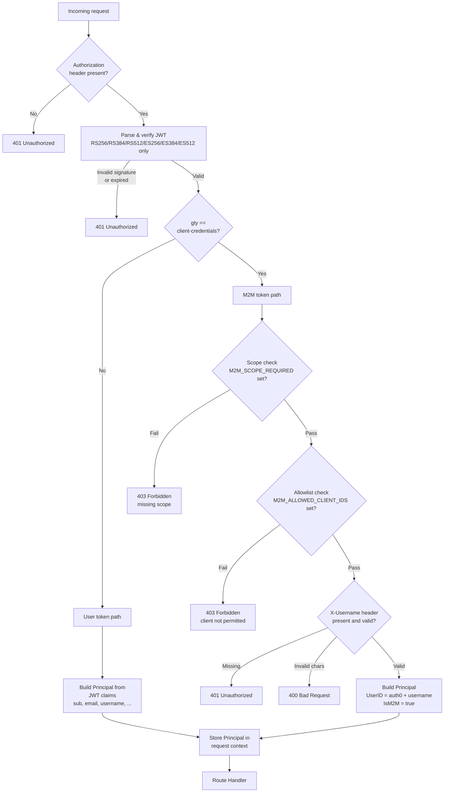
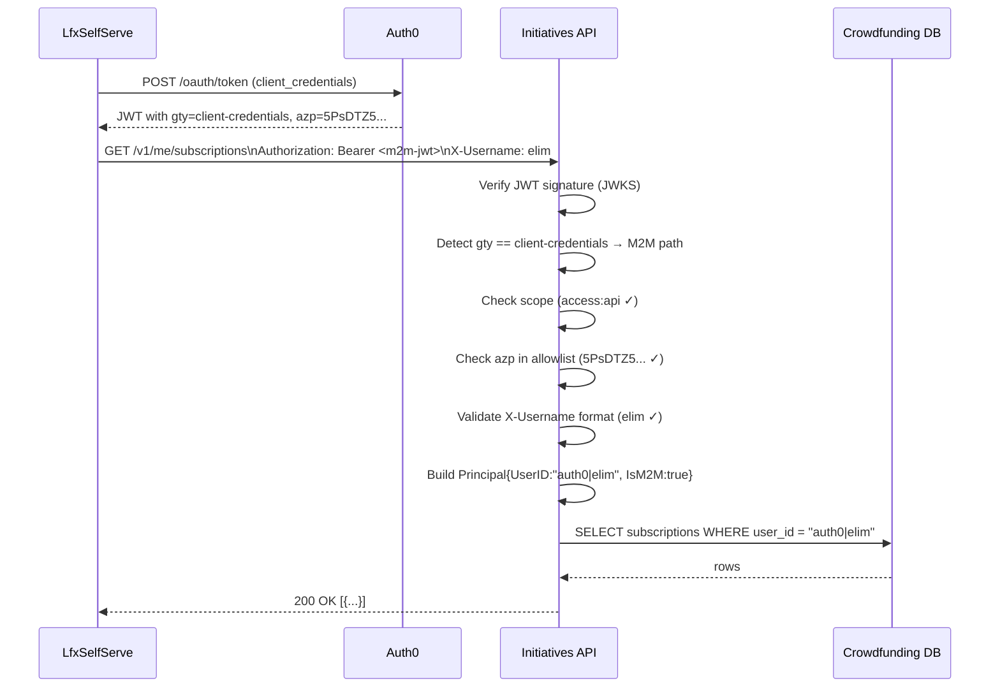

# Auth0 Backend Integration

This document explains the Auth0 JWT authentication changes made to the
Initiatives API backend. It covers how authentication works, what changed
in the code, and what you need to do before deploying to each environment.

---

## Table of Contents

1. [The Big Picture](#1-the-big-picture)
2. [Two Types of Tokens](#2-two-types-of-tokens)
3. [How a Request Is Authenticated](#3-how-a-request-is-authenticated)
4. [M2M (Machine-to-Machine) Authentication](#4-m2m-machine-to-machine-authentication)
5. [What Changed and Where](#5-what-changed-and-where)
6. [Environment Variables Reference](#6-environment-variables-reference)
7. [Deployment Checklists](#7-deployment-checklists)
8. [Local Development](#8-local-development)
9. [Troubleshooting](#9-troubleshooting)

---

## 1. The Big Picture

Every protected API call must carry a **Bearer token** — a signed JSON Web
Token (JWT) issued by Auth0. The backend verifies that signature using
Auth0's public keys (fetched from a JWKS endpoint), then extracts the
caller's identity and stores it in the request context so handlers can
use it without re-parsing the token.

```
Browser / Service
      │
      │  Authorization: Bearer <jwt>
      ▼
┌─────────────────────────────────────────────────────────┐
│                  JWT Middleware                          │
│                                                         │
│  1. Extract token from Authorization header             │
│  2. Fetch Auth0 public keys from JWKS URL               │
│  3. Verify signature + expiry + audience + issuer       │
│  4. Identify token type: user token or M2M token?       │
│  5. Build a Principal and store it in request context   │
└──────────────────────────┬──────────────────────────────┘
                           │ Principal{}
                           ▼
                      Route Handler
                  (reads principal.UserID,
                   principal.Email, etc.)
```

**What is a Principal?**  
A `Principal` is the Go struct that represents "who made this request". It
is populated from the JWT and passed to every handler via the request
context. Handlers never re-parse the token — they just call
`auth.PrincipalFromContext(r.Context())`.

---

## 2. Two Types of Tokens

Auth0 issues two fundamentally different token types. The middleware handles
both.

### User ID Token (normal login)

Issued when a human logs in through the browser via LF SSO (Auth0).

| Claim | Example value | Meaning |
|---|---|---|
| `sub` | `auth0\|elim` | Auth0 user ID — matches `users.user_id` in the DB |
| `https://sso.linuxfoundation.org/claims/username` | `elim` | LF SSO username |
| `email` | `elim@example.com` | User's email |
| `gty` | _(absent)_ | No grant type on user tokens |

### M2M Client-Credentials Token

Issued to a **backend service** (e.g. LfxSelfServe) that needs to act
*on behalf of* a user. The token carries no user identity — instead the
calling service passes the target username in an HTTP header.

| Claim | Example value | Meaning |
|---|---|---|
| `sub` | `5PsDTZ5...@clients` | Auth0 client ID + `@clients` suffix |
| `azp` | `5PsDTZ5...` | Auth0 client ID (preferred over `sub`) |
| `gty` | `client-credentials` | **This is how we detect M2M tokens** |
| `scope` | `access:api` | Scopes granted to this M2M client |

> **Key point:** `gty == "client-credentials"` is the canonical way to
> distinguish M2M tokens from user tokens. Never rely on the presence of
> user-specific claims for this check.

---

## 3. How a Request Is Authenticated



### The three M2M security gates

M2M requests must pass **all three** checks in order:

1. **Scope gate** — The token's `scope` claim must contain the value of
   `M2M_SCOPE_REQUIRED` (e.g. `access:api`). This limits the blast radius
   to M2M clients that have been explicitly granted the scope in Auth0.

2. **Allowlist gate** — The token's `azp` claim (Auth0 client ID) must be
   in the `M2M_ALLOWED_CLIENT_IDS` list. This limits impersonation to
   known, trusted services.

3. **Username format gate** — The `X-Username` header must match
   `^[a-zA-Z0-9._-]+$`. This prevents injection attacks where a malicious
   value like `elim|evil` could corrupt the constructed user ID.

Either gate can be disabled by leaving its env var empty, but **both
should be set in production**.

---

## 4. M2M (Machine-to-Machine) Authentication

### What is M2M and why does it exist?

Some LFX backend services (e.g. LfxSelfServe) need to read or act on data
on behalf of a user — for example, fetching a user's donations, listing or
cancelling their subscriptions, or reading initiative ledger stats as part
of a Mentorship programme workflow. These services authenticate with Auth0
using the **client credentials** OAuth flow (service → Auth0, no browser
involved) and then pass the target user's LF username in an HTTP header.

> **M2M cannot create donations.** Donations must originate from a direct
> user token because they require Stripe payment confirmation from the
> user's own session. M2M access is limited to reads and subscription
> management.

### The constructed UserID

The M2M path builds a `UserID` that matches exactly what a direct user
login would produce:

```
X-Username: elim
     │
     ▼
Principal.UserID = "auth0|" + "elim" = "auth0|elim"
```

This means the same database row is found whether the action was taken
directly by the user or proxied by a backend service.

### Payment routes block M2M

Payment operations (setup intents, payment methods) require a real user
email to create a Stripe customer. M2M tokens carry no email, so these
routes reject M2M tokens with `403 Forbidden`:

```
POST /v1/me/setup-intent        ─┐
POST /v1/me/payment-method       ├── RequireDirectAuth middleware
GET  /v1/me/payment-account      │   blocks IsM2M == true
DELETE /v1/me/payment-method    ─┘
```

### Full M2M request flow



---

## 5. What Changed and Where

### Files modified

| File | What changed |
|---|---|
| `internal/infrastructure/auth/jwt.go` | Complete rewrite — dual-path middleware, M2M security gates, `RequireDirectAuth` |
| `internal/infrastructure/auth/jwt_test.go` | **New file** — 20 tests covering all auth paths |
| `internal/domain/models/filters.go` | `Principal` struct enriched with LF SSO claims + M2M provenance fields |
| `cmd/initiatives-api/config.go` | Added `M2MScopeRequired`, `M2MAllowedClientIDs` to `JWTConfig`; env parsing |
| `cmd/initiatives-api/server.go` | Wires M2M config; startup warnings; payment routes wrapped in `RequireDirectAuth` |
| `cmd/initiatives-api/main.go` | Root cancelable context threaded through to `NewServer` for JWKS goroutine lifecycle |
| `.env.example` | Added M2M vars with safe placeholder comments |
| `charts/lfx-v2-initiatives-service/values.yaml` | Added `M2M_SCOPE_REQUIRED` and `M2M_ALLOWED_CLIENT_IDS` to `config:` section |

---

### `Principal` struct (models/filters.go)

Before this change, `Principal` held only a `UserID`. Now it carries
everything needed for audit logs, display, and M2M provenance tracking:

```go
type Principal struct {
    UserID        string // "auth0|elim" — matches users.user_id in the DB
    Username      string // LF SSO username (from custom JWT claim)
    Email         string
    EmailVerified bool
    Name          string // full display name
    GivenName     string
    FamilyName    string
    Picture       string
    IsM2M         bool   // true = proxied via M2M token, not a direct user login
    M2MClientID   string // the Auth0 client_id of the proxying service
}
```

---

### JWT validation changes (jwt.go)

**Algorithm restriction** — Only asymmetric algorithms are accepted.
Symmetric algorithms (HS256 etc.) are rejected because an attacker who
knows the secret key could forge tokens:

```go
jwt.WithValidMethods([]string{"RS256", "RS384", "RS512", "ES256", "ES384", "ES512"})
```

**JWKS goroutine lifecycle** — The `keyfunc` library spawns a background
goroutine to refresh public keys from Auth0. Previously this goroutine
was bound to `context.Background()` and leaked on shutdown. Now the root
application context is threaded through from `main()`:

```
main() creates ctx, cancel := context.WithCancel(context.Background())
  └─> NewServer(ctx, ...)
        └─> NewJWTAuthenticator(ctx, ...)  ← goroutine stopped when ctx is cancelled
              └─> keyfunc.NewDefaultCtx(ctx, ...)
```

On `SIGTERM`/`SIGINT`: `cancel()` is called before `srv.Shutdown()`,
stopping the JWKS goroutine cleanly.

---

### Route structure (server.go)

```
/livez, /healthz, /readyz               ← no auth (health checks)
/v1/stripe/webhook                      ← no JWT (HMAC signature check instead)
/v1/statistics                          ← no auth (public)
/v1/initiatives        GET / GET /{id}  ← no auth (public)

/v1/* (protected — user token OR M2M token accepted)
  ├── jwtAuth.Middleware                ← validates Bearer token, sets Principal
  │
  ├── POST   /initiatives               user token only (in practice)
  ├── PATCH  /initiatives/{id}          user token only (in practice)
  ├── DELETE /initiatives/{id}          user token only (in practice)
  ├── GET    /initiatives/{id}/donations       ✓ M2M readable
  ├── POST   /initiatives/{id}/donations       ✗ M2M must not use (user token only)
  ├── GET    /initiatives/{id}/subscriptions   ✓ M2M readable
  ├── POST   /initiatives/{id}/subscriptions   ✓ M2M can manage
  ├── DELETE /subscriptions/{id}               ✓ M2M can manage
  ├── GET    /me/donations                     ✓ M2M readable
  ├── GET    /me/subscriptions                 ✓ M2M readable
  │
  └── RequireDirectAuth group          ← hard-blocks M2M tokens (403)
        ├── POST   /me/setup-intent
        ├── POST   /me/payment-method
        ├── GET    /me/payment-account
        └── DELETE /me/payment-method
```

> The "M2M must not use" note on `POST /initiatives/{id}/donations` is a
> convention enforced by the calling service, not a middleware guard.
> Donations require Stripe payment confirmation from the user's own browser
> session, so a backend service has no valid reason to call that endpoint.

---

## 6. Environment Variables Reference

### Auth-related variables

| Variable | Required | Example | Description |
|---|---|---|---|
| `JWKS_URL` | Yes* | `https://lf.auth0.com/.well-known/jwks.json` | Auth0 JWKS endpoint. Used to fetch public keys for signature verification. |
| `JWT_AUDIENCE` | Yes | `https://api.crowdfunding.lfx.dev/` | The API identifier configured in Auth0. Tokens must include this in their `aud` claim. |
| `JWT_ISSUER` | Yes | `https://lf.auth0.com/` | Auth0 domain. Tokens must include this in their `iss` claim. |
| `M2M_SCOPE_REQUIRED` | Recommended | `access:api` | Scope the M2M token must carry. Leave empty to skip the scope check (not recommended). |
| `M2M_ALLOWED_CLIENT_IDS` | Recommended | `5PsDTZ5abc,7QrXYZ123` | Comma-separated list of Auth0 client IDs allowed to proxy requests. Leave empty to skip the allowlist (not recommended). |
| `DISABLED_MOCK_LOCAL_PRINCIPAL` | Dev only | `local-user` | **Never in production.** Bypasses JWT validation entirely and uses this value as the mock user ID. |

> \* `JWKS_URL` is required unless `DISABLED_MOCK_LOCAL_PRINCIPAL` is set.
> Setting both will cause the service to refuse to start.

### How `M2M_ALLOWED_CLIENT_IDS` is parsed

The value is a comma-separated string:

```
M2M_ALLOWED_CLIENT_IDS=5PsDTZ5abc,7QrXYZ123,  AnotherID
```

Spaces around commas are trimmed. Empty segments are ignored. The parsed
list is compared against the `azp` claim in the M2M token (or derived from
the `sub` claim by stripping `@clients` if `azp` is absent).

---

## 7. Deployment Checklists

### Before every deployment

- [ ] Run `go test ./...` from the `backend/` directory — all tests must pass
- [ ] Run `go build ./cmd/initiatives-api` — must compile cleanly
- [ ] Confirm `DISABLED_MOCK_LOCAL_PRINCIPAL` is **not set** (or is empty)
      in the target environment's configuration

---

### Staging deployment

1. **Auth0 — API settings**
   - [ ] An API resource is configured in Auth0 with identifier matching
         `JWT_AUDIENCE` (e.g. `https://api-staging.crowdfunding.lfx.dev/`)
   - [ ] The JWKS URL for the Auth0 tenant is reachable from the cluster

2. **Helm values (`values.yaml` or overlay)**
   ```yaml
   config:
     JWKS_URL: "https://<auth0-tenant>/.well-known/jwks.json"
     JWT_AUDIENCE: "https://api-staging.crowdfunding.lfx.dev/"
     JWT_ISSUER: "https://<auth0-tenant>/"
     M2M_SCOPE_REQUIRED: "access:api"
     M2M_ALLOWED_CLIENT_IDS: "<LfxSelfServe-client-id>"
   ```
   - [ ] `M2M_SCOPE_REQUIRED` matches the scope granted to LfxSelfServe
         in Auth0 → Applications → LfxSelfServe → APIs → Permissions
   - [ ] `M2M_ALLOWED_CLIENT_IDS` contains the Auth0 client ID of
         LfxSelfServe (found in Auth0 → Applications → LfxSelfServe →
         Settings → Client ID)

3. **Verify startup logs** — After deploying, check the pod logs for:
   - ✅ No `JWT AUTHENTICATION IS DISABLED` warning
   - ✅ No `M2M proxy auth is partially configured` warning
   - ✅ `server listening addr=:8080`

4. **Smoke test**
   ```bash
   # Health check (no auth needed)
   curl https://api-staging.crowdfunding.lfx.dev/livez

   # Protected route without token → should return 401
   curl https://api-staging.crowdfunding.lfx.dev/v1/me/donations

   # Protected route with valid user token → should return 200
   curl -H "Authorization: Bearer <user-token>" \
        https://api-staging.crowdfunding.lfx.dev/v1/me/donations
   ```

---

### Production deployment

Everything in the staging checklist, plus:

- [ ] `JWKS_URL`, `JWT_AUDIENCE`, `JWT_ISSUER` point to the **production**
      Auth0 tenant, not staging
- [ ] `M2M_ALLOWED_CLIENT_IDS` contains **only** the production Auth0
      client IDs of services that legitimately need M2M proxy access
- [ ] The Auth0 API resource has token expiry set to ≤ 86400 seconds (24h)
- [ ] Auth0 → Advanced → Refresh Token settings reviewed (M2M tokens do
      not use refresh tokens; client credentials are re-issued per request)
- [ ] `DISABLED_MOCK_LOCAL_PRINCIPAL` is confirmed absent from all Secrets
      and ConfigMaps in the production namespace:
      ```bash
      kubectl get configmap -n <namespace> -o yaml | grep DISABLED_MOCK
      kubectl get secret -n <namespace> -o yaml | grep DISABLED_MOCK
      ```

---

### Adding a new M2M client

When a new internal service needs M2M proxy access:

1. Create an Auth0 Machine-to-Machine application for the service
2. Grant it the `access:api` scope on the Crowdfunding API resource
3. Note the **Client ID** (shown in Auth0 → Applications → \<app\> →
   Settings → Client ID)
4. Add the Client ID to the Helm value:
   ```yaml
   config:
     M2M_ALLOWED_CLIENT_IDS: "<existing-id>,<new-client-id>"
   ```
5. Deploy with `helm upgrade`
6. Verify in pod logs that no partial-configuration warning appears

---

## 8. Local Development

For local development, you do not need a real Auth0 tenant. Set
`DISABLED_MOCK_LOCAL_PRINCIPAL` in your `.env` file:

```bash
# .env (local only — never commit with a real value)
DISABLED_MOCK_LOCAL_PRINCIPAL=local-dev-user
```

When this is set:
- `JWKS_URL` is **not required** and must be empty
- Every request (with or without an Authorization header) is treated as
  authenticated
- The principal will have `UserID = "local-dev-user"` and
  `Username = "local-dev-user"`
- The server prints a loud warning in the logs at startup:

```
!!! JWT AUTHENTICATION IS DISABLED — ALL REQUESTS ARE    !!!
!!! TREATED AS AUTHENTICATED. NEVER USE IN PRODUCTION.   !!!
```

> **Safety check:** If you accidentally set `DISABLED_MOCK_LOCAL_PRINCIPAL`
> AND `JWKS_URL` at the same time, the service will **refuse to start**
> with an error message explaining that they are mutually exclusive. This
> prevents the bypass flag from being left on in an environment that has
> real Auth0 config.

---

## 9. Troubleshooting

### `401 Unauthorized` — "invalid or missing token"

- Token is missing from the `Authorization` header
- Token is expired — check `exp` claim with `jwt.io`
- Token audience (`aud`) does not match `JWT_AUDIENCE` — verify the API
  identifier in Auth0 matches exactly (including trailing slash if present)
- Token issuer (`iss`) does not match `JWT_ISSUER`
- Token was signed with HS256 — only RS256/RS384/RS512/ES256/ES384/ES512
  are accepted

### `403 Forbidden` — "M2M token missing required scope"

- The Auth0 M2M application has not been granted the required scope
- Go to Auth0 → Applications → \<app\> → APIs → find the Crowdfunding API
  → enable the `access:api` permission
- Re-issue the token (client credentials tokens are short-lived; request a
  new one)

### `403 Forbidden` — "M2M client not permitted to proxy user requests"

- The calling service's Auth0 Client ID is not in `M2M_ALLOWED_CLIENT_IDS`
- Verify the Client ID by decoding the token at `jwt.io` and checking the
  `azp` claim
- Add the Client ID to `M2M_ALLOWED_CLIENT_IDS` and redeploy

### `403 Forbidden` — "payment operations require a user token, not an M2M token"

- An M2M service is calling a payment route (`/me/setup-intent` etc.)
- Payment routes require a direct user token — M2M proxy is intentionally
  blocked because Stripe customer creation needs the user's real email
- The calling service must use the user's own token for payment operations

### `400 Bad Request` — "X-Username contains invalid characters"

- The `X-Username` header value contains characters outside
  `[a-zA-Z0-9._-]`
- Common causes: URL-encoded values, leading/trailing whitespace, or
  pipe/slash characters from an injection attempt
- The calling service should send only the raw LF SSO username

### Service fails to start — "DISABLED_MOCK_LOCAL_PRINCIPAL and JWKS_URL are mutually exclusive"

- Both env vars are set at the same time
- For production/staging: remove `DISABLED_MOCK_LOCAL_PRINCIPAL`
- For local dev: remove `JWKS_URL`

### `M2M proxy auth is partially configured` warning at startup

- Exactly one of `M2M_SCOPE_REQUIRED` / `M2M_ALLOWED_CLIENT_IDS` is set;
  the other is empty
- This is not a fatal error but weakens M2M security — set both vars
  together

### JWKS fetch error at startup

- The service cannot reach `JWKS_URL` from inside the cluster
- Verify the URL is correct and network policies allow egress to Auth0
- Check Auth0 tenant status at https://status.auth0.com
