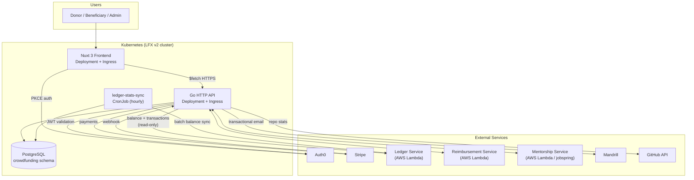

# LFX Crowdfunding — Architecture

This document describes the architecture of the rewritten LFX Crowdfunding platform. It reflects the target system: a Kubernetes-native monorepo replacing the original AWS Lambda + DynamoDB stack.

---

## System Overview



---

## Components

### Frontend — Nuxt 3

Server-side rendered Vue 3 application. Acts as a BFF: handles authentication, session cookies, and Stripe.js. All data fetched from the Go API.

| Concern | Choice |
|---|---|
| Framework | Nuxt 3 + Vue 3 |
| Language | TypeScript (strict) |
| Styling | Tailwind CSS + PrimeVue v4 |
| State | Pinia (app state) + Vue Query (server state) |
| Auth | OAuth2 PKCE, HTTP-only session cookies |
| Payments | Stripe.js |

**Authentication flow:**

1. User clicks login → `GET /api/auth/login` → server generates PKCE challenge → returns Auth0 redirect URL
2. Auth0 authenticates → redirects to `/auth/callback`
3. Server exchanges code for tokens → stores in HTTP-only cookies
4. All API calls include `credentials: 'include'` — token sent automatically

**Pages:**

```
pages/
├── index.vue                  # Initiative discovery (listing)
├── auth/callback.vue          # Auth0 OAuth callback
├── stripe/callback.vue        # Stripe OAuth callback
├── github/callback.vue        # GitHub OAuth callback
├── email/
│   ├── approve.vue            # Approve expense (email JWT link)
│   ├── reject.vue             # Reject expense (email JWT link)
│   └── approve-project.vue    # Approve initiative (email JWT link)
├── projects/
│   ├── create/                # GitHub OAuth → repo select → details form
│   └── [slug]/
│       ├── index.vue          # Project overview
│       ├── financial.vue      # Donations & expenses
│       ├── edit.vue           # Edit project
│       └── payments.vue       # Donate / subscribe
└── funds/
    ├── create/                # General fund / event / OSTIF creation form
    └── [slug]/
        ├── index.vue          # Fund overview
        ├── financial.vue      # Donations & expenses
        ├── edit.vue           # Edit fund
        └── payments.vue       # Donate / subscribe
```

---

### Backend — Go HTTP API

Chi router. Owns all business logic: initiative CRUD, Stripe payments, webhook processing, transactional email, and read-only Ledger integration. Structured as a layered DDD application.

| Concern | Choice |
|---|---|
| Language | Go (latest stable) |
| Router | Chi |
| Database | PostgreSQL via `pgx/v5` |
| Migrations | `golang-migrate` |
| Auth | Auth0 JWT middleware |
| Logging | `slog` (stdlib) |
| Tracing | OpenTelemetry |

**Package layout:**

```
backend/
├── cmd/
│   ├── initiatives-api/     # HTTP server entrypoint
│   └── ledger-stats-sync/   # CronJob entrypoint
├── internal/
│   ├── domain/              # Domain models + repository interfaces
│   ├── service/             # Business logic / orchestration
│   ├── handler/             # HTTP handlers
│   └── infrastructure/
│       ├── db/              # PostgreSQL repository implementations
│       ├── clients/         # Ledger + Stripe HTTP clients
│       └── auth/            # JWT middleware
└── db/
    ├── migrations/          # golang-migrate SQL files
    └── seed.sql             # Development seed data
```

**API surface:**

| Method | Path | Description |
|---|---|---|
| `GET` | `/v1/initiatives` | List initiatives (filterable, paginated) |
| `POST` | `/v1/initiatives` | Create initiative |
| `GET` | `/v1/initiatives/{id}` | Get initiative by UUID or slug |
| `PUT` | `/v1/initiatives/{id}` | Update initiative |
| `DELETE` | `/v1/initiatives/{id}` | Delete initiative |
| `GET` | `/v1/initiatives/{id}/transactions` | Donations and expenses |
| `POST` | `/v1/initiatives/{id}/payment-intent` | Create Stripe payment intent |
| `POST` | `/v1/initiatives/{id}/subscription` | Create Stripe subscription |
| `DELETE` | `/v1/subscriptions/{id}` | Cancel subscription |
| `POST` | `/v1/hooks/stripe` | Stripe webhook receiver |

**Mentorship compatibility endpoints** (called directly by the Mentorship service):

| Method | Path | Purpose |
|---|---|---|
| `GET` | `/v1/projects/{id}/{slug}/sync` | Slug sync after rename |
| `GET` | `/v1/projects/{id}/funding` | Funding status |
| `POST` | `/v1/projects/title-check` | Title uniqueness validation |
| `POST` | `/v1/entities/{id}/addbeneficiary` | Add beneficiary |
| `POST` | `/v1/entities/{id}/removebeneficiary` | Remove beneficiary |

---

### Background Jobs

| Job | K8s resource | Schedule | Purpose |
|---|---|---|---|
| `ledger-stats-sync` | CronJob | Hourly | Fetches balance and sponsor data from Ledger HTTP API; caches into `initiative_ledger_stats` |

---

### Database — PostgreSQL

`crowdfunding` schema on the shared LFX v2 RDS instance. All monetary values stored as `bigint` (cents). All primary keys are UUIDs.

**Core tables:**

| Table | Purpose |
|---|---|
| `initiatives` | Unified table for all initiative types (project, event, mentorship, general_fund, security_audit, ostif, other) |
| `initiative_goals` | Funding goals per initiative; donated/spent enriched live from Ledger |
| `initiative_ledger_stats` | Hourly-cached financial stats and sponsors (written by CronJob) |
| `initiative_beneficiaries` | Beneficiaries linked to an initiative |
| `initiative_contributors` | Contributors (project type only) |
| `initiative_mentors` | Mentors (mentorship type only) |
| `users` | LFX user identity; Auth0 subject as primary key |
| `organizations` | Donor organizations |
| `donations` | One-time donation records |
| `subscriptions` | Recurring subscription records |

**initiative_type values:**

| Type | Description |
|---|---|
| `project` | Open source software project |
| `mentorship` | Mentorship program (managed by Mentorship service) |
| `event` | Conference or community event |
| `general_fund` | General-purpose fundraising fund |
| `security_audit` | OSTIF security audit |
| `ostif` | Legacy OSTIF type (migrated rows only) |
| `other` | Legacy general type (migrated rows only) |

**Financial data flow:**

```
Ledger Service (Lambda)
        │
        │  GET /api/balance/{projectID}
        ▼
ledger-stats-sync CronJob (hourly)
        │
        │  writes total_raised, available_balance,
        │  supporters, sponsors JSONB
        ▼
initiative_ledger_stats
        │
        │  JOIN on every initiative read
        ▼
GET /v1/initiatives/{id}  ←── also calls Ledger live
                               for per-goal donated/spent
```

---

## External Integrations

| Service | Direction | Purpose |
|---|---|---|
| Auth0 | CF → Auth0 | JWT validation; user identity |
| Stripe | CF → Stripe | Charges, subscriptions, Stripe Connect |
| Stripe webhook | Stripe → CF | `customer.subscription.deleted` → cancel in DB |
| Ledger Service | CF → Ledger (read-only) | Balance, per-goal subtotals, transaction history |
| Ledger Service | Ledger → CF | Donation callbacks (`GET /v1/projects/{id}`) |
| Reimbursement Service | Bidirectional | Expense policy, beneficiary lifecycle |
| Mentorship Service | Bidirectional | Program sync via SNS/SQS + direct HTTP calls |
| Mandrill | CF → Mandrill | Transactional email |
| GitHub | CF → GitHub | Repo stats; OAuth for project creation |

---

## Deployment

All application components run in Kubernetes, deployed via ArgoCD from [`linuxfoundation/lfx-v2-argocd`](https://github.com/linuxfoundation/lfx-v2-argocd).

| Component | K8s resource |
|---|---|
| Nuxt 3 frontend | `Deployment` + `Service` + `Ingress` |
| Go HTTP API | `Deployment` + `Service` + `Ingress` |
| `ledger-stats-sync` | `CronJob` |
| PostgreSQL | Managed RDS (shared LFX v2 instance) |
| Secrets | External Secrets Operator |

**URLs:**

| Environment | URL |
|---|---|
| Dev | `https://funding.dev.platform.linuxfoundation.org/` |
| Prod | `https://crowdfunding.lfx.linuxfoundation.org/` |

---

## What Was Intentionally Removed

The rewrite drops the following from the original Lambda system:

| Removed | Replaced by |
|---|---|
| AWS Lambda (application code) | Kubernetes Deployments |
| DynamoDB | PostgreSQL |
| OpenSearch | Postgres full-text search |
| Serverless Framework | Helm charts + ArgoCD |
| CloudWatch Events / DynamoDB Streams | K8s CronJobs |
| `travel_fund` initiative type | Merged into `general_fund` |
| `community` initiative type | 3 dead rows discarded at migration |
