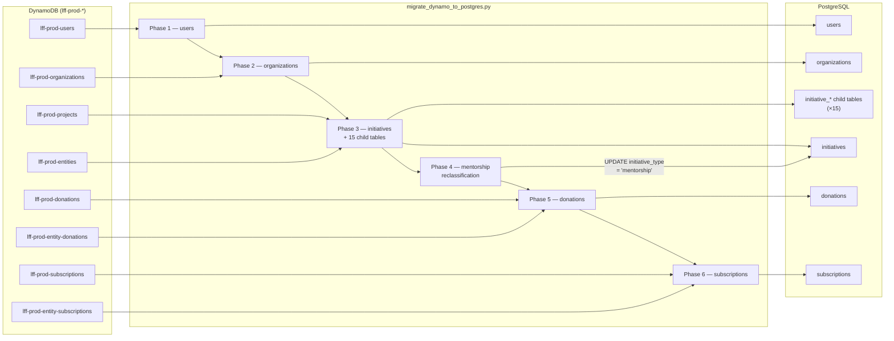
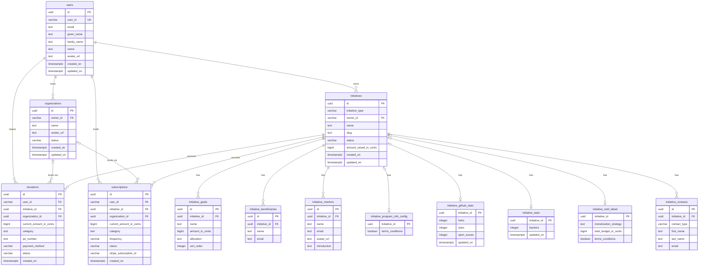
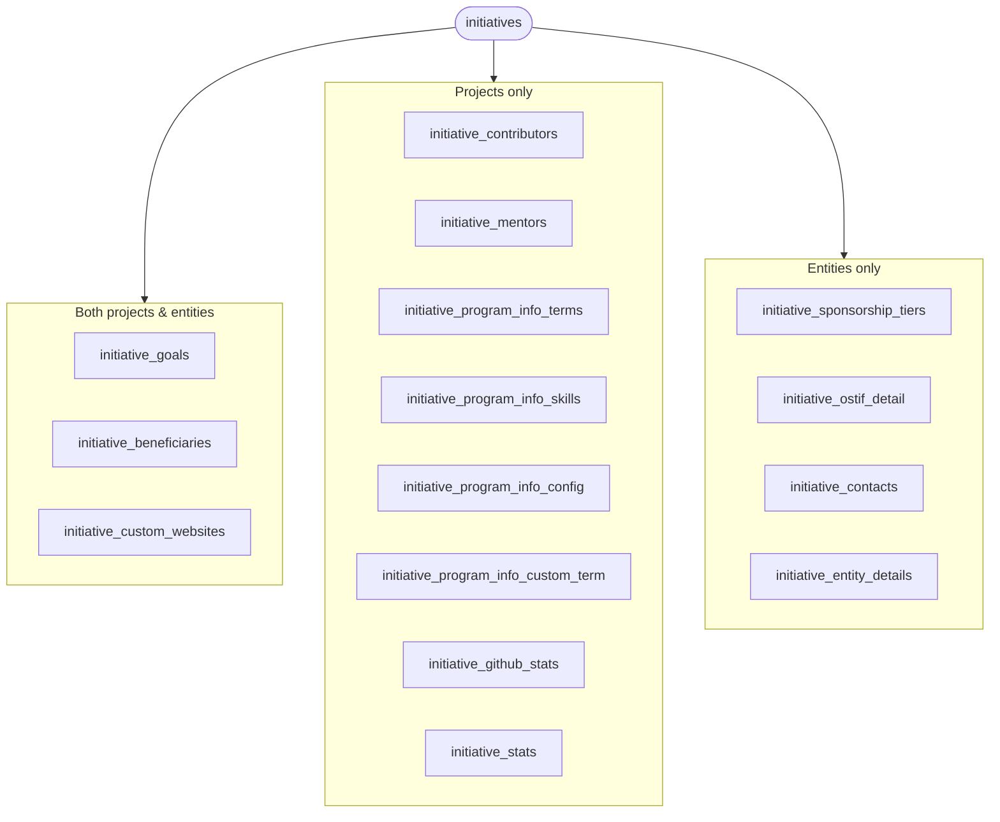
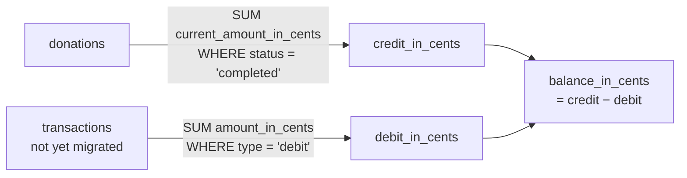
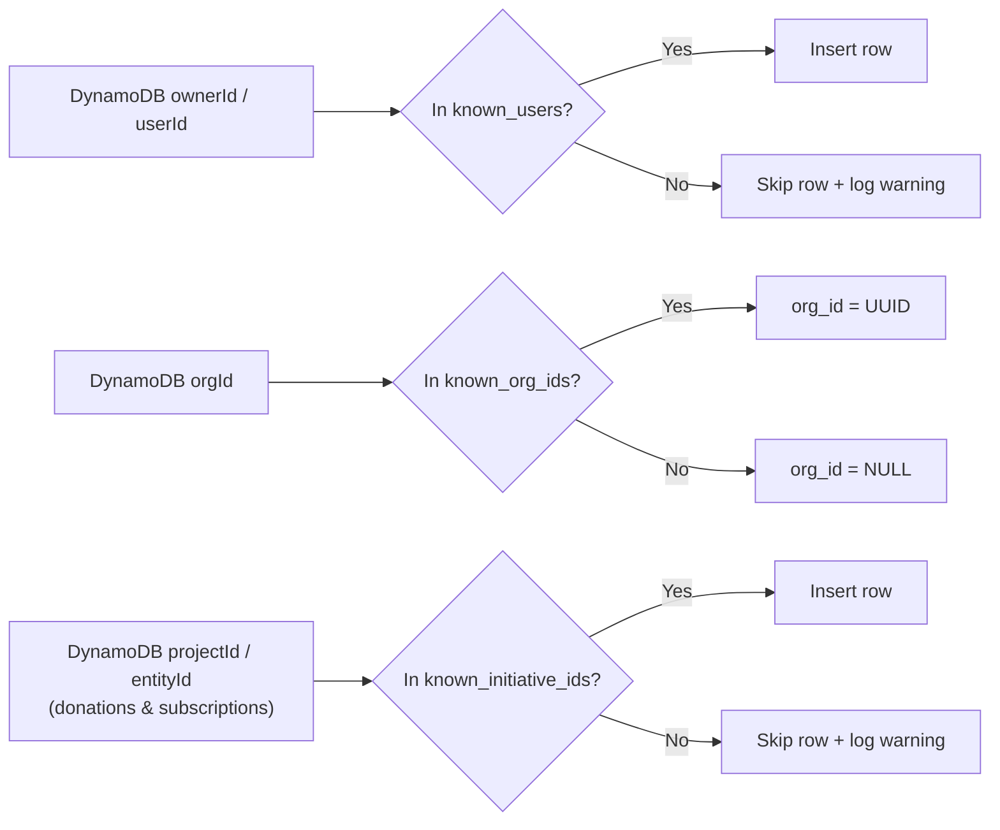

# LFF Data Design & Migration Reference

**Schema version:** 2.0.0  
**Last updated:** 2026-05-12  
**Source data:** AWS DynamoDB `us-east-1` (`lff-prod-*`)  
**Target:** PostgreSQL `localhost:5433 / dbname=postgres`  
**Migration status:** ✅ Complete — exit 0

---

## Contents

1. [Architecture Overview](#1-architecture-overview)
2. [Source → Target Table Map](#2-source--target-table-map)
3. [Entity-Relationship Diagram](#3-entity-relationship-diagram)
4. [Initiative Tree (child tables)](#4-initiative-tree-child-tables)
5. [Schema DDL](#5-schema-ddl)
6. [Data Dictionary](#6-data-dictionary)
7. [Source → Target Field Mapping](#7-source--target-field-mapping)
8. [Column Type Rationale](#8-column-type-rationale)
9. [Financial Data Design](#9-financial-data-design)
10. [Migration Architecture](#10-migration-architecture)
11. [Migration Statistics](#11-migration-statistics)
12. [Running the Migration](#12-running-the-migration)
13. [Excluded Fields](#13-excluded-fields)
14. [Post-Cutover Cleanup](#14-post-cutover-cleanup)

---

## 1. Architecture Overview



> **UUID strategy:** All surrogate PKs are generated deterministically via `uuid5(UUID_NS, "{scope}:{natural_key}")` so re-runs produce the same IDs and FK relationships remain stable. The namespace UUID `6ba7b810-9dad-11d1-80b4-00c04fd430c8` must never change.

---

## 2. Source → Target Table Map

| DynamoDB table(s) | PostgreSQL table | Rows (production) |
|---|---|---:|
| `lff-prod-users` | `users` | 16,847 (incl. 58 placeholders) |
| `lff-prod-organizations` | `organizations` | 606 |
| `lff-prod-projects` + `lff-prod-entities` | `initiatives` | 2,023 |
| `lff-prod-projects` | `initiative_goals` | 4,438 |
| `lff-prod-projects` + `lff-prod-entities` | `initiative_beneficiaries` | 2,004 |
| `lff-prod-projects` + `lff-prod-entities` | `initiative_custom_websites` | 1 |
| `lff-prod-projects` | `initiative_contributors` | 37 |
| `lff-prod-projects` | `initiative_mentors` | 2,914 |
| `lff-prod-projects` | `initiative_program_info_terms` | 92 |
| `lff-prod-projects` | `initiative_program_info_skills` | 5,472 |
| `lff-prod-projects` | `initiative_program_info_config` | 1,841 |
| `lff-prod-projects` | `initiative_program_info_custom_term` | 11 |
| `lff-prod-entities` | `initiative_sponsorship_tiers` | 0 |
| `lff-prod-entities` | `initiative_ostif_detail` | 11 |
| `lff-prod-entities` | `initiative_contacts` | 26 |
| `lff-prod-projects` | `initiative_github_stats` | 1,552 |
| `lff-prod-projects` | `initiative_stats` | 1,841 |
| `lff-prod-entities` | `initiative_entity_details` | 0 |
| `lff-prod-donations` + `lff-prod-entity-donations` | `donations` | 1,598 |
| `lff-prod-subscriptions` + `lff-prod-entity-subscriptions` | `subscriptions` | 277 |

---

## 3. Entity-Relationship Diagram



---

## 4. Initiative Tree (child tables)



All child tables carry `initiative_id UUID NOT NULL REFERENCES initiatives(id) ON DELETE CASCADE`.

---

## 5. Schema DDL

The full DDL is in [db/migrations/001_initial.up.sql](../../db/migrations/001_initial.up.sql). Key structural decisions are noted inline below.

### `users`

```sql
CREATE TABLE IF NOT EXISTS users (
  id          UUID         PRIMARY KEY DEFAULT gen_random_uuid(),
  user_id     VARCHAR(255) NOT NULL UNIQUE,  -- Auth0 subject (e.g. auth0|abc123)
  email       TEXT,
  given_name  TEXT,
  family_name TEXT,
  name        TEXT,
  avatar_url  TEXT,
  created_on  TIMESTAMPTZ DEFAULT NOW(),
  updated_on  TIMESTAMPTZ DEFAULT NOW()
);
```

> `user_id` (not `id`) is the natural key and FK target throughout the schema.
> 58 placeholder rows (all fields NULL except `user_id`) are inserted for user IDs referenced
> elsewhere but absent from `lff-prod-users`.

### `organizations`

```sql
CREATE TABLE IF NOT EXISTS organizations (
  id         UUID         PRIMARY KEY DEFAULT gen_random_uuid(),
  owner_id   VARCHAR(255) NOT NULL REFERENCES users(user_id),
  name       TEXT         NOT NULL,
  avatar_url TEXT,
  status     VARCHAR(50),
  created_on TIMESTAMPTZ  DEFAULT NOW(),
  updated_on TIMESTAMPTZ  DEFAULT NOW()
);
```

### `initiatives`

```sql
CREATE TABLE IF NOT EXISTS initiatives (
  id                   UUID         PRIMARY KEY DEFAULT gen_random_uuid(),
  initiative_type      VARCHAR(50)  NOT NULL,
  source_dynamo_table  VARCHAR(50),            -- 'projects' | 'entities' — drop post-cutover

  owner_id             VARCHAR(255) NOT NULL REFERENCES users(user_id),

  name                 TEXT         NOT NULL,
  slug                 TEXT,
  status               VARCHAR(50),
  industry             TEXT,
  description          TEXT,
  color                VARCHAR(10),
  logo_url             TEXT,
  website_url          TEXT,
  coc_url              TEXT,

  stripe_plan_id       TEXT,
  stripe_product_id    TEXT,
  amount_raised_in_cents BIGINT       NOT NULL DEFAULT 0,
  accept_funding        BOOLEAN      DEFAULT false,

  -- project-only
  cii_project_id       TEXT,
  jobspring_project_id TEXT,
  stacks_identifier    TEXT,          -- never populated in production (0/1,841)

  -- entity-only
  eventbrite_url       TEXT,
  application_url      TEXT,
  event_start_date     TIMESTAMPTZ,
  event_end_date       TIMESTAMPTZ,
  country              VARCHAR(100),
  city                 VARCHAR(100),
  is_online            BOOLEAN      DEFAULT false,

  created_on           TIMESTAMPTZ  DEFAULT NOW(),
  updated_on           TIMESTAMPTZ  DEFAULT NOW()
);
```

> **Phase 5 cleanup:** `ALTER TABLE initiatives DROP COLUMN source_dynamo_table;`

### `initiative_goals`

```sql
CREATE TABLE IF NOT EXISTS initiative_goals (
  id              UUID    PRIMARY KEY DEFAULT gen_random_uuid(),
  initiative_id   UUID    NOT NULL REFERENCES initiatives(id) ON DELETE CASCADE,
  name            TEXT    NOT NULL,
  amount_in_cents BIGINT  NOT NULL DEFAULT 0,
  allocation      TEXT,
  repo_link       TEXT,         -- development category only
  description     TEXT,         -- entity goals only
  color           VARCHAR(10),  -- entity goals only
  icon            TEXT,         -- entity goals only
  sort_order      INTEGER DEFAULT 0,
  UNIQUE (initiative_id, name),
  created_on  TIMESTAMPTZ DEFAULT NOW(),
  updated_on  TIMESTAMPTZ DEFAULT NOW()
);
```

> **JSON tag quirk:** `Budget.AmountInCents` is serialised with tag `"amount"`, not `"amountInCents"`.
> Access as `budget.get("amount")` in the migration script.

### `donations`

```sql
CREATE TABLE IF NOT EXISTS donations (
  id                      UUID         PRIMARY KEY DEFAULT gen_random_uuid(),
  user_id                 VARCHAR(255) NOT NULL REFERENCES users(user_id),
  initiative_id           UUID         REFERENCES initiatives(id) ON DELETE SET NULL,
  organization_id         UUID         REFERENCES organizations(id) ON DELETE SET NULL,
  cached_details          JSONB,
  category                TEXT,
  current_amount_in_cents BIGINT       NOT NULL CHECK (current_amount_in_cents >= 0),
  po_number               TEXT,                   -- DynamoDB key: 'ponumber' (lowercase)
  payment_method          VARCHAR(50),
  status                  VARCHAR(50),
  stripe_charge_id        VARCHAR(255),
  created_on              TIMESTAMPTZ  DEFAULT NOW(),
  updated_on              TIMESTAMPTZ  DEFAULT NOW()
);
```

### `subscriptions`

```sql
CREATE TABLE IF NOT EXISTS subscriptions (
  id                          UUID         PRIMARY KEY DEFAULT gen_random_uuid(),
  user_id                     VARCHAR(255) NOT NULL REFERENCES users(user_id),
  initiative_id               UUID         REFERENCES initiatives(id) ON DELETE SET NULL,
  organization_id             UUID         REFERENCES organizations(id) ON DELETE SET NULL,
  cached_details              JSONB,
  category                    TEXT,
  current_amount_in_cents     BIGINT       NOT NULL CHECK (current_amount_in_cents >= 0),
  frequency                   VARCHAR(50),
  status                      VARCHAR(50),
  stripe_subscription_id      VARCHAR(255),
  stripe_subscription_item_id VARCHAR(255),
  created_on                  TIMESTAMPTZ  DEFAULT NOW(),
  updated_on                  TIMESTAMPTZ  DEFAULT NOW()
);
```

### `updated_on` trigger

A single trigger function keeps `updated_on` current on every `UPDATE` across all 20 tables:

```sql
CREATE OR REPLACE FUNCTION set_updated_on()
RETURNS TRIGGER LANGUAGE plpgsql AS $$
BEGIN
    NEW.updated_on = NOW();
    RETURN NEW;
END;
$$;

-- Applied to: users, organizations, initiatives, all initiative_* child tables,
-- donations, subscriptions
```

### Indexes (23 total)

```sql
-- organizations
CREATE INDEX IF NOT EXISTS idx_organizations_owner_id            ON organizations(owner_id);

-- initiatives
CREATE INDEX IF NOT EXISTS idx_initiatives_owner_id              ON initiatives(owner_id);
CREATE INDEX IF NOT EXISTS idx_initiatives_slug                  ON initiatives(slug);
CREATE INDEX IF NOT EXISTS idx_initiatives_status                ON initiatives(status);
CREATE INDEX IF NOT EXISTS idx_initiatives_type                  ON initiatives(initiative_type);
CREATE INDEX IF NOT EXISTS idx_initiatives_amount_raised         ON initiatives(amount_raised_in_cents DESC);

-- initiative child tables
CREATE INDEX IF NOT EXISTS idx_initiative_goals_iid              ON initiative_goals(initiative_id);
CREATE INDEX IF NOT EXISTS idx_initiative_beneficiaries_iid      ON initiative_beneficiaries(initiative_id);
CREATE INDEX IF NOT EXISTS idx_initiative_custom_websites_iid    ON initiative_custom_websites(initiative_id);
CREATE INDEX IF NOT EXISTS idx_initiative_contributors_iid       ON initiative_contributors(initiative_id);
CREATE INDEX IF NOT EXISTS idx_initiative_mentors_iid            ON initiative_mentors(initiative_id);
CREATE INDEX IF NOT EXISTS idx_initiative_program_info_terms_iid ON initiative_program_info_terms(initiative_id);
CREATE INDEX IF NOT EXISTS idx_initiative_program_info_skills_iid ON initiative_program_info_skills(initiative_id);
CREATE INDEX IF NOT EXISTS idx_initiative_sponsorship_tiers_iid  ON initiative_sponsorship_tiers(initiative_id);
CREATE INDEX IF NOT EXISTS idx_initiative_contacts_iid           ON initiative_contacts(initiative_id);

-- donations
CREATE INDEX IF NOT EXISTS idx_donations_user_id                 ON donations(user_id);
CREATE INDEX IF NOT EXISTS idx_donations_initiative_id           ON donations(initiative_id);
CREATE INDEX IF NOT EXISTS idx_donations_status                  ON donations(status);
CREATE INDEX IF NOT EXISTS idx_donations_org_id                  ON donations(organization_id);

-- subscriptions
CREATE INDEX IF NOT EXISTS idx_subscriptions_user_id             ON subscriptions(user_id);
CREATE INDEX IF NOT EXISTS idx_subscriptions_initiative_id       ON subscriptions(initiative_id);
CREATE INDEX IF NOT EXISTS idx_subscriptions_org_id              ON subscriptions(organization_id);
CREATE INDEX IF NOT EXISTS idx_subscriptions_status              ON subscriptions(status);
```

---

## 6. Data Dictionary

### `users`

| Column | Type | Constraints | DynamoDB field | Notes |
|--------|------|-------------|----------------|-------|
| `user_id` | VARCHAR(255) | PK, NN, UQ | `id` | Auth0 subject (`auth0|abc123`). Natural key — not a UUID. FK target throughout schema. |
| `email` | TEXT | | `email` | |
| `given_name` | TEXT | | `givenName` | Go JSON tag is `givenname` (no camelCase). |
| `family_name` | TEXT | | `familyName` | |
| `name` | TEXT | | `name` | Full display name. |
| `avatar_url` | TEXT | | `avatarUrl` | |
| `created_on` | TIMESTAMPTZ | DEFAULT NOW() | — | No `createdOn` in DynamoDB users table. |
| `updated_on` | TIMESTAMPTZ | DEFAULT NOW() | — | |

### `organizations`

| Column | Type | Constraints | DynamoDB field | Notes |
|--------|------|-------------|----------------|-------|
| `id` | UUID | PK | `organizationId` | Deterministic via `_as_uuid(organizationId)`. |
| `owner_id` | VARCHAR(255) | NN, FK → `users.user_id` | `ownerId` | |
| `name` | TEXT | NN | `name` | |
| `avatar_url` | TEXT | | `avatarUrl` | |
| `status` | VARCHAR(50) | | `status` | Known values: `active`, `inactive`. |

### `initiatives`

#### Identity

| Column | Type | Constraints | Notes |
|--------|------|-------------|-------|
| `id` | UUID | PK | Surrogate. Derived from `projectId` / `entityId` via `_as_uuid()` — stable across re-runs. |
| `initiative_type` | VARCHAR(50) | NN | Projects: initially `'project'`, reclassified to `'mentorship'` in Phase 3. Entities: from `entityType` with `'initiative' → 'general fund'` reversal. |
| `source_dynamo_table` | VARCHAR(50) | | `'projects'` or `'entities'` — migration-only, drop post-cutover. |
| `owner_id` | VARCHAR(255) | NN, FK → `users.user_id` | `ownerId` — Auth0 subject. |

#### Core display fields

| Column | Type | DynamoDB field | Source | Notes |
|--------|------|----------------|--------|-------|
| `name` | TEXT | `name` | both | |
| `slug` | TEXT | `slug` | both | URL-safe identifier. |
| `status` | VARCHAR(50) | `status` | both | Projects: `submitted`, `published`, `declined`, `hidden`. Entities: same + `hide` (13 records). |
| `industry` | TEXT | `industry` | both | |
| `description` | TEXT | `description` | both | |
| `color` | VARCHAR(10) | `color` | both | Hex (`#RRGGBB`); max 7 chars, truncated at 10. |
| `logo_url` | TEXT | `logoUrl` | both | |
| `website_url` | TEXT | `website` / `websiteURL` | both | Different JSON keys per source. |
| `coc_url` | TEXT | `codeOfConduct.link` / `cocURL` | both | Projects nest under `codeOfConduct`; entities flat. |

#### Financial / platform IDs

| Column | Type | DynamoDB field | Source | Notes |
|--------|------|----------------|--------|-------|
| `stripe_plan_id` | TEXT | `planId` / `stripePlanId` | both | |
| `stripe_product_id` | TEXT | `productId` / `stripeProductId` | both | |
| `amount_raised_in_cents` | BIGINT | `amountRaised` | both | Denormalised total in cents. |
| `accept_funding` | BOOLEAN | `acceptFunding` | entities | Always `false` for projects. |

#### Project-only fields

| Column | Type | DynamoDB field | Notes |
|--------|------|----------------|-------|
| `cii_project_id` | TEXT | `ciiProjectID` | CII Best Practices badge ID. |
| `jobspring_project_id` | TEXT | `jobspringProjectId` | Non-NULL only when `initiative_type = 'mentorship'`. |
| `stacks_identifier` | TEXT | `stacksIdentifier` | **Never populated in production** (0/1,841 records). |

#### Entity-only fields

| Column | Type | DynamoDB field | Notes |
|--------|------|----------------|-------|
| `eventbrite_url` | TEXT | `eventbriteId` | Eventbrite event URL (event-type entities only). |
| `application_url` | TEXT | `applicationURL` | |
| `event_start_date` | TIMESTAMPTZ | `eventStartDate` | |
| `event_end_date` | TIMESTAMPTZ | `eventEndDate` | |
| `country` | VARCHAR(100) | `country` | From `EntityLocation`. |
| `city` | VARCHAR(100) | `city` | |
| `is_online` | BOOLEAN | `isOnline` | |

### `initiative_goals`

| Column | Type | Constraints | DynamoDB field | Notes |
|--------|------|-------------|----------------|-------|
| `id` | UUID | PK | — | `uuid5("goal", initiative_id, name)`. |
| `initiative_id` | UUID | NN, FK → `initiatives(id)` | | |
| `name` | TEXT | NN, UQ(initiative_id, name) | — | Projects: `development`, `marketing`, `meetups`, `travel`, `bugBounty`, `documentation`, `other`, `mentee`. Entities: free-form. |
| `amount_in_cents` | BIGINT | NN, DEFAULT 0 | `budget.amount` | **JSON tag `"amount"` not `"amountInCents"`.** |
| `allocation` | TEXT | | `budget.allocation` | |
| `repo_link` | TEXT | | `development.repoLink` | `development` goal only. |
| `description` | TEXT | | `goals[].description` | Entities only. |
| `color` | VARCHAR(10) | | `goals[].goalColor` | Entities only. |
| `icon` | TEXT | | `goals[].goalIcon` | Entities only. |
| `sort_order` | INTEGER | DEFAULT 0 | — | Projects: 0=development … 7=mentee. Entities: array index. |

### `initiative_mentors`

| Column | Type | DynamoDB field | Notes |
|--------|------|----------------|-------|
| `id` | UUID | — | `uuid5("mentor", initiative_id, email\|name)`. |
| `initiative_id` | UUID | | FK → `initiatives(id)`. |
| `name` | TEXT | `mentee.mentor[].name` | |
| `email` | TEXT | `mentee.mentor[].email` | |
| `avatar_url` | TEXT | `mentee.mentor[].avatarURL` | JSON tag `"avatarURL"`. |
| `introduction` | TEXT | `mentee.mentor[].introduction` | |

### `initiative_program_info_config`

One row per mentorship project. `initiative_id` is the PK (1-to-1).

| Column | Type | DynamoDB field | Notes |
|--------|------|----------------|-------|
| `initiative_id` | UUID | | PK, FK → `initiatives(id)`. |
| `terms_conditions` | BOOLEAN | `mentee.termsConditions` | Whether project owner accepted mentorship T&Cs. |

### `initiative_program_info_custom_term`

Only inserted when `customTerm.termName` is non-empty. One row per initiative.

| Column | Type | DynamoDB field | Notes |
|--------|------|----------------|-------|
| `initiative_id` | UUID | | PK, FK. |
| `term_name` | TEXT | `customTerm.termName` | |
| `start_month` | VARCHAR(20) | `customTerm.startMonth` | e.g. `"January"`. |
| `end_month` | VARCHAR(20) | `customTerm.endMonth` | |
| `year` | INTEGER | `customTerm.year` | 4-digit year. |

### `initiative_sponsorship_tiers`

Entities only. `SponsorshipTier{name, description, color, icon, minimum}`.

| Column | Type | DynamoDB field | Notes |
|--------|------|----------------|-------|
| `id` | UUID | — | `uuid5("sponsorship_tier", initiative_id, name)`. |
| `initiative_id` | UUID | | FK. |
| `name` | TEXT | `sponsorshipTiers[].name` | |
| `description` | TEXT | `sponsorshipTiers[].description` | |
| `color` | VARCHAR(10) | `sponsorshipTiers[].color` | Truncated to 10 chars. |
| `icon` | TEXT | `sponsorshipTiers[].icon` | |
| `minimum` | BIGINT | `sponsorshipTiers[].minimum` | Minimum donation in cents. |
| `sort_order` | INTEGER | — | Array index. |

### `initiative_ostif_detail`

OSTIF-type entities only. One row per initiative.

| Column | Type | DynamoDB field | Notes |
|--------|------|----------------|-------|
| `initiative_id` | UUID | | PK, FK. |
| `monetization_strategy` | TEXT | `detail.monetizationStrategy` | |
| `current_security_strategy` | TEXT | `detail.currentSecurityStrategy` | |
| `license_type` | VARCHAR(100) | `detail.licenseType` | e.g. `"MIT"`. |
| `total_budget_in_cents` | BIGINT | `detail.totalBudget` | Used as `FundingStatus.TotalAnnualGoalInCents` for ostif. |
| `terms_conditions` | BOOLEAN | `detail.termsConditions` | |

### `initiative_contacts`

OSTIF-type entities only. Contact types: `primary`, `secondary`, `technical_lead`.

| Column | Type | DynamoDB field | Notes |
|--------|------|----------------|-------|
| `id` | UUID | — | `uuid5("contact", initiative_id, contact_type)`. |
| `initiative_id` | UUID | | FK. |
| `contact_type` | VARCHAR(50) | — | `primary` / `secondary` / `technical_lead`. |
| `first_name` | TEXT | `detail.{type}.firstName` | |
| `last_name` | TEXT | `detail.{type}.lastName` | |
| `email` | TEXT | `detail.{type}.email` | |
| `phone_number` | VARCHAR(50) | `detail.{type}.phoneNumber` | |
| `other_contact_option` | TEXT | `detail.{type}.otherContactOption` | |
| `preferred_contact_method` | VARCHAR(50) | `detail.{type}.preferredContactMethod` | |

### `initiative_github_stats`

Projects only — 1-to-1. Updated by `UpdateGithubDataCache`.

| Column | Type | DynamoDB field | Notes |
|--------|------|----------------|-------|
| `initiative_id` | UUID | | PK, FK. |
| `forks` | INTEGER | `cachedDetails.githubStats.forks` | |
| `stars` | INTEGER | `cachedDetails.githubStats.stars` | |
| `open_issues` | INTEGER | `cachedDetails.githubStats.openIssues` | |
| `updated_on` | TIMESTAMPTZ | — | Set to `NOW()` on each upsert. |

### `initiative_stats`

Projects only — 1-to-1. Updated by `UpdateProjectStats`.

| Column | Type | DynamoDB field | Notes |
|--------|------|----------------|-------|
| `initiative_id` | UUID | | PK, FK. |
| `backers` | INTEGER | `cachedDetails.projectStats.backers` | Count of unique donors. |
| `updated_on` | TIMESTAMPTZ | — | Set to `NOW()` on each upsert. |

> `ProjectStats.TotalRaised` excluded — no active write path (always 0 in production).

### `initiative_entity_details`

Entities only — 1-to-1. `map[string]string` → JSONB.

| Column | Type | DynamoDB field | Notes |
|--------|------|----------------|-------|
| `initiative_id` | UUID | | PK, FK. |
| `details` | JSONB | `entityDetails` | Arbitrary application metadata. All production records have empty maps (0/182 populated). |

### `donations`

Merged from `lff-prod-donations` + `lff-prod-entity-donations`.

| Column | Type | Constraints | DynamoDB field | Notes |
|--------|------|-------------|----------------|-------|
| `id` | UUID | PK | — | `uuid5("proj_donation"\|"entity_donation", user_id, project_id\|entity_id)`. |
| `user_id` | VARCHAR(255) | NN, FK → `users.user_id` | `userId` | |
| `initiative_id` | UUID | FK → `initiatives.id` | `projectId` / `entityId` | Surrogate UUID, not the natural key. |
| `organization_id` | UUID | FK → `organizations.id` | `orgId` | NULL when org not in `known_org_ids`. |
| `cached_details` | JSONB | | `cachedDetails` | Snapshot: `{backerDetails: {name, avatarURL}}`. |
| `category` | TEXT | | `category` | Observed values: `development` (140), `mentorship` (115), `bugBounty` (6), `documentation` (5), `marketing` (4), `mentee` (3), `meetups` (2), `travel` (1). NULL = "all needs". |
| `current_amount_in_cents` | BIGINT | NN | `currentAmountInCents` | US cents (500 = $5.00). |
| `po_number` | TEXT | | `ponumber` | DynamoDB key is all-lowercase `ponumber`. 44 production records (36 project + 8 entity). |
| `payment_method` | VARCHAR(50) | | `paymentmethod` | `card` or `invoice`. DynamoDB key is all-lowercase. |
| `status` | VARCHAR(50) | | `status` | **All production values are NULL** — never written by current backend. |
| `stripe_charge_id` | VARCHAR(255) | | `stripeChargeId` | e.g. `ch_abc123`. |
| `created_on` | TIMESTAMPTZ | DEFAULT NOW() | `createdOn` | |

### `subscriptions`

Merged from `lff-prod-subscriptions` + `lff-prod-entity-subscriptions`.  
Differences from `donations`: no `po_number`, no `payment_method`, no `stripe_charge_id`. Adds `frequency`, `stripe_subscription_id`, `stripe_subscription_item_id`.

| Column | Type | Constraints | DynamoDB field | Notes |
|--------|------|-------------|----------------|-------|
| `id` | UUID | PK | — | `uuid5("proj_subscription"\|"entity_subscription", user_id, project_id\|entity_id)`. |
| `user_id` | VARCHAR(255) | NN, FK → `users.user_id` | `userId` | |
| `initiative_id` | UUID | FK → `initiatives.id` | `projectId` / `entityId` | |
| `organization_id` | UUID | FK → `organizations.id` | `orgId` | |
| `cached_details` | JSONB | | `cachedDetails` | |
| `category` | TEXT | | `category` | Same values as donations. |
| `current_amount_in_cents` | BIGINT | NN | `currentAmountInCents` | Monthly recurring amount in cents. |
| `frequency` | VARCHAR(50) | | `frequency` | Only `monthly` observed (270/270 records); `yearly` valid but unused. |
| `status` | VARCHAR(50) | | `status` | `active` (104) or `inactive` (166). |
| `stripe_subscription_id` | VARCHAR(255) | | `stripeSubscriptionId` | e.g. `sub_abc123`. |
| `stripe_subscription_item_id` | VARCHAR(255) | | `stripeSubscriptionItemId` | e.g. `si_abc123`. |
| `created_on` | TIMESTAMPTZ | DEFAULT NOW() | `createdOn` | |

---

## 7. Source → Target Field Mapping

### `initiatives` core columns

| PostgreSQL column | `lff-prod-projects` source | `lff-prod-entities` source |
|---|---|---|
| `initiative_type` | `'project'` (hardcoded, see Phase 3) | `entityType` (with `'initiative' → 'general fund'` reversal) |
| `owner_id` | `ownerId` | `ownerId` |
| `name` | `name` | `name` |
| `slug` | `slug` | `slug` |
| `status` | `status` | `status` |
| `industry` | `projectDetails.industry` | `industry` |
| `description` | `projectDetails.description` | `description` |
| `color` | `projectDetails.color` | `color` |
| `logo_url` | `logoUrl` | `logoUrl` |
| `website_url` | `projectDetails.website` | `websiteURL` |
| `coc_url` | `projectDetails.codeOfConduct.link` | `cocURL` |
| `cii_project_id` | `projectDetails.ciiProjectID` | — |
| `stripe_plan_id` | `planId` | `stripePlanId` |
| `stripe_product_id` | `productId` | `stripeProductId` |
| `jobspring_project_id` | `jobspringProjectId` | — |
| `stacks_identifier` | `projectDetails.stacksIdentifier` | — |
| `eventbrite_url` | — | `eventbriteId` |
| `application_url` | — | `applicationURL` |
| `amount_raised_in_cents` | `amountRaised` | `amountRaised` |
| `accept_funding` | `false` | `acceptFunding` |
| `event_start_date` | — | `eventStartDate` |
| `event_end_date` | — | `eventEndDate` |
| `country` | — | `country` |
| `city` | — | `city` |
| `is_online` | `false` | `isOnline` |
| `created_on` | `createdOn` | `createdOn` |
| `updated_on` | `updatedOn` | `updatedOn` |

> **entityType quirk:** `SaveEntity` rewrites `'general fund'` → `'initiative'` before every `PutItem`.
> The migration reverses this: `'initiative' → 'general fund'`.

### `initiative_goals` — project budget category sort order

| `sort_order` | `name` | DynamoDB source key |
|---:|---|---|
| 0 | `development` | `projectDetails.development` |
| 1 | `marketing` | `projectDetails.marketing` |
| 2 | `meetups` | `projectDetails.meetups` |
| 3 | `travel` | `projectDetails.travel` |
| 4 | `bugBounty` | `projectDetails.bugBounty` |
| 5 | `documentation` | `projectDetails.documentation` |
| 6 | `other` | `projectDetails.other` |
| 7 | `mentee` | `projectDetails.mentee` |

### DynamoDB quirks summary

| Quirk | Impact |
|---|---|
| `Budget.AmountInCents` JSON tag is `"amount"` not `"amountInCents"` | Access via `budget.get("amount")` |
| `entityType == 'initiative'` means `'general fund'` | Reversed in migration |
| `donations.ponumber` all lowercase | `d.get("ponumber")` not `d.get("poNumber")` |
| `donations.paymentmethod` all lowercase | `d.get("paymentmethod")` |
| `users.id` is the natural key (Auth0 subject), not a UUID | FK target is `user_id VARCHAR(255)` |
| Go `time.String()` format includes nanoseconds + ` UTC m=+...` suffix | Stripped by `_parse_ts()` before parsing |

---

## 8. Column Type Rationale

| Type | Used for | Reason |
|---|---|---|
| `UUID` | Surrogate PKs, all FK refs to `initiatives.id` and `organizations.id` | Stable across re-runs via deterministic `uuid5`. Efficient index and join performance. |
| `VARCHAR(255)` | `user_id`, `owner_id`, Stripe IDs (`stripe_charge_id`, `stripe_subscription_id`) | Structurally bounded — Auth0 subjects and Stripe IDs are short. Preserves index efficiency for FK join columns. |
| `VARCHAR(50)` | Enum-like: `status`, `initiative_type`, `payment_method`, `frequency`, `contact_type` | Go `valid:"in(...)"` constraints enforce short values. |
| `VARCHAR(10)` | `color` | Hex max 7 chars (`#RRGGBB`); `valid:"hexcolor"` in Go. |
| `TEXT` | All free-form strings: `name`, `description`, `website_url`, etc. | No length enforced in Go; production data includes URLs and descriptions well over 255 chars. |
| `BIGINT` | `current_amount_in_cents`, `amount_in_cents` (goals), `amount_raised_in_cents`, `total_budget_in_cents` | Go uses `int64` for monetary amounts. |
| `INTEGER` | stats counters (`backers`, `forks`, `stars`, `open_issues`) | Go uses `int`; small counts. |
| `BOOLEAN` | `accept_funding`, `is_online`, `terms_conditions` | Go `bool`. |
| `TIMESTAMPTZ` | All timestamps | DynamoDB stores as strings in ≥8 formats; normalised to UTC by `_parse_ts()`. |
| `JSONB` | `donations.cached_details`, `subscriptions.cached_details`, `initiative_entity_details.details` | Variable structure; not queried by key in hot path. |

---

## 9. Financial Data Design

### Why `balance` and `funding_status` are not persisted

Neither field is persisted anywhere — not in DynamoDB, not in PostgreSQL. They are computed on every API call from two live sources:

1. **Ledger microservice** (`GetEntityBalanceFromStartDate`) — authoritative source for all credits (donations, subscription settlements) and debits (payouts). Lives in `lff-prod-transactions` (not yet migrated).
2. **Subscription aggregates** (`subscriptionRepository.GetSubscriptionSummary`) — derived directly from the `subscriptions` table.

The DynamoDB `amountRaised` snapshots (now in `initiatives.amount_raised_in_cents`) were written by background jobs (`updateEntityAmountRaised`) as a read-cache for list views. They are stale by design and are superseded by the PostgreSQL `amount_raised_in_cents` column plus real-time derivation described below.

### Deriving balance from PostgreSQL



#### `balance.credit_in_cents`

```sql
SELECT
    i.id,
    COALESCE(SUM(d.current_amount_in_cents), 0) AS credit_in_cents
FROM initiatives i
LEFT JOIN donations d ON d.initiative_id = i.id
                     AND d.status = 'completed'
GROUP BY i.id;
```

> The ledger API credits both one-off donations and settled subscription payments.
> For a full credit total: `SUM(donations) + SUM(settled subscription payments)`.

#### `funding_status.total_annual_goal_in_cents`

```sql
SELECT initiative_id, SUM(amount_in_cents) AS total_annual_goal_in_cents
FROM initiative_goals
GROUP BY initiative_id;
```

For ostif entities, use `initiative_ostif_detail.total_budget_in_cents` directly.

#### `funding_status.total_subscription_count` and annual amount

```sql
SELECT
    i.id,
    COUNT(s.id)                                 AS total_subscription_count,
    COALESCE(SUM(s.current_amount_in_cents), 0) AS annual_subscription_amount_in_cents
FROM initiatives i
LEFT JOIN subscriptions s ON s.initiative_id = i.id
                         AND s.status = 'active'
GROUP BY i.id;
```

#### Per-category funding breakdown (projects)

```sql
SELECT
    g.initiative_id,
    g.name                                           AS category,
    g.amount_in_cents                                AS goal_in_cents,
    COALESCE(SUM(d.current_amount_in_cents), 0)      AS donations_in_cents,
    COUNT(s.id)                                      AS subscription_count,
    COALESCE(SUM(s.current_amount_in_cents), 0)      AS subscription_amount_in_cents
FROM initiative_goals g
JOIN initiatives i   ON i.id = g.initiative_id
LEFT JOIN donations d     ON d.initiative_id = i.id AND d.category = g.name AND d.status = 'completed'
LEFT JOIN subscriptions s ON s.initiative_id = i.id AND s.category = g.name AND s.status = 'active'
GROUP BY g.initiative_id, g.name, g.amount_in_cents;
```

### Recommended materialised view

```sql
CREATE MATERIALIZED VIEW initiative_funding_summary AS
SELECT
    i.id,
    i.name,
    COALESCE(SUM(DISTINCT g.amount_in_cents), 0)                           AS total_annual_goal_in_cents,
    COALESCE(SUM(d.current_amount_in_cents) FILTER (WHERE d.status = 'completed'), 0)
                                                                           AS total_donations_in_cents,
    COUNT(s.id) FILTER (WHERE s.status = 'active')                         AS total_subscription_count,
    COALESCE(SUM(s.current_amount_in_cents) FILTER (WHERE s.status = 'active'), 0)
                                                                           AS annual_subscription_amount_in_cents
FROM initiatives i
LEFT JOIN initiative_goals  g ON g.initiative_id = i.id
LEFT JOIN donations         d ON d.initiative_id = i.id
LEFT JOIN subscriptions     s ON s.initiative_id = i.id
GROUP BY i.id, i.name;

-- Refresh after each donation/subscription write:
-- REFRESH MATERIALIZED VIEW CONCURRENTLY initiative_funding_summary;
```

> `balance.debit_in_cents` cannot be populated until `lff-prod-transactions` is migrated.
> Until then, the Ledger API remains authoritative for payout data.

---

## 10. Migration Architecture

### Phase flow

```mermaid
flowchart TD
    START([Start migration]) --> SCAN

    subgraph SCAN["Scan DynamoDB (8 tables)"]
        S1[lff-prod-users\n16,789 items]
        S2[lff-prod-organizations\n606 items]
        S3[lff-prod-projects\n1,841 items]
        S4[lff-prod-entities\n182 items]
        S5[lff-prod-donations\n1,411 items]
        S6[lff-prod-entity-donations\n188 items]
        S7[lff-prod-subscriptions\n270 items]
        S8[lff-prod-entity-subscriptions\n7 items]
    end

    SCAN --> PLACEHOLDER["Collect extra user IDs\nfrom all tables → 58 placeholders"]
    PLACEHOLDER --> PH1

    subgraph MIGRATE["Migrate in FK order"]
        PH1["Phase 1: users\n16,789 + 58 placeholders\nON CONFLICT user_id DO UPDATE"]
        PH2["Phase 2: organizations\n606 rows\nskip if owner not in known_users"]
        PH3["Phase 3a: initiatives\n2,023 rows\nprojects first, then entities\nON CONFLICT id DO UPDATE"]
        PH3B["Phase 3b: 15 child tables\ngoals / beneficiaries / mentors\nprogram_info / stats / etc."]
        PH4["Phase 4: mentorship reclassification\nUPDATE initiative_type = 'mentorship'\nWHERE mentee goal > 0\n→ 1,486 rows updated"]
        PH5["Phase 5: donations\n1,598 rows\n1 skipped — initiative FK missing"]
        PH6["Phase 6: subscriptions\n277 rows"]
        PH1 --> PH2 --> PH3 --> PH3B --> PH4 --> PH5 --> PH6
    end

    PH6 --> COMMIT([COMMIT]) --> END([Migration complete ✅])
```



### UUID generation

```python
_UUID_NS = uuid.UUID("6ba7b810-9dad-11d1-80b4-00c04fd430c8")  # Must never change

def _uuid5(scope: str, *parts) -> str:
    key = "|".join(str(p) for p in parts)
    return str(uuid.uuid5(_UUID_NS, f"{scope}:{key}"))

def _as_uuid(value) -> str | None:
    """Parse UUID string or fall back to uuid5 coercion."""
    try:
        return str(uuid.UUID(str(value).strip()))
    except ValueError:
        return _uuid5("coerce", value)
```

All child row IDs are derived from `_uuid5(scope, initiative_id, natural_discriminator)` so every re-run produces identical IDs and upserts are idempotent.

### Timestamp parsing

`_parse_ts()` handles ≥8 formats including the Go `time.String()` format with nanoseconds and monotonic suffix:

```
2019-04-02 15:42:26.518360269 +0000 UTC m=+2580.502337766
```

It strips the ` UTC m=+...` suffix and truncates sub-second precision to 6 digits before parsing.

### FK resolution strategy



---

## 11. Migration Statistics

### Row counts (production run — 2026-05-12)

| Table | Rows | Notes |
|---|---:|---|
| `users` | 16,847 | 16,789 from DynamoDB + 58 placeholders |
| `organizations` | 606 | |
| `initiatives` | 2,023 | 1,841 projects + 182 entities |
| `initiative_goals` | 4,438 | |
| `initiative_beneficiaries` | 2,004 | |
| `initiative_custom_websites` | 1 | |
| `initiative_contributors` | 37 | |
| `initiative_mentors` | 2,914 | |
| `initiative_program_info_terms` | 92 | |
| `initiative_program_info_skills` | 5,472 | |
| `initiative_program_info_config` | 1,841 | |
| `initiative_program_info_custom_term` | 11 | |
| `initiative_sponsorship_tiers` | 0 | All production tiers arrays are empty |
| `initiative_ostif_detail` | 11 | |
| `initiative_contacts` | 26 | |
| `initiative_github_stats` | 1,552 | |
| `initiative_stats` | 1,841 | |
| `initiative_entity_details` | 0 | All production entityDetails maps are empty |
| `donations` | 1,598 | 1 skipped — orphaned initiative FK |
| `subscriptions` | 277 | |
| **mentorship reclassification** | **1,486** | rows updated in Phase 4 |

### Initiative type breakdown (post-Phase 4 reclassification)

| `initiative_type` | Count | Origin |
|---|---:|---|
| `mentorship` | 1,486 | reclassified from `project` |
| `project` | ~355 | remaining projects |
| `general fund` | 122 | entities |
| `other` | 26 | entities |
| `event` | 20 | entities |
| `ostif` | 11 | entities |
| `community` | 3 | entities |

### Data integrity

- **0** orphaned goals (all `initiative_id` FKs resolve)
- **0** orphaned donations from unknown users
- **1** donation skipped — references a project with `ownerId = null` in DynamoDB (also excluded from initiatives)
- **0** broken subscription FKs

---

## 12. Running the Migration

### Prerequisites

```bash
cd <repo-root>
source .venv/bin/activate        # boto3 + psycopg2-binary
```

### Full reset and re-run

```bash
# 1. Drop all tables
psql "host=localhost port=5433 dbname=postgres user=flightapp password=flightapp_dev" \
  -c "DO \$\$ DECLARE r RECORD; BEGIN
        FOR r IN (SELECT tablename FROM pg_tables WHERE schemaname = 'public')
        LOOP EXECUTE 'DROP TABLE IF EXISTS ' || quote_ident(r.tablename) || ' CASCADE';
        END LOOP;
      END \$\$;"

# 2. Re-apply schema
psql "host=localhost port=5433 dbname=postgres user=flightapp password=flightapp_dev" \
  -f db/migrations/001_initial.up.sql

# 3. Set credentials
export AWS_ACCESS_KEY_ID="..."
export AWS_SECRET_ACCESS_KEY="..."
export AWS_SESSION_TOKEN="..."          # STS temporary credentials
export AWS_REGION="us-east-1"
export PG_DSN="host=localhost port=5433 dbname=postgres user=flightapp password=flightapp_dev"

# 4. Run
python3 db/scripts/migrate_dynamo_to_postgres.py
```

### Script location

`db/scripts/migrate_dynamo_to_postgres.py` — run from the repo root.

### Dependencies

```
pip install boto3 psycopg2-binary
```

### Idempotency

All INSERTs use `ON CONFLICT … DO UPDATE`, so the script is safe to re-run. The same DynamoDB source record always produces the same surrogate UUID because `_uuid5` is deterministic given the fixed namespace. Re-running produces the same row counts.

---

## 13. Excluded Fields

These appear in Go domain structs and/or DynamoDB but are not persisted to PostgreSQL.

| Field | Go location | Reason |
|---|---|---|
| `balance` | `projects/domain.Balance` · `entities/domain.Balance` | Computed by Ledger microservice at read time. Never written by `SaveProject` / `SaveEntity`. |
| `funding_status` | `projects/domain.FundingStatus` · `entities/domain.FundingStatus` | Computed from `balance` + subscription aggregates. Populated by `fillFundingStatus` at request time. |
| `entity_stats.sponsors` | `entities/domain.EntityStats.Sponsors` | `GetEntitySponsors` pushes to Elasticsearch only. `SaveEntity` never called with sponsors. |
| `diversity` | `projects/domain.Diversity` | `GetDiversity` fetches external demographic API at read time; results not persisted. |
| `vulnerability_summary` | `projects/domain.VulnerabilitySummary` | `GetVulnerabilitySummary` fetches external security scanner at read time. |
| `badges` | `projects/domain.Badge[]` | `convertProjectToDynamoRepresentation` never assigns `Badges`. Always nil in DynamoDB. |
| `project_stats.total_raised` | `ProjectStats.TotalRaised` | No active write path — `UpdateProjectStats` only touches `backers`. Always 0 in DynamoDB. |
| `cii_markup` | `ProjectDetails.CIIMarkup` | Fetched live from `bestpractices.coreinfrastructure.org`; not stored. |
| `uncategorised` | `projects/domain.Uncategorised` | "All needs" pseudo-category; no independent goal row. |
| `project_funding_status` | `projects/domain.ProjectFundingStatus` | Per-category breakdown computed from ledger + subscriptions at read time. |

---

## 14. Post-Cutover Cleanup

Once the application no longer writes to DynamoDB and `source_dynamo_table` is no longer needed for debugging:

```sql
ALTER TABLE initiatives DROP COLUMN source_dynamo_table;
```

Pending future work:

- **`transactions` migration** — `lff-prod-transactions` (payout records) is not yet migrated. Until it is, the Ledger API remains authoritative for `balance.debit_in_cents` and `balance.balance_in_cents`.
- **Application write path** — switch `SaveProject`, `SaveEntity`, donation / subscription writes from DynamoDB to PostgreSQL.
- **`initiative_funding_summary` materialised view** — create and wire up `REFRESH MATERIALIZED VIEW CONCURRENTLY` on each donation/subscription write.
